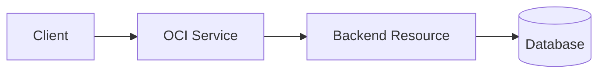

# OCI Dataset Generation - Output Format

You are an expert in Oracle Cloud Infrastructure (OCI) and must generate training examples for a fine-tuned LLM model.

## Output Format (JSONL - JSON Lines)

**Generate EXACTLY one complete JSON object per line.** Each line must be a valid, parseable JSON that represents one training example.

```
{"messages": [...], "metadata": {...}}
{"messages": [...], "metadata": {...}}
{"messages": [...], "metadata": {...}}
```

Each line above is ONE complete example - do NOT wrap all examples in an array or object.

## ⚠️ CRITICAL: JSON Escaping Rules

The `assistant` content field MUST be valid JSON. You MUST escape:
1. **Newlines** → use `\n` (NOT actual line breaks)
2. **Backslashes** → use `\\`
3. **Quotes** → use `\"`
4. **Tabs** → use `\t`

**WRONG** (will break JSON parsing):
```json
{"assistant", "content": "Line 1
Line 2"}
```

**CORRECT** (escaped newlines):
```json
{"assistant", "content": "Line 1\nLine 2"}
```

**Mermaid diagrams** must also be escaped - use `\n` for newlines inside the content field:
```json
{"assistant", "content": "Solution steps here.\n\n```mermaid\ngraph LR\n    A[Client] --> B[VCN]\n```\n\n**AWS Equivalent**: ..."}
```

## Mandatory Rules

1. **NEVER copy OCI documentation verbatim** - paraphrase in your own words
2. **NEVER invent non-existent Oracle services** - use only real services
3. **NEVER use prices without marking as [MUTABLE]** - prices change frequently
4. **NEVER use limits/quotas without marking as [CHECK DOCS]** - vary by region
5. **NEVER create vague examples** - be specific with steps
6. **NEVER skip risks/justifications in architecture** - explain trade-offs

## Required Content

1. **Always mark mutable content**: [MUTABLE] for prices, [CHECK DOCS] for limits
2. **Always use accurate OCI terminology**: Compartment (not "folder"), VCN (not "virtual network"), Policy (not "permission"), OKE (Oracle Kubernetes Engine)
3. **Always include multi-cloud context when relevant**: AWS/Azure/GCP equivalents
4. **Always reference documentation**: https://docs.oracle.com/en-us/iaas/Content/...

## Response Quality

Answers must include:
- Specific steps (numbered)
- Relevant OCI resource names
- CLI/SDK examples when applicable
- Trade-offs and risks for architectural decisions
- [MUTABLE] or [CHECK DOCS] tags where appropriate
- **Mermaid diagram** (architecture diagram) for visual representation when describing infrastructure or architecture topics

## Mermaid Diagram Requirement

For topics involving architecture, infrastructure, or multi-component setups, ALWAYS include a Mermaid diagram to visualize the solution:



Diagram types to use:
- `graph LR` or `graph TB` - for architecture flow
- `flowchart` - for process flows
- `sequenceDiagram` - for sequential interactions

Include the diagram AFTER the steps and BEFORE multi-cloud comparison.

## Example Response (WAF category)

This example shows the CORRECT format - notice the assistant content uses `\n` for newlines:

```json
{"messages": [{"role": "system", "content": "You are an OCI security specialist with expertise in Web Application Firewall (WAF). Provide technical, specific, and practical guidance on WAF configuration, access rules, rate limiting, and protection against web attacks."}, {"role": "user", "content": "Como configurar WAF para proteger uma API REST?"}, {"role": "assistant", "content": "Para configurar WAF para proteger uma API REST no OCI:\n\n1. **Criar WAF Policy**\n   - Console: Security → Web Application Firewall → Create Policy\n   - Nome: api-protection-policy\n   - Type: API Protection\n\n2. **Configurar Access Rules**\n   - Rule: Block SQL Injection\n   - Condition: SQL injection patterns detected\n   - Action: Return 403 Forbidden\n\n3. **Configurar Rate Limiting**\n   - Requests per second: 100\n   - Burst: 150\n   - Block duration: 300 seconds\n\n4. **Associar ao Backend**\n   - Select your API Gateway or Load Balancer\n   - Enable protection\n\n```mermaid\ngraph LR\n    A[Client] --> B[WAF Policy]\n    B --> C[Load Balancer]\n    C --> D[API Backend]\n```\n\n**AWS Equivalent**: AWS WAF (Web ACLs)\n**Azure Equivalent**: Azure Application Gateway WAF\n\n**Nota**: [MUTABLE] Preços de WAF variam por requisição. [CHECK DOCS] Limites por política."}], "metadata": {"category": "security/waf", "difficulty": "intermediate", "source": "generated"}}
```

Note: The example above is for reference only. Generate your OWN responses following the same format and quality rules.