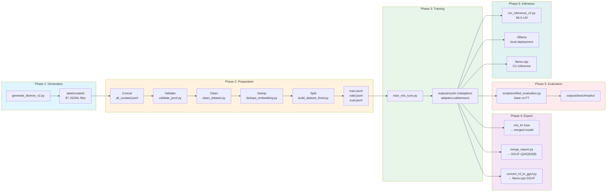

# OCI Specialist LLM

[🇺🇸 English](README.en-US.md) | [🇧🇷 Português](README.md)

Fine-tuned Large Language Model for Oracle Cloud Infrastructure (OCI) using Apple Silicon, MLX, and LoRA.

[](LICENSE)
[](https://www.python.org)
[](https://mlx.ai)
[](https://huggingface.co/mlx-community/Qwen2.5-Coder-7B-Instruct-4bit)
[](docs/taxonomy.md)

> **Language**: Data and prompts in Brazilian Portuguese (PT-BR).

---

## Overview

This project trains a specialized LLM for Oracle Cloud Infrastructure using Apple's MLX framework on Apple Silicon. The pipeline covers dataset generation, validation, MLX LoRA fine-tuning, and evaluation.



**Tech Stack**: Python 3.12, MLX 0.31.1, MLX-LM 0.31.1, MLX-Tune 0.4.18, JSONL chat format.

---

## Features

- **LoRA Fine-tuning**: Low-rank adaptation with 4-bit quantized base model
- **Apple Silicon Optimized**: Runs natively on M1/M2/M3/M4/M5 Macs
- **Comprehensive Evaluation**: Automated scoring with semantic similarity
- **Multiple Export Formats**: Merge with base model and convert to GGUF (Q4/Q5/Q8)
- **Local Inference**: Deploy with MLX-LM, Ollama or llama.cpp for offline inference
- **Richer Metadata**: Intent, persona, constraint, and lifecycle stage for RAG

---

## Dataset

| Metric | Value |
|--------|-------|
| **Total Generated** | 21,750 examples (87 categories × 250) |
| **After Clean/Dedup** | 21,327 examples |
| **Train** | 15,995 examples (75%) |
| **Valid** | 3,199 examples (15%) |
| **Eval** | 2,133 examples (10%) |
| **Categories** | 87 OCI topics |
| **Metadata** | intent, persona, constraint, lifecycle_stage |

### Split

| Split | Examples | % |
|-------|----------|---|
| Train | 15,995 | 75% |
| Valid | 3,199 | 15% |
| Eval | 2,133 | 10% |

### Categories

- **OCI Core** (compute, storage, networking, lb, database, container, serverless) - 20 topics
- **Security** (iam, policies, vault, encryption, cloud-guard, waf, zero-trust, posture-management) - 10 topics
- **Migration** (AWS/Azure/GCP/On-prem → OCI) - 14 topics
- **Terraform** (provider, compute, storage, networking, etc) - 12 topics
- **Observability** (logging, monitoring, stack-monitoring, apm) - 4 topics
- **Troubleshooting** (connectivity, performance, authentication, database, compute, storage, oke, functions) - 8 topics
- **DevOps** (ci-cd, resource-manager, artifacts, secrets) - 4 topics
- **Governance** (landing-zone, compartments, tagging, budgets-cost, policies-guardrails, compliance, audit-readiness, resource-discovery) - 8 topics
- **FinOps** (cost-optimization, showback-chargeback, rightsizing, storage-tiering) - 4 topics
- **Platform** (backup-governance, sre-operations) - 2 topics

---

## Getting Started

### Prerequisites

- Apple Silicon Mac (M1/M2/M3/M4/M5)
- Python 3.12

### 1. Training Environment (LLM)

```bash
python3.12 -m venv venv
source venv/bin/activate
pip install -r requirements.txt
```

### 2. OCI Copilot Environment (RAG)

```bash
python3.12 -m venv venv-rag
source venv-rag/bin/activate
pip install -r requirements-rag.txt
pip install langgraph chainlit
```

### Quick Start

```bash
# 1. Generate dataset
python scripts/generate_diverse_v2.py

# 2. Validate, clean, deduplicate and build splits
bash scripts/prepare_data.sh

# 3. Train (Cycle 1)
bash training/run_all_cycles.sh --fresh

# 4. Export to GGUF
python scripts/merge_export.py --cycle cycle-1 --quant q4 --name oci-specialist
```

---

## Training

```bash
# Train with single cycle (recommended)
bash training/run_all_cycles.sh --fresh
```

**Configuration**: See `config/cycle-1.env`

| Parameter | Value |
|-----------|-------|
| MODEL | mlx-community/Meta-Llama-3.1-8B-Instruct-4bit |
| LEARNING_RATE | 2e-4 |
| LORA_RANK | 8 |
| LORA_ALPHA | 16 |
| LORA_DROPOUT | 0.05 |
| NUM_LAYERS | 14 |
| GRADIENT_CHECKPOINTING | true |
| GRADIENT_ACCUMULATION | 4 |
| WARMUP_STEPS | 300 |
| ITERS | 3618 |
| MAX_SEQ_LENGTH | 2048 |
| WEIGHT_DECAY | 0.01 |
| LR_SCHEDULER | cosine |

---

## Evaluation

```bash
# Small mode (10 samples de categorias diferentes, ~5 min)
python scripts/unified_evaluation.py --cycle cycle-1 --mode small

# Medium evaluation (200 samples stratified, ~30-40 min) - Recommended
python scripts/unified_evaluation.py --cycle cycle-1 --mode medium --fresh

# Full evaluation (1930 samples, ~4-6 hours)
python scripts/unified_evaluation.py --cycle cycle-1 --mode full --fresh
```

Outputs include:
- JSON results with detailed scoring
- Markdown comparison report
- Radar charts (metrics comparison)
- Category bar charts

---

## RAG (Retrieval-Augmented Generation)

*(Note: Make sure to activate the `venv-rag` environment as per the Getting Started section)*

```bash
# RAG Tests
pytest tests/ -v
```

### Structure

```text
rag/
├── config.py          # Loads YAML config
├── loaders.py         # Document loaders
├── splitter.py        # Text splitter
├── dense_retriever.py # FAISS + embeddings (persisted)
├── sparse_retriever.py# BM25 (persisted)
├── hybrid_retriever.py# RRF fusion + Cross-Encoder reranking
├── tools.py           # LangChain tools
├── api.py             # FastAPI service (RAG Backend)
├── app_chainlit.py    # Chainlit UI (OCI Copilot Frontend)
├── orchestrator.py    # LangGraph State Machine (Orchestrator)
└── demo.py            # Demo script
```

### Offline Ingestion

To save RAM (especially on M3 Pro 18GB), RAG document ingestion must be done offline and saved to disk (`.faiss` and `.pkl`).

```bash
python scripts/update_rag.py
```

### Backend API (RAG)

```bash
# Start FastAPI server (loads indices from disk)
uvicorn rag.api:app --host 0.0.0.0 --port 8000

# Search
curl -X POST "http://localhost:8000/rag/retrieve" \
  -H "Content-Type: application/json" \
  -d '{"query": "How to create an instance in OCI?", "strategy": "migracao"}'
```

### Recommended UI: Chainlit

The official **OCI Copilot** interface is built with **Chainlit**. It connects to the RAG backend, exposes agent reasoning, supports local file attachments, on-the-fly strategy changing, and provides Human-In-The-Loop action buttons for safe script execution.

```bash
# Start Graphical Interface
chainlit run rag/app_chainlit.py -w
# Access: http://localhost:8000
```

---

## Inference

> All methods use the fine-tuned model and expose an OpenAI-compatible API or built-in UI on `http://localhost:8080`.

### MLX-LM — API Server (Apple Silicon)

```bash
# Start server with fine-tuned LoRA adapters
mlx_lm.server \
  --model mlx-community/Meta-Llama-3.1-8B-Instruct-4bit \
  --adapter outputs/cycle-1/adapters \
  --port 8080
```

Connect via **Open WebUI** (GUI):

```bash
docker run -d -p 3000:8080 \
  -e OPENAI_API_BASE_URL=http://host.docker.internal:8080/v1 \
  -e OPENAI_API_KEY=ignore \
  ghcr.io/open-webui/open-webui:main
# Open: http://localhost:3000
```

Or via **CLI**:

```bash
curl http://localhost:8080/v1/chat/completions \
  -H "Content-Type: application/json" \
  -d '{"model":"oci-specialist","messages":[{"role":"user","content":"Liste 3 serviços do OCI"}]}'
```

### Ollama — Local Server + WebUI

```bash
# 1. Create and import model (one-time)
cat > ./outputs/cycle-1/gguf/Modelfile << 'EOF'
FROM ./oci-specialist-Q4_K_M.gguf
PARAMETER temperature 0.1
PARAMETER top_p 0.9
PARAMETER top_k 40
SYSTEM Você é um especialista em OCI (Oracle Cloud Infrastructure).
EOF

ollama create oci-specialist -f ./outputs/cycle-1/gguf/Modelfile

# 2. Connect Open WebUI
docker run -d -p 3000:8080 \
  --add-host=host.docker.internal:host-gateway \
  -e OLLAMA_BASE_URL=http://host.docker.internal:11434 \
  ghcr.io/open-webui/open-webui:main
# Open: http://localhost:3000

# Or interactive CLI
ollama run oci-specialist
```

### llama.cpp — HTTP Server + Built-in WebUI

```bash
# Build llama.cpp
git clone https://github.com/ggerganov/llama.cpp.git
cd llama.cpp
make -j

# Start server with fine-tuned GGUF
./llama-server \
  -m ../outputs/cycle-1/gguf/oci-specialist-Q4_K_M.gguf \
  --host 0.0.0.0 --port 8080 --ctx-size 4096

# WebUI:  http://localhost:8080
# API:    http://localhost:8080/v1
```

> [!NOTE]
> The model is ~4.7GB when exported to GGUF Q4 format.

---

## Project Structure

```
├── config/                  # Configuration files
│   ├── cycle-1.env         # Training config
│   ├── inference_prompts.yaml
│   └── gguf.env
├── data/                    # Datasets
│   ├── curated/            # 87 topic files
│   ├── train.jsonl         # 14,470 examples
│   ├── valid.jsonl         # 2,894 examples
│   └── eval.jsonl          # 1,930 examples
├── docs/                   # Documentation
│   ├── taxonomy.md
│   ├── quality-rules.md
│   └── eval-rubric.md
├── scripts/                # Pipeline scripts
│   ├── generate_diverse_v2.py
│   ├── validate_jsonl.py
│   ├── clean_dataset.py
│   ├── dedupe_embedding.py
│   ├── build_dataset_fixed.py
│   ├── merge_export.py
│   ├── convert_hf_to_gguf.py
│   ├── unified_evaluation.py
│   └── run_inference_v2.py
├── training/               # Training scripts
│   ├── train_mlx_tune.py
│   └── run_all_cycles.sh
├── outputs/                # Generated outputs
│   └── cycle-1/
│       ├── adapters/      # LoRA adapters
│       └── gguf/          # Exported models
└── venv/                   # Python virtual environment
```

---

## Roadmap

Based on the results of the initial training cycle (`cycle-1`), the following improvements are planned:

1. ~~**Implement RAG (Retrieval-Augmented Generation)**~~ ✅ **IMPLEMENTED**: The project now includes a multi-agent RAG pipeline using LangGraph, FAISS/BM25 local indices (offline ingestion), and a robust **Chainlit** UI.

2. **Hugging Face Hub Integration**: Upload the final fine-tuned adapters and merged GGUF models (including the fine-tuned Qwen 2.5 Coder 7B) to the Hugging Face Hub to make them easily accessible to the community and facilitate deployments in other environments.

---

## Resources

- [MLX Documentation](https://mlx.ai)
- [MLX-LM GitHub](https://github.com/ml-explore/mlx-lm)
- [llama.cpp](https://github.com/ggerganov/llama.cpp)
- [Oracle Cloud Infrastructure Docs](https://docs.oracle.com/en-us/iaas/Content/home.htm)
- [HuggingFace Model](https://huggingface.co/mlx-community/Meta-Llama-3.1-8B-Instruct-4bit)

---

## License

This project is licensed under the MIT License.

---

## Evaluation Summary

After completing the training (`cycle-1`), the fine-tuned model was evaluated against the base model. Here is the summary of the evaluation (based on 200 samples):

| Metric | Base Model | Fine-Tuned | Delta |
|--------|-------------|------------|-------|
| technical_correctness | 3.40 | 3.40 | +0.00 |
| depth | 2.60 | 2.60 | +0.00 |
| structure | 3.93 | 4.23 | +0.30 |
| hallucination | 3.25 | 3.87 | +0.62 |
| clarity | 3.49 | 3.19 | -0.30 |
| overall | 3.33 | 3.46 | +0.12 |

### Model Comparison


### Category


### Top Improvements & Regressions

**Top 5 Gains:**
1. `troubleshooting/functions` (+0.65)
2. `networking/vcn` (+0.62)
3. `storage/file` (+0.57)
4. `troubleshooting/compute` (+0.57)
5. `migration/azure-storage` (+0.55)

**Areas for Improvement (Drops):**
1. `troubleshooting/performance` (-0.31)
2. `terraform/networking` (-0.27)
3. `governance/tagging` (-0.22)
4. `terraform/compute` (-0.21)
5. `terraform/serverless` (-0.19)

### Detailed Category Results

<details>
<summary>Click to expand all 87 categories</summary>

| # | Category | Base | FT | Delta |
|---|---------|------|----|-------|
| 1 | compute/custom-images | 3.38 | 3.66 | +0.27 |
| 2 | compute/instances | 3.44 | 3.58 | +0.14 |
| 3 | compute/scaling | 3.55 | 3.56 | +0.01 |
| 4 | container/instances | 3.42 | 3.25 | -0.17 |
| 5 | container/oke | 3.24 | 3.27 | +0.03 |
| 6 | database/autonomous | 3.23 | 3.46 | +0.24 |
| 7 | database/autonomous-json | 3.38 | 3.60 | +0.22 |
| 8 | database/exadata | 3.33 | 3.56 | +0.23 |
| 9 | database/mysql | 3.24 | 3.48 | +0.24 |
| 10 | database/nosql | 3.38 | 3.41 | +0.02 |
| 11 | database/postgresql | 3.33 | 3.66 | +0.33 |
| 12 | devops/artifacts | 3.38 | 3.29 | -0.09 |
| 13 | devops/ci-cd | 3.43 | 3.86 | +0.43 |
| 14 | devops/resource-manager | 3.54 | 3.55 | +0.01 |
| 15 | devops/secrets | 3.41 | 3.61 | +0.20 |
| 16 | finops/cost-optimization | 3.23 | 3.47 | +0.24 |
| 17 | finops/rightsizing | 3.47 | 3.40 | -0.07 |
| 18 | finops/showback-chargeback | 3.49 | 3.32 | -0.17 |
| 19 | finops/storage-tiering | 3.26 | 3.22 | -0.04 |
| 20 | governance/audit-readiness | 3.52 | 3.56 | +0.04 |
| 21 | governance/budgets-cost | 3.53 | 3.38 | -0.15 |
| 22 | governance/compartments | 3.42 | 3.27 | -0.14 |
| 23 | governance/compliance | 3.33 | 3.25 | -0.08 |
| 24 | governance/landing-zone | 3.30 | 3.23 | -0.07 |
| 25 | governance/policies-guardrails | 3.34 | 3.33 | -0.02 |
| 26 | governance/resource-discovery | 3.21 | 3.33 | +0.12 |
| 27 | governance/tagging | 3.63 | 3.41 | -0.22 |
| 28 | lb/load-balancer | 3.42 | 3.35 | -0.07 |
| 29 | migration/aws-compute | 3.24 | 3.66 | +0.42 |
| 30 | migration/aws-database | 3.17 | 3.37 | +0.19 |
| 31 | migration/aws-storage | 3.25 | 3.76 | +0.51 |
| 32 | migration/azure-compute | 3.38 | 3.37 | -0.00 |
| 33 | migration/azure-database | 3.38 | 3.35 | -0.03 |
| 34 | migration/azure-storage | 3.21 | 3.76 | +0.55 |
| 35 | migration/data-transfer | 3.32 | 3.56 | +0.23 |
| 36 | migration/gcp-compute | 3.20 | 3.66 | +0.46 |
| 37 | migration/gcp-database | 3.22 | 3.45 | +0.23 |
| 38 | migration/gcp-storage | 3.40 | 3.41 | +0.00 |
| 39 | migration/onprem-compute | 3.36 | 3.53 | +0.17 |
| 40 | migration/onprem-database | 3.30 | 3.42 | +0.12 |
| 41 | migration/onprem-storage | 3.34 | 3.66 | +0.32 |
| 42 | migration/onprem-vmware | 3.13 | 3.49 | +0.35 |
| 43 | networking/connectivity | 3.32 | 3.68 | +0.36 |
| 44 | networking/security | 3.38 | 3.66 | +0.28 |
| 45 | networking/vcn | 3.24 | 3.86 | +0.62 |
| 46 | observability/apm | 3.14 | 3.43 | +0.29 |
| 47 | observability/logging | 3.37 | 3.50 | +0.13 |
| 48 | observability/monitoring | 3.32 | 3.56 | +0.24 |
| 49 | observability/stack-monitoring | 3.27 | 3.33 | +0.06 |
| 50 | platform/backup-governance | 3.52 | 3.52 | -0.00 |
| 51 | platform/sre-operations | 3.37 | 3.37 | +0.01 |
| 52 | security/cloud-guard | 3.51 | 3.62 | +0.11 |
| 53 | security/dynamic-groups | 3.35 | 3.24 | -0.11 |
| 54 | security/encryption | 3.38 | 3.24 | -0.15 |
| 55 | security/federation | 3.45 | 3.86 | +0.41 |
| 56 | security/iam-basics | 3.43 | 3.31 | -0.12 |
| 57 | security/policies | 3.36 | 3.36 | +0.00 |
| 58 | security/posture-management | 3.40 | 3.39 | -0.00 |
| 59 | security/vault-keys | 3.43 | 3.56 | +0.13 |
| 60 | security/vault-secrets | 3.23 | 3.68 | +0.46 |
| 61 | security/waf | 3.32 | 3.56 | +0.24 |
| 62 | security/zero-trust | 3.27 | 3.56 | +0.29 |
| 63 | serverless/api-gateway | 3.36 | 3.21 | -0.15 |
| 64 | serverless/functions | 3.11 | 3.55 | +0.43 |
| 65 | storage/block | 3.26 | 3.27 | +0.00 |
| 66 | storage/file | 3.29 | 3.86 | +0.57 |
| 67 | storage/object | 3.26 | 3.22 | -0.05 |
| 68 | terraform/compute | 3.41 | 3.20 | -0.21 |
| 69 | terraform/container | 3.10 | 3.01 | -0.08 |
| 70 | terraform/database | 3.43 | 3.38 | -0.05 |
| 71 | terraform/devops | 3.44 | 3.33 | -0.11 |
| 72 | terraform/load-balancer | 3.21 | 3.33 | +0.12 |
| 73 | terraform/networking | 3.64 | 3.37 | -0.27 |
| 74 | terraform/observability | 3.41 | 3.57 | +0.16 |
| 75 | terraform/provider | 3.40 | 3.31 | -0.09 |
| 76 | terraform/security | 3.49 | 3.34 | -0.15 |
| 77 | terraform/serverless | 3.23 | 3.04 | -0.19 |
| 78 | terraform/state | 3.37 | 3.20 | -0.17 |
| 79 | terraform/storage | 3.37 | 3.38 | +0.00 |
| 80 | troubleshooting/authentication | 3.36 | 3.36 | +0.00 |
| 81 | troubleshooting/compute | 3.13 | 3.70 | +0.57 |
| 82 | troubleshooting/connectivity | 3.26 | 3.66 | +0.40 |
| 83 | troubleshooting/database | 3.32 | 3.59 | +0.27 |
| 84 | troubleshooting/functions | 3.01 | 3.66 | +0.65 |
| 85 | troubleshooting/oke | 3.30 | 3.56 | +0.26 |
| 86 | troubleshooting/performance | 3.51 | 3.21 | -0.31 |
| 87 | troubleshooting/storage | 3.39 | 3.27 | -0.13 |

</details>