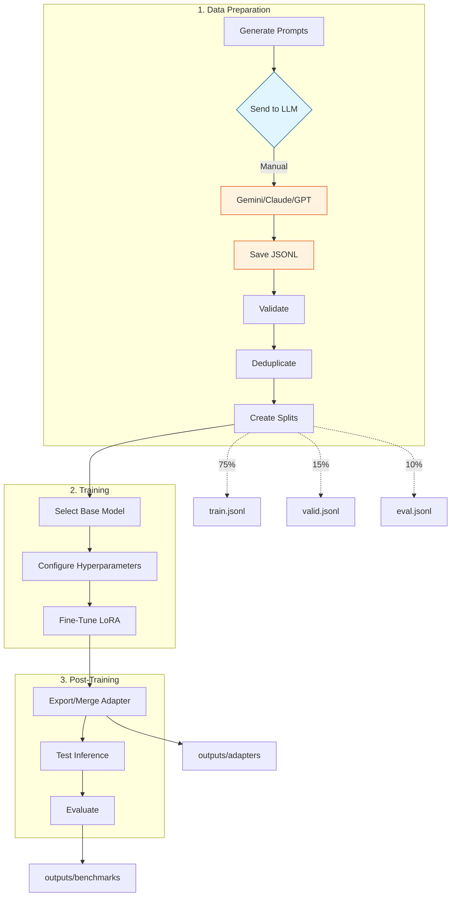

<!-- prettier-ignore -->
<div align="center">

# OCI Specialist LLM

Fine-tuning pipeline for an OCI specialist LLM using Apple Silicon, MLX, and LoRA.

[](LICENSE)
[](https://www.python.org)
[](https://mlx.ai)
[](docs/taxonomy.md)

</div>

> **Language**: [🇧🇷 PT-BR](README.md) | 🇺🇸 EN-US (secundário)

---

## Overview

This project builds an LLM specialized in Oracle Cloud Infrastructure (OCI). The pipeline prioritizes dataset quality, low cost, rigorous validation, and follows strict quality rules to ensure accurate and helpful responses.

The model is designed to assist with:
- Explaining OCI services, architecture, and best practices
- Troubleshooting OCI workloads
- Guiding migration from AWS, Azure, GCP, and on-premises to OCI
- Writing OCI Terraform configurations
- Providing security and IAM guidance

---

## Dataset

The dataset contains examples generated via MASTER_PROMPT. See `docs/taxonomy.md` for all topics.

| Category | Topics |
|----------|--------|
| OCI Core (compute, storage, networking, lb, database, container, serverless) | 20 |
| Security (iam-basics, policies, vault, encryption, cloud-guard, waf) | 9 |
| Migration (AWS/Azure/GCP/On-prem → OCI) | 14 |
| Terraform (provider, compute, storage, networking, lb, database, container, serverless, security, observability, devops, state) | 12 |
| Observability | 4 |
| Troubleshooting | 8 |
| DevOps | 4 |

> **Total: 71 topics × 10 examples = 710 examples**

### Data Format

Each example follows the OpenAI chat format:

```json
{
  "messages": [
    {"role": "system", "content": "You are an OCI specialist..."},
    {"role": "user", "content": "How do I configure..."},
    {"role": "assistant", "content": "## Solution\n\n### Steps..."}
  ],
  "metadata": {"category": "compute/instances", "difficulty": "intermediate", "source": "generated"}
}
```

---

## Quality Rules

We enforce strict quality rules to ensure dataset accuracy:

- **NEVER** copy OCI documentation verbatim
- **NEVER** invent non-existent Oracle services
- **NEVER** use prices or limits without marking as mutable
- **NEVER** create vague examples like "use best practices"
- **NEVER** generate architectural responses without steps, risks, or justifications

---

## Prerequisites

- **Apple Silicon Mac** (M1/M2/M3/M4) for MLX training
- **Python 3.12** (recommended via venv)

### Setup Virtual Environment

```bash
python3.12 -m venv venv
source venv/bin/activate
pip install -r requirements.txt
```

---

## Quick Start

### Generate Curated Data

Use **MASTER_PROMPT** with any external LLM (Gemini, Claude, GPT):

```bash
# List available topics
python scripts/generate_prompt.py --list

# Generate prompt for a specific topic
python scripts/generate_prompt.py compute/instances

# Generate ALL prompts at once
python scripts/generate_prompt.py --all
```

The generated prompt should be sent to an LLM, and the result saved to `data/curated/[topic]-001.jsonl`.

### Complete Pipeline

```bash
# 0. Activate virtual environment
source venv/bin/activate

# ========== 1. DATA PREPARATION ==========

# 1.1 Generate ALL prompts
python scripts/generate_prompt.py --all

# 1.2 Send to LLM and save to data/curated/
 - Read each file in tmp/prompt_*.md
 - Send to Gemini/Claude/GPT
 - Save result to data/curated/[topic]-001.jsonl

# 1.3 Concatenate all JSONL
cat data/curated/*.jsonl > data/all_curated.jsonl

# 1.4 Validate dataset
python3 scripts/validate_jsonl.py data/all_curated.jsonl --filter
mv data/all_curated_valid.jsonl data/all_curated.jsonl

# 1.5 Deduplicate
python3 scripts/dedupe_dataset.py data/all_curated.jsonl --remove

# 1.6 Create splits (train/valid/eval)
python3 scripts/build_dataset_fixed.py -i data/all_curated.jsonl -o data/

# ========== 2. TRAINING ==========

# 2.1 Select base model (default: mlx-community/Llama-3.2-3B-Instruct-4bit)
export MODEL="mlx-community/Llama-3.2-3B-Instruct-4bit"

# 2.2 Fine-Tune LoRA
bash training/train_mlx.sh

# ========== 3. POST-TRAINING ==========

# 3.1 Export/Merge adapter
bash training/export_adapter.sh

# 3.2 Test inference
bash training/run_inference.sh

# 3.3 Evaluate
python scripts/evaluate_model.py outputs/adapters data/eval.jsonl outputs/benchmarks
```

### Pipeline Flow


    B --> C{Send to LLM}
    C -->|Manual| D[Gemini/Claude/GPT]
    D --> E[Save JSONL]
    E --> F[Concatenate]
    F --> G[Validate]
    G --> H[Deduplicate]
    H --> I[Create Splits]
    I --> J[Train]
    J --> K[Evaluate]
    
    I -.->|75%| L[train]
    I -.->|15%| M[valid]
    I -.->|10%| N[eval]
    
    style C fill:#e1f5fe,stroke:#01579b
    style D fill:#fff3e0,stroke:#e65100
    style E fill:#fff3e0,stroke:#e65100
```

---

## Project Structure

```
olia-2-oci/
├── AGENTS.md                      # Agent guidelines
├── README.md                      # Portuguese version (default)
├── README.en-US.md                # English version
├── CONTRIBUTING.md                # Contributing guide
├── docs/                          # Project documentation
│   ├── taxonomy.md               # Dataset topics
│   ├── quality-rules.md          # Quality rules
│   └── eval-rubric.md            # Evaluation criteria
├── scripts/                      # Pipeline scripts
│   ├── generate_prompt.py       # Generate prompts for LLM
│   ├── validate_jsonl.py         # Validate JSONL format
│   ├── dedupe_dataset.py         # Remove duplicates
│   ├── build_dataset_fixed.py    # Create train/valid/eval splits
│   └── evaluate_model.py         # Run benchmarks
├── .agents/skills/               # Data generation skills
│   └── generate-oci-dataset/
│       ├── MASTER_FORMAT.md
│       └── prompts/              # Prompts per topic
└── training/                     # MLX training scripts
    ├── train_mlx.sh
    └── run_inference.sh
```

---

## Pipeline

1. **Documentation** → Scope, taxonomy, quality rules
2. **Data Generation** → MASTER_PROMPT + external LLM → curated/
3. **Validation** → JSONL validator, deduplication
4. **Dataset Building** → train (~75%), valid (~15%), eval (~10%)
5. **Training** → MLX LoRA fine-tuning on Apple Silicon
6. **Evaluation** → Benchmark comparing base vs fine-tuned

---

## Outputs

After training:

- `outputs/adapters/` - Trained LoRA adapters
- `outputs/benchmarks/` - Evaluation reports
- `outputs/logs/` - Training logs