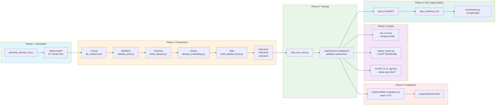

# OCI Specialist LLM

[🇺🇸 English](README.en-US.md) | [🇧🇷 Português](README.md)

Large Language Model (LLM) fine-tuned for Oracle Cloud Infrastructure (OCI) using Apple Silicon, MLX, and LoRA.

[](LICENSE)
[](https://www.python.org)
[](https://mlx.ai)
[](https://huggingface.co/mlx-community/Qwen2.5-Coder-7B-Instruct-4bit)
[](docs/taxonomy.md)

> **Language**: Data and prompts in Brazilian Portuguese (PT-BR).

---

## Overview

This project trains a specialized LLM for Oracle Cloud Infrastructure using Apple's MLX framework on Apple Silicon. The pipeline covers dataset generation, validation, fine-tuning via MLX LoRA, and integration with a RAG layer (OCI Copilot).



**Tech Stack**: Python 3.12, MLX 0.31.1, Qwen 2.5 Coder 7B, LangGraph, Chainlit, FAISS.

---

## Features

- **LoRA Fine-tuning**: Low-rank adaptation with **Qwen 2.5 Coder 7B Instruct** (4-bit) base model.
- **M3 Pro Optimized**: Hyper-optimized configurations for 18GB RAM, using **native BF16** and zero disk Swap.
- **Advanced Hybrid RAG**: Semantic (FAISS) + Lexical (BM25) search with local persistence and **Offline Ingestion**.
- **Multi-Agent System**: Orchestration via **LangGraph** (Router, Discovery, Architecture, Execution).
- **OCI Copilot Interface**: UI built with **Chainlit**, supporting file attachments, token streaming, and **Human-in-the-loop** for safe CLI commands.
- **Automated Evaluation**: Benchmark pipeline to measure technical accuracy, hallucination, and depth.

---

## Dataset

| Metric | Value |
|--------|-------|
| **Total Generated** | 21,750 examples (87 categories × 250) |
| **After Clean/Dedup** | 21,327 examples |
| **Train** | 15,995 examples (75%) |
| **Valid** | 3,199 examples (15%) |
| **Eval** | 2,133 examples (10%) |
| **Categories** | 87 OCI topics |

### Split

| Split | Examples | % |
|-------|----------|---|
| Train | 15,995 | 75% |
| Valid | 3,199 | 15% |
| Eval | 2,133 | 10% |

---

## Training

Training now uses the **Qwen 2.5 Coder 7B Instruct** (4-bit) model, optimized for maximum performance on Apple Silicon M3 Pro.

### Environment Preparation

```bash
python3.12 -m venv venv
source venv/bin/activate
pip install -r requirements.txt
```

### Execution

```bash
# Run the consolidated training cycle
bash training/run_all_cycles.sh --fresh
```

**Optimized Configuration** (`config/cycle-1.env`):

| Parameter | Value | Description |
|-----------|-------|-------------|
| **MODEL** | `Qwen2.5-Coder-7B-Instruct-4bit` | Superior code base |
| **NUM_LAYERS** | 14 | 50% of layers (Total: 28) |
| **BATCH_SIZE** | 1 | Agility in single sequences |
| **GRAD_ACCUM** | 4 | Effective batch size of 4 |
| **BF16** | true | Native hardware acceleration on M3 |
| **GRAD_CHECKPOINT**| false | Priority for speed (Tokens/sec) |
| **ITERS** | 4000 | Complete learning cycle |
| **MAX_SEQ** | 768 | Ideal context for OCI |

---

## Evaluation

The evaluation pipeline compares the fine-tuned model against the base model to ensure no catastrophic regressions occurred.

```bash
# Recommended Evaluation (200 stratified samples, ~30 min)
python scripts/unified_evaluation.py --cycle cycle-1 --mode medium --fresh

# Full Evaluation (2133 samples, ~4-6 hours)
python scripts/unified_evaluation.py --cycle cycle-1 --mode full --fresh
```

### Summary of Results (Initial)

| Metric | Base Model | Fine-Tuned | Delta |
|--------|-------------|------------|-------|
| technical_correctness | 3.40 | 3.40 | +0.00 |
| depth | 2.60 | 2.60 | +0.00 |
| structure | 3.93 | 4.23 | +0.30 |
| hallucination | 3.25 | 3.87 | +0.62 |
| clarity | 3.49 | 3.19 | -0.30 |
| **Overall** | **3.33** | **3.46** | **+0.12** |

---

## RAG (Retrieval-Augmented Generation)

OCI Copilot uses a persistent RAG layer to access real-time facts from Oracle documentation.

### RAG Setup

```bash
python3.12 -m venv venv-rag
source venv-rag/bin/activate
pip install -r requirements-rag.txt
pip install langgraph chainlit
```

### Offline Ingestion (Mandatory)
To save RAM, indices must be generated before starting the system:
```bash
python scripts/update_rag.py
```

### Module Structure
- `api.py`: FastAPI backend serving FAISS and BM25 indices.
- `orchestrator.py`: **LangGraph** orchestrator (Router -> Specialists -> Execution).
- `app_chainlit.py`: Visual interface with attachment support and manual command approval.

---

## Inference

After training, you can spin up the model for local or API use.

### MLX-LM API
```bash
mlx_lm.server --model mlx-community/Qwen2.5-Coder-7B-Instruct-4bit --adapter outputs/cycle-1/adapters
```

### OCI Copilot UI (Official)
```bash
# Start the full ecosystem
# Terminal 1:
uvicorn rag.api:app --port 8000
# Terminal 2:
chainlit run rag/app_chainlit.py
```

---

## Benchmark

### Metrics Comparison


### Performance by Category


### Top Gains
1. **Troubleshooting Functions**: +0.65
2. **Networking VCN**: +0.62
3. **Storage File**: +0.57
4. **Troubleshooting Compute**: +0.57
5. **Migration Azure Storage**: +0.55

---

## Roadmap

The following improvements are planned:

1. **OpenRouter Integration**: Routing to frontier models (Claude/GPT-4) for complex tasks.
2. **Hugging Face Hub Export**: Publishing trained adapters.

---

## Acknowledgments

This project was developed by integrating the following cutting-edge technologies:

- **Hardware**: Apple Silicon (M3 Pro) with Unified Memory.
- **Training and Inference**: [MLX Framework](https://mlx.ai) and MLX-Tune.
- **Base Model**: [Qwen 2.5 Coder 7B Instruct](https://huggingface.co/Qwen/Qwen2.5-Coder-7B-Instruct) (Alibaba Cloud).
- **Agent Orchestration**: [LangGraph](https://python.langchain.com/docs/langgraph) and [LangChain](https://langchain.com).
- **User Interface**: [Chainlit](https://chainlit.io).
- **Backend Services**: [FastAPI](https://fastapi.tiangolo.com).
- **Search Engines (RAG)**: FAISS (Dense) and Rank-BM25 (Sparse).
- **Embeddings and Re-ranking**: [Hugging Face](https://huggingface.co) and Sentence-Transformers.
- **Data**: Synthesized and validated specifically for Oracle Cloud Infrastructure (OCI) scenarios.

---

## License

This project is licensed under the MIT License. See the [LICENSE](LICENSE) file for details.
