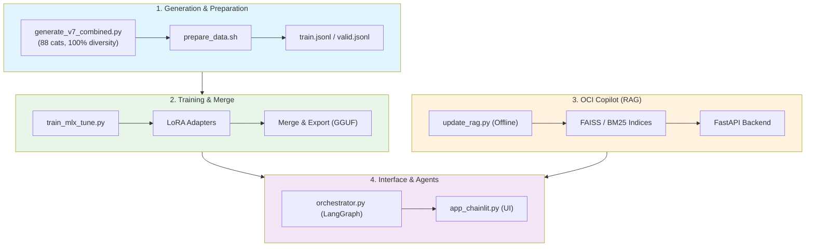
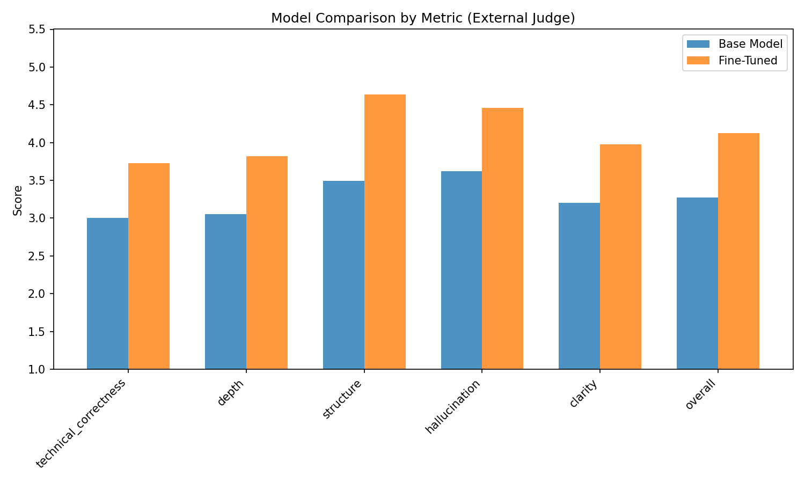
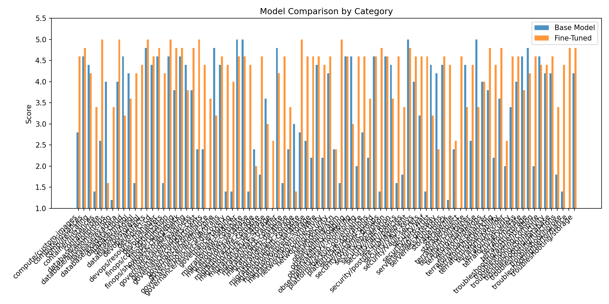

# OCI Specialist LLM

[🇺🇸 English](README.en-US.md) | [🇧🇷 Português](README.md)

Large Language Model (LLM) fine-tuned for Oracle Cloud Infrastructure (OCI) using Apple Silicon, MLX, and LoRA.

[](LICENSE)
[](https://www.python.org)
[](https://mlx.ai)
[](https://github.com/Aaronipher/mlx-tune)
[](https://huggingface.co/mlx-community/Qwen2.5-Coder-7B-Instruct-4bit)
[](docs/taxonomy.md)
[](https://python.langchain.com/docs/langgraph)
[](https://chainlit.io)
[](https://fastapi.tiangolo.com)
[](https://github.com/facebookresearch/faiss)
[](https://github.com/dorianbrown/rank_bm25)
[](https://www.sbert.net/docs/pretrained_models.html#cross-encoders)
[](https://huggingface.co)

---

> **Language**: Data and prompts in Brazilian Portuguese (PT-BR).

### 🚀 Core Stack & Components
- **Base LLM**: [Qwen 2.5 Coder 7B Instruct](https://huggingface.co/Qwen/Qwen2.5-Coder-7B-Instruct) (4-bit).
- **Agent Orchestration**: [LangGraph](https://python.langchain.com/docs/langgraph) & [LangChain](https://langchain.com).
- **OCI Copilot Interface**: [Chainlit](https://chainlit.io) (Interactive UI with HITL).
- **Training & Inference**: [MLX Framework](https://mlx.ai) & [MLX-Tune](https://github.com/Aaronipher/mlx-tune).
- **RAG (Hybrid Search)**: [FAISS](https://github.com/facebookresearch/faiss) (Dense) + [Rank-BM25](https://github.com/dorianbrown/rank_bm25) (Sparse).
- **Backend Service**: [FastAPI](https://fastapi.tiangolo.com) (RAG API).
- **Embeddings & Rerank**: [Hugging Face](https://huggingface.co) & [Sentence-Transformers](https://sbert.net).
- **Hardware**: Optimized for Apple Silicon (M3 Pro 18GB).
- **Language**: Python 3.12.

---

## Overview

The OCI Specialist LLM development process follows a strict pipeline order to ensure technical accuracy and performance on Apple Silicon.



---

## Features

- **LoRA Fine-tuning**: Low-rank adaptation with **Qwen 2.5 Coder 7B Instruct** (4-bit) base model.
- **M3 Pro Optimized**: Hyper-optimized configurations for 18GB RAM, using **native BF16** and zero disk Swap.
- **Advanced Hybrid RAG**: Semantic (FAISS) + Lexical (BM25) search with local persistence and **Offline Ingestion**.
- **Query Rewriting**: Automatic query expansion via LLM for better recall.
- **Multi-Query Expansion**: Generation of 3-5 variations of the original query.
- **Cross-Encoder Re-ranking**: Result re-ordering post-RRF.
- **Re-ranking by Type**: Configurable strategy per query type (migration, troubleshooting, etc).
- **Intelligent Chunking**: Split by sections and headings, not just tokens.
- **Metadata Extraction**: Automatic extraction of OCI service, version and category.
- **Incremental Update**: Indexing new docs without full rebuild.
- **Intent Classification via Embeddings**: Real intent classification (not mock).
- **Tool Calling**: Agents with tools via @tool decorator and Pydantic.
- **Session Management**: Persisted sessions with history and context window.
- **Rate Limiting**: User access control via token bucket.
- **HITL**: Human-in-the-loop for destructive commands.
- **Streaming SSE**: Real-time token streaming via Server-Sent Events.
- **Agent Fallback**: Redundancy when agent fails.
- **Structured Logging**: JSON logging with trace_id per request.
- **Metrics**: Latency P50/P95/P99 + health checks.
- **Multi-Agent System**: Orchestration via **LangGraph** (Router, Discovery, Architecture, Execution, Troubleshooting, etc).
- **OCI Copilot Interface**: UI built with **Chainlit**, supporting file attachments, token streaming, and **Human-in-the-loop** for safe CLI commands.
- **Action Buttons**: Action buttons for OCI CLI and Terraform in UI.
- **Merge & Export**: Pipeline to fuse LoRA adapters into the base model and export to GGUF format (local quantization).
- **Automated Evaluation**: Benchmark pipeline to measure technical accuracy, hallucination, and depth.

---

## Dataset

| Metric | Value |
|--------|-------|
| **Total Generated** | 13,200 examples (88 categories × 150) |
| **After Cleaning** | 14,940 examples |
| **After Dedup** | 13,196 examples |
| **Train** | 9,897 examples (75%) |
| **Valid** | 1,979 examples (15%) |
| **Eval** | 1,320 examples (10%) |
| **Categories** | 88 OCI topics |

---

## Installation and Getting Started

> [!IMPORTANT]
> **All commands in this project must be executed from the project root directory.**
> **Remember to activate the correct virtual environment with `source venv/bin/activate` or `source venv-rag/bin/activate` before running any command.**

### 1. Clone the Repository

```bash
git clone https://github.com/otavio-lemos/olia-2-oci.git
cd olia-2-oci
```

### 2. Training Environment (LLM)

```bash
python3.12 -m venv venv
source venv/bin/activate
pip install -r requirements.txt
```

### 3. OCI Copilot Environment (RAG)

```bash
python3.12 -m venv venv-rag
source venv-rag/bin/activate
pip install -r requirements-rag.txt
```

---

## Dataset Preparation

Pipeline to validate, clean, deduplicate, and generate dataset splits.

### Full Flow


### Dataset Generation

Generates examples using templates with real OCI CLI commands and varied intents. Fast, free, no internet dependency.

```bash
# Generate dataset (88 categories × 180 examples = 15,840)
python scripts/generate_v7_combined.py
```

### Final Step — Validate, Clean and Generate Splits

After generating examples, run the preparation pipeline:

```bash
# Validate, clean, deduplicate and generate splits (75/15/10%)
bash scripts/prepare_data.sh
```

### Pipeline Scripts

| Script | Function | Input | Output |
|--------|---------|-------|--------|
| `validate_jsonl.py` | Validates JSONL structure (messages schema) | `all_curated.jsonl` | `all_curated.jsonl` (or fails) |
| `clean_dataset.py` | Removes generic templates, incorrect CLI, noise | `all_curated.jsonl` | `all_curated_clean.jsonl` |
| `dedupe_embedding.py` | Semantic deduplication by embeddings (threshold 0.97) | `all_curated_clean.jsonl` | `all_curated_semantic_dedup.jsonl` |
| `build_dataset_fixed.py` | Generates splits (75% train, 15% valid, 10% eval) | `all_curated_semantic_dedup.jsonl` | `train.jsonl`, `valid.jsonl`, `eval.jsonl` |

---

## Training

Training uses the MLX-Tune framework, focused on Apple Silicon architecture.

### 1. Run Training (Fine-Tuning)

> [!NOTE]
> Run with **venv** environment activated: `source venv/bin/activate`

```bash
# Run the consolidated training cycle
bash training/run_cycles.sh --all --fresh
```

### 2. Weight Fusion (Merge) & Export

> [!NOTE]
> Run with **venv** environment activated: `source venv/bin/activate`

After generating LoRA adapters, merge with the base model for inference use.

```bash
# Merge and export to GGUF Q4
python scripts/merge_export.py --cycle cycle-1 --quant q4 --name oci-specialist
```

---

## Evaluation

The evaluation pipeline compares the fine-tuned model against the base model using:
- **Automatic scoring**: Correctness, Depth, Structure, Hallucination, Clarity
- **Semantic similarity**: Sentence Transformers (MiniLM-L6-v2)
- **Judge (optional)**: LLM-as-Judge using different model (e.g., Llama 3.1 8B) for unbiased evaluation

> [!NOTE]
> Run with **venv** environment activated: `source venv/bin/activate`

### 1. Generate Quantized Models (Prerequisite)

Before evaluating, generate quantized models with merge_export:

```bash
# Generate quantized versions of merged model
# Creates: safetensors/bf16/, safetensors/q4/
python scripts/merge_export.py --cycle cycle-1 --quant q4
```

### 2. Run Evaluation

```bash
# Quick Evaluation (10 samples) - specific model required
python scripts/unified_evaluation_v4.py --cycle cycle-1 --ft-model outputs/cycle-1/safetensors/q4 --mode small --fresh

# Full Evaluation (1320 samples)
python scripts/unified_evaluation_v4.py --cycle cycle-1 --ft-model outputs/cycle-1/safetensors/q4 --mode full --fresh

# Evaluation with Judge (LLM-as-Judge using different model)
python scripts/unified_evaluation_v4.py --cycle cycle-1 --ft-model outputs/cycle-1/safetensors/q4 --mode medium --external-judge --judge-lang pt --judge-tokens 800 --max-tokens 768
```

Results: see [Benchmark](#benchmark)

---

## RAG (Retrieval-Augmented Generation)

OCI Copilot uses a persistent RAG layer to access facts from Oracle documentation.

### 1. Offline Ingestion (Mandatory)
> [!NOTE]
> Run with **venv-rag** environment activated: `source venv-rag/bin/activate`

To save RAM during chat, indices must be generated offline:
```bash
python scripts/update_rag.py
```

### 2. Orchestration and Agents
The ecosystem is orchestrated via **LangGraph** and served via **FastAPI**.

**Start Backend API (RAG Indices):**
> [!NOTE]
> Run with **venv-rag** environment activated: `source venv-rag/bin/activate`

```bash
uvicorn rag.api:app --host 0.0.0.0 --port 8000
```

**Start Orchestrator and UI (Copilot Interface):**
> [!NOTE]
> Run with **venv-rag** environment activated: `source venv-rag/bin/activate`

```bash
chainlit run rag/app_chainlit.py --port 8001
```

---

## Inference and UI

Local inference is performed using the model after the **Merge** process.

### 1. Inference Servers

#### MLX (Recommended - Apple Silicon)
> [!TIP]
> Recommended for Apple Silicon. Local inference via MLX with LoRA adapter.

> [!NOTE]
> Run with **venv** environment activated: `source venv/bin/activate`

```bash
mlx_lm.server --model mlx-community/Qwen2.5-Coder-7B-Instruct-4bit --adapter outputs/cycle-1/adapters
```

#### Ollama
```bash
# 1. Create Modelfile
cat > ./outputs/cycle-1/gguf/Modelfile << 'EOF'
FROM ./oci-specialist-Q4_K_M.gguf
PARAMETER temperature 0.1
PARAMETER top_p 0.9
PARAMETER top_k 40
SYSTEM You are an OCI (Oracle Cloud Infrastructure) specialist.
EOF

# 2. Create model
ollama create oci-specialist -f ./outputs/cycle-1/gguf/Modelfile

# 3. Start server in background
ollama serve &

# 4. Load model into memory
curl http://localhost:11434/api/generate -d '{"model": "oci-specialist", "keep_alive": -1}'
```

#### llama.cpp
```bash
llama-server -m outputs/cycle-1/gguf/oci-specialist-Q4_K_M.gguf --port 8080
```

### 2. OCI Copilot UI
> [!NOTE]
> Run with **venv-rag** environment activated: `source venv-rag/bin/activate`

With the RAG backend running, start the visual interface:
```bash
chainlit run rag/app_chainlit.py --port 8001
```

---

## Benchmark

### External Judge Evaluation (mlx-community/Meta-Llama-3.1-8B-Instruct-4bit) - 200 samples

| Metric | Base Model | Fine-Tuned | Delta |
|--------|-------------|------------|-------|
| technical_correctness | 3.00 | 3.73 | **+0.72** |
| depth | 3.06 | 3.82 | **+0.76** |
| structure | 3.50 | 4.63 | **+1.14** |
| hallucination | 3.62 | 4.46 | **+0.84** |
| clarity | 3.20 | 3.98 | **+0.77** |
| **Overall** | **3.27** | **4.12** | **+0.85** |

### How to Evaluate
To generate new benchmark reports, use the commands detailed in the [Evaluation](#evaluation) section.

### Metrics Comparison


### Performance by Category


### Top Gains by Topic (Top 5)
1. **Storage Object**: +3.60
2. **Troubleshooting Performance**: +3.80
3. **Observability APM**: +3.40
4. **Security Dynamic Groups**: +3.40
5. **Database PostgreSQL**: +3.40

### Detailed Category Results (88 Topics)

<details>
<summary>Click to expand the performance by category table</summary>
<sub>

| # | Category | Base | FT | Delta |
---|----------|------|----|-------|
| 1 | compute/custom-images | 2.80 | 4.60 | +1.80 |
| 2 | compute/instances | 4.60 | 4.80 | +0.20 |
| 3 | compute/scaling | 4.40 | 4.20 | -0.20 |
| 4 | container/instances | 1.40 | 3.40 | +2.00 |
| 5 | container/oke | 2.60 | 5.00 | +2.40 |
| 6 | database/autonomous | 4.00 | 1.60 | -2.40 |
| 7 | database/autonomous-json | 1.20 | 3.40 | +2.20 |
| 8 | database/exadata | 4.00 | 5.00 | +1.00 |
| 9 | database/exadata-cloud | 4.60 | 3.20 | -1.40 |
| 10 | database/mysql | 4.20 | 3.60 | -0.60 |
| 11 | database/nosql | 1.60 | 4.20 | +2.60 |
| 12 | database/postgresql | 1.00 | 4.40 | +3.40 |
| 13 | devops/artifacts | 4.80 | 5.00 | +0.20 |
| 14 | devops/ci-cd | 4.40 | 4.60 | +0.20 |
| 15 | devops/resource-manager | 4.60 | 4.80 | +0.20 |
| 16 | devops/secrets | 1.60 | 4.20 | +2.60 |
| 17 | finops/cost-optimization | 4.60 | 5.00 | +0.40 |
| 18 | finops/rightsizing | 3.80 | 4.80 | +1.00 |
| 19 | finops/showback-chargeback | 4.60 | 4.80 | +0.20 |
| 20 | finops/storage-tiering | 4.40 | 3.80 | -0.60 |
| 21 | governance/audit-readiness | 3.80 | 4.80 | +1.00 |
| 22 | governance/budgets-cost | 2.40 | 5.00 | +2.60 |
| 23 | governance/compartments | 2.40 | 4.40 | +2.00 |
| 24 | governance/compliance | 1.00 | 3.60 | +2.60 |
| 25 | governance/landing-zone | 4.80 | 3.20 | -1.60 |
| 26 | governance/policies-guardrails | 4.40 | 4.60 | +0.20 |
| 27 | governance/resource-discovery | 1.40 | 4.40 | +3.00 |
| 28 | governance/tagging | 1.40 | 4.00 | +2.60 |
| 29 | lb/load-balancer | 5.00 | 4.60 | -0.40 |
| 30 | migration/aws-compute | 5.00 | 4.60 | -0.40 |
| 31 | migration/aws-database | 1.40 | 4.40 | +3.00 |
| 32 | migration/aws-storage | 2.40 | 2.00 | -0.40 |
| 33 | migration/azure-compute | 1.80 | 4.60 | +2.80 |
| 34 | migration/azure-database | 3.60 | 3.00 | -0.60 |
| 35 | migration/azure-storage | 0.80 | 2.60 | +1.80 |
| 36 | migration/data-transfer | 4.80 | 4.20 | -0.60 |
| 37 | migration/gcp-compute | 1.60 | 4.60 | +3.00 |
| 38 | migration/gcp-database | 2.40 | 3.40 | +1.00 |
| 39 | migration/gcp-storage | 3.00 | 1.40 | -1.60 |
| 40 | migration/onprem-compute | 2.80 | 5.00 | +2.20 |
| 41 | migration/onprem-database | 2.60 | 4.60 | +2.00 |
| 42 | migration/onprem-storage | 2.20 | 4.60 | +2.40 |
| 43 | migration/onprem-vmware | 4.40 | 4.60 | +0.20 |
| 44 | networking/connectivity | 2.20 | 4.40 | +2.20 |
| 45 | networking/security | 4.20 | 4.60 | +0.40 |
| 46 | networking/vcn | 2.40 | 2.40 | +0.00 |
| 47 | observability/apm | 1.60 | 5.00 | +3.40 |
| 48 | observability/logging | 4.60 | 4.60 | +0.00 |
| 49 | observability/monitoring | 4.60 | 3.00 | -1.60 |
| 50 | observability/stack-monitoring | 2.00 | 4.60 | +2.60 |
| 51 | platform/backup-governance | 2.80 | 4.60 | +1.80 |
| 52 | platform/sre-operations | 2.20 | 3.60 | +1.40 |
| 53 | security/cloud-guard | 4.60 | 4.60 | +0.00 |
| 54 | security/dynamic-groups | 1.40 | 4.80 | +3.40 |
| 55 | security/encryption | 4.60 | 4.60 | +0.00 |
| 56 | security/federation | 4.40 | 3.60 | -0.80 |
| 57 | security/iam-basics | 1.60 | 4.60 | +3.00 |
| 58 | security/policies | 1.80 | 3.40 | +1.60 |
| 59 | security/posture-management | 5.00 | 4.80 | -0.20 |
| 60 | security/vault-keys | 4.00 | 4.60 | +0.60 |
| 61 | security/vault-secrets | 3.20 | 4.60 | +1.40 |
| 62 | security/waf | 1.40 | 4.60 | +3.20 |
| 63 | security/zero-trust | 4.40 | 3.20 | -1.20 |
| 64 | serverless/api-gateway | 4.20 | 2.40 | -1.80 |
| 65 | serverless/functions | 4.40 | 4.60 | +0.20 |
| 66 | storage/block | 1.20 | 4.40 | +3.20 |
| 67 | storage/file | 2.40 | 2.60 | +0.20 |
| 68 | storage/object | 1.00 | 4.60 | +3.60 |
| 69 | terraform/compute | 4.40 | 3.40 | -1.00 |
| 70 | terraform/container | 2.60 | 4.40 | +1.80 |
| 71 | terraform/database | 5.00 | 3.40 | -1.60 |
| 72 | terraform/devops | 4.00 | 4.00 | +0.00 |
| 73 | terraform/load-balancer | 3.80 | 4.80 | +1.00 |
| 74 | terraform/networking | 2.20 | 4.40 | +2.20 |
| 75 | terraform/observability | 3.60 | 4.80 | +1.20 |
| 76 | terraform/provider | 2.00 | 2.60 | +0.60 |
| 77 | terraform/security | 3.40 | 4.60 | +1.20 |
| 78 | terraform/serverless | 4.00 | 4.60 | +0.60 |
| 79 | terraform/state | 4.60 | 3.80 | -0.80 |
| 80 | terraform/storage | 4.80 | 4.20 | -0.60 |
| 81 | troubleshooting/authentication | 2.00 | 4.60 | +2.60 |
| 82 | troubleshooting/compute | 4.60 | 4.40 | -0.20 |
| 83 | troubleshooting/connectivity | 4.20 | 4.40 | +0.20 |
| 84 | troubleshooting/database | 4.20 | 4.60 | +0.40 |
| 85 | troubleshooting/functions | 1.80 | 3.40 | +1.60 |
| 86 | troubleshooting/oke | 1.40 | 4.40 | +3.00 |
| 87 | troubleshooting/performance | 1.00 | 4.80 | +3.80 |
| 88 | troubleshooting/storage | 4.20 | 4.80 | +0.60 |

</sub>
</details>

---

## Hugging Face Hub

The trained model and dataset are available on Hugging Face:

| Resource | URL |
|----------|-----|
| **Safetensors** | https://huggingface.co/otavio-lemos/oci-copilot-jr-safetensors |
| **GGUF** | https://huggingface.co/otavio-lemos/oci-copilot-jr-gguf |
| **Dataset** | https://huggingface.co/datasets/otavio-lemos/oci-copilot-jr-dataset |

### Model Files (Safetensors)
- `adapters/` - LoRA adapters Cycle 1
- `safetensors/bf16/` - Model in BF16
- `safetensors/q4/` - Model quantized Q4

### Model Files (GGUF)
- `oci-specialist-Q4_K_M.gguf` - Version quantized Q4 (4.6GB)
- `oci-specialist-FP16.gguf` - Version FP16 (~15GB)
- `eval_results.json` - Evaluation results

### Dataset
- `train.jsonl` - 9,897 examples
- `valid.jsonl` - 1,979 examples  
- `eval.jsonl` - 1,320 examples

---

## Roadmap

The following improvements are planned:

1. **OpenRouter Integration**: Routing to frontier models (Claude/GPT-4) for complex tasks.
2. **Hugging Face Hub Export**: Publishing trained adapters and quantized models.

---

## Acknowledgments

This project was developed by integrating the following cutting-edge technologies:

- **Hardware**: Apple Silicon (M3 Pro) with Unified Memory.
- **Training and Inference**: [MLX Framework](https://mlx.ai) and [MLX-Tune](https://github.com/Aaronipher/mlx-tune).
- **Base Model**: [Qwen 2.5 Coder 7B Instruct](https://huggingface.co/Qwen/Qwen2.5-Coder-7B-Instruct) (Alibaba Cloud).
- **Agent Orchestration**: [LangGraph](https://python.langchain.com/docs/langgraph) and [LangChain](https://langchain.com).
- **User Interface**: [Chainlit](https://chainlit.io).
- **Backend Services**: [FastAPI](https://fastapi.tiangolo.com).
- **Search Engines (RAG Hybrid)**: [FAISS](https://github.com/facebookresearch/faiss) (Dense) and [Rank-BM25](https://github.com/dorianbrown/rank_bm25) (Sparse).
- **Embeddings and Re-ranking**: [Hugging Face](https://huggingface.co) and [Sentence-Transformers](https://sbert.net).
- **Development**: [Python 3.12](https://www.python.org).
- **Data**: Synthesized and validated specifically for Oracle Cloud Infrastructure (OCI) scenarios.

---

## License

This project is licensed under the MIT License. See the [LICENSE](LICENSE) file for details.
