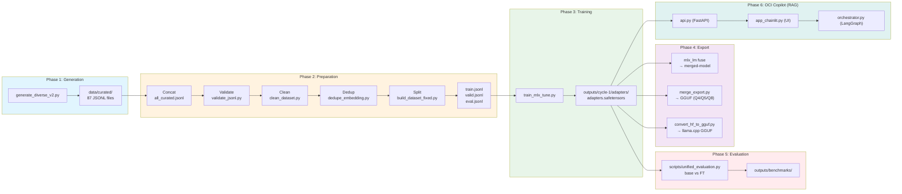

# OCI Specialist LLM

[🇺🇸 English](README.en-US.md) | [🇧🇷 Português](README.md)

Large Language Model (LLM) fine-tuned for Oracle Cloud Infrastructure (OCI) using Apple Silicon, MLX, and LoRA.

[](LICENSE)
[](https://www.python.org)
[](https://mlx.ai)
[](https://huggingface.co/mlx-community/Qwen2.5-Coder-7B-Instruct-4bit)
[](docs/taxonomy.md)

> **Language**: Data and prompts in Brazilian Portuguese (PT-BR).

---

## Overview

This project trains a specialized LLM for Oracle Cloud Infrastructure using Apple's MLX framework on Apple Silicon. The pipeline covers dataset generation, validation, MLX LoRA fine-tuning, and integration with a RAG layer (OCI Copilot).



**Tech Stack**: Python 3.12, MLX 0.31.1, Qwen 2.5 Coder 7B, LangGraph, Chainlit, FAISS.

---

## Features

- **LoRA Fine-tuning**: Low-rank adaptation with Qwen 2.5 Coder 7B (4-bit) base model.
- **M3 Pro Optimized**: Hyper-optimized settings for 18GB RAM, using native BF16 and zero Swap.
- **Hybrid RAG**: Semantic (FAISS) + Lexical (BM25) search with disk persistence and Offline Ingestion.
- **Multi-Agent**: Orchestration via LangGraph (Router, Discovery, Architecture, Execution).
- **Advanced UI**: Chainlit interface with support for attachments, streaming, and Human-in-the-loop for CLI commands.

---

## Dataset

| Metric | Value |
|--------|-------|
| **Total Generated** | 21,750 examples (87 categories × 250) |
| **After Clean/Dedup** | 21,327 examples |
| **Train** | 15,995 examples (75%) |
| **Valid** | 3,199 examples (15%) |
| **Eval** | 2,133 examples (10%) |
| **Categories** | 87 OCI topics |

### Split

| Split | Examples | % |
|-------|----------|---|
| Train | 15,995 | 75% |
| Valid | 3,199 | 15% |
| Eval | 2,133 | 10% |

---

## Getting Started

### 1. Training Environment (LLM)

```bash
python3.12 -m venv venv
source venv/bin/activate
pip install -r requirements.txt
```

### 2. OCI Copilot Environment (RAG)

```bash
python3.12 -m venv venv-rag
source venv-rag/bin/activate
pip install -r requirements-rag.txt
pip install langgraph chainlit
```

### Quick Start

```bash
# 1. Prepare data
bash scripts/prepare_data.sh

# 2. Ingest Documentation (RAG Offline)
python scripts/update_rag.py

# 3. Train Model
bash training/run_all_cycles.sh --fresh

# 4. Start Interface
# Terminal 1: RAG API
uvicorn rag.api:app --port 8000
# Terminal 2: Copilot UI
chainlit run rag/app_chainlit.py
```

---

## Training

Training uses the **Qwen 2.5 Coder 7B Instruct** (4-bit) model, optimized for the M3 Pro chip.

```bash
bash training/run_all_cycles.sh --fresh
```

**Current Configuration** (`config/cycle-1.env`):

| Parameter | Value |
|-----------|-------|
| MODEL | mlx-community/Qwen2.5-Coder-7B-Instruct-4bit |
| NUM_LAYERS | 14 |
| BATCH_SIZE | 1 |
| GRADIENT_ACCUMULATION | 4 |
| BF16 | true |
| GRADIENT_CHECKPOINTING | false |
| ITERS | 4000 |
| MAX_SEQ_LENGTH | 768 |
| LEARNING_RATE | 2e-4 |
| LORA_RANK | 8 |
| LORA_ALPHA | 16 |

---

## OCI Copilot (RAG)

The RAG system now operates persistently and orchestrated.

### Offline Ingestion
To save RAM, generate indices before use:
```bash
python scripts/update_rag.py
```

### LangGraph Orchestration
The `rag/orchestrator.py` file manages the flow between agents:
- **Router**: Classifies user intent.
- **Specialists**: Query RAG with dynamic weights (Hybrid).
- **Execution**: Generates commands and waits for manual approval (HITL).

---

## Inference and UI

The official interface is **Chainlit**, accessible at `http://localhost:8000` after starting the script.

```bash
chainlit run rag/app_chainlit.py -w
```

---

## Roadmap

1. ~~**Implement RAG**~~ ✅ **COMPLETED**
2. ~~**Migrate to Qwen 2.5 Coder**~~ ✅ **COMPLETED**
3. **Hugging Face Hub Integration**: Upload adapters and GGUF models.

---

## License

This project is licensed under the MIT License.

---

## Evaluation Summary (Initial Results)

| Metric | Base Model | Fine-Tuned (Cycle 1) | Delta |
|--------|-------------|------------|-------|
| technical_correctness | 3.40 | 3.40 | +0.00 |
| depth | 2.60 | 2.60 | +0.00 |
| structure | 3.93 | 4.23 | +0.30 |
| hallucination | 3.25 | 3.87 | +0.62 |
| clarity | 3.49 | 3.19 | -0.30 |
| overall | 3.33 | 3.46 | +0.12 |
