<!-- prettier-ignore -->
<div align="center">

# OCI Specialist LLM

Fine-tuning pipeline for an OCI specialist LLM using Apple Silicon, MLX, and LoRA.

[](LICENSE)
[](https://www.python.org)
[](https://mlx.ai)
[](https://huggingface.co/mlx-community/Llama-3.2-3B-Instruct-4bit)
[](docs/taxonomy.md)

</div>

> **Language**: [🇧🇷 PT-BR](README.md) | 🇺🇸 EN-US (secondary)

---

## Overview

This project builds an LLM specialized in Oracle Cloud Infrastructure (OCI). The pipeline prioritizes dataset quality, low cost, rigorous validation, and follows strict quality rules to ensure accurate and helpful responses.

The model is designed to assist with:
- Explaining OCI services, architecture, and best practices
- Troubleshooting OCI workloads
- Guiding migration from AWS, Azure, GCP, and on-premises to OCI
- Writing OCI Terraform configurations
- Providing security and IAM guidance

---

## Training Results

Multi-cycle training with decreasing learning rate completed successfully:

| Cycle | LR | Iters | Val Loss | Train Loss | Mode |
|-------|-----|-------|----------|------------|------|
| cycle-1 | 5e-5 | 200 | 0.163 | 0.161 | From scratch |
| cycle-2 | 1e-5 | 200 | 0.119 | 0.104 | Continues cycle-1 |
| cycle-3 | 5e-6 | 200 | **0.114** | **0.089** | Continues cycle-2 (best) |

**Best adapter**: `outputs/cycle-3/adapters.safetensors` (lowest val loss: 0.114)
**Merged model**: `outputs/merged-model/` (~1.8GB)

### Training Progression

```
Val Loss:  0.163 → 0.119 → 0.114  (30% improvement)
Train Loss: 0.161 → 0.104 → 0.089  (45% improvement)
```

> **Note**: The results above are from the last training executed.
> After each new training and evaluation, this section is automatically updated with real data.

### Real-Time Monitoring

During training and evaluation, progress is automatically pushed to GitHub every 50 steps/examples:

**During training:**
- [`outputs/logs/cycle-N/training-progress.md`](outputs/logs/) — formatted summary
- [`outputs/logs/cycle-N/metrics.csv`](outputs/logs/) — raw metrics (step, train_loss, val_loss)

**During evaluation:**
- [`outputs/benchmarks/eval-progress-NNNNN.md`](outputs/benchmarks/) — base vs fine-tuned comparison report

**Direct links:**
- [outputs/benchmarks/](https://github.com/otavio-lemos/olia-2-oci/tree/main/outputs/benchmarks/)
- [outputs/logs/](https://github.com/otavio-lemos/olia-2-oci/tree/main/outputs/logs/)

> After training and evaluation completion, the README is updated with final results.

---

## Dataset

The dataset contains 9,940 unique examples generated with structural diversity and rigorous validation.

| Metric | Value |
|--------|-------|
| **Total Examples** | 9,940 |
| **Categories** | 71 OCI topics |
| **Examples per Category** | 140 |
| **Duplicates** | 0 (exact + near) |
| **Fake CLI Commands** | 0 |
| **Fake SDK Classes** | 0 |
| **Fake TF Resources** | 0 |

### Split Distribution

| Split | Examples | Percentage |
|-------|----------|------------|
| Train | 7,455 | 75.0% |
| Valid | 1,491 | 15.0% |
| Eval | 994 | 10.0% |
| **Total** | **9,940** | **100%** |

### Difficulty Distribution (Train)

| Difficulty | Count | Percentage |
|------------|-------|------------|
| Beginner | 2,223 | 29.8% |
| Intermediate | 3,731 | 50.0% |
| Advanced | 1,501 | 20.1% |

### Categories by Group

| Group | Topics | Examples |
|-------|--------|----------|
| OCI Core (compute, storage, networking, lb, database, container, serverless) | 20 | 2,800 |
| Security (iam-basics, policies, vault, encryption, cloud-guard, waf) | 9 | 1,260 |
| Migration (AWS/Azure/GCP/On-prem → OCI) | 14 | 1,960 |
| Terraform (provider, compute, storage, networking, lb, database, container, serverless, security, observability, devops, state) | 12 | 1,680 |
| Observability | 4 | 560 |
| Troubleshooting | 8 | 1,120 |
| DevOps | 4 | 560 |

### Data Format

Each example follows the JSON chat format:

```json
{
  "messages": [
    {"role": "system", "content": "You are an OCI specialist..."},
    {"role": "user", "content": "How do I configure..."},
    {"role": "assistant", "content": "## Solution\n\n### Steps..."}
  ],
  "metadata": {"category": "compute/instances", "difficulty": "intermediate", "source": "generated"}
}
```

---

## Quality Rules

We enforce strict quality rules to ensure dataset accuracy:

- **NEVER** copy OCI documentation verbatim
- **NEVER** invent non-existent Oracle services
- **NEVER** use prices or limits without marking as mutable
- **NEVER** create vague examples like "use best practices"
- **NEVER** generate architectural responses without steps, risks, or justifications
- **ALWAYS** validate JSONL before export
- **ALWAYS** use verified CLI, SDK, and Terraform commands

---

## Prerequisites

- **Apple Silicon Mac** (M1/M2/M3/M4) for MLX training
- **Python 3.12** (recommended via venv)

### Setup Virtual Environment

```bash
python3.12 -m venv venv
source venv/bin/activate
pip install -r requirements.txt
```

---

## Quick Start

### Complete Pipeline

```bash
# 0. Activate virtual environment
source venv/bin/activate

# ========== 1. DATA PREPARATION ==========

# 1.1 Concatenate all curated JSONL files
cat data/curated/*.jsonl > data/all_curated.jsonl

# 1.2 Validate dataset
python scripts/validate_jsonl.py data/all_curated.jsonl

# 1.3 Deduplicate
python scripts/dedupe_dataset.py data/all_curated.jsonl --remove

# 1.4 Create splits (train/valid/eval)
python scripts/build_dataset_fixed.py --input data/all_curated.jsonl

# Or use the complete script that does all of the above:
# bash scripts/prepare_data.sh

# ========== 2. TRAINING ==========

# 2.1 Multi-cycle training (recommended)
bash training/run_all_cycles.sh

# ========== 3. POST-TRAINING ==========

# 3.1 Export/Merge adapter (uses venv automatically)
# Check which cycle has lowest val loss in outputs/logs/cycle-*/metrics.csv
# cycle-3 is the best from current training (val loss: 0.114)
ADAPTER_DIR=outputs/cycle-3 bash training/export_adapter.sh

# 3.2 Test inference
bash training/run_inference.sh

# 3.3 Evaluate (full — 9,940 examples, recommended)
python scripts/evaluate_model.py "mlx-community/Llama-3.2-3B-Instruct-4bit" "outputs/merged-model" data/all_curated_clean.jsonl outputs/benchmarks

# 3.3 Evaluate (quick — 994 examples from eval split)
# python scripts/evaluate_model.py "mlx-community/Llama-3.2-3B-Instruct-4bit" "outputs/merged-model" data/eval.jsonl outputs/benchmarks
```

### Multi-Cycle Training

The pipeline supports multi-cycle training with decreasing learning rate:

| Variable | cycle-1 | cycle-2 | cycle-3 |
|----------|---------|---------|---------|
| `LEARNING_RATE` | 5e-5 | 1e-5 | 5e-6 |
| `ITERS` | 200 | 200 | 200 |
| `RESUME` | scratch | cycle-1 | cycle-2 |

> ⚠️ **Note**: The script `training/run_all_cycles.sh` uses smaller iterations (200/100/50) by default.
> The values above reflect the actual training executed. To reproduce, adjust `ITERS` in `config/cycle-*.env` files.

```bash
# Run all cycles sequentially
bash training/run_all_cycles.sh

# Monitor training progress (push to GitHub)
bash scripts/push_training_progress.sh cycle-1  # or cycle-2, cycle-3
```

### Cycle Configuration (`config/cycle-1.env`)

| Variable | Description | Default |
|----------|-------------|---------|
| `MODEL` | MLX base model (HuggingFace) | `mlx-community/Llama-3.2-3B-Instruct-4bit` |
| `TRAIN_DATA` | Training data file | `data/train.jsonl` |
| `VALID_DATA` | Validation data file | `data/valid.jsonl` |
| `OUTPUT_DIR` | Folder to save LoRA adapters | `outputs/cycle-1` |
| `EPOCHS` | Number of training epochs | `2` |
| `BATCH_SIZE` | Batch size | `1` |
| `LEARNING_RATE` | Learning rate | `5e-5` |
| `LORA_RANK` | LoRA matrix rank | `8` |
| `LORA_ALPHA` | LoRA scale | `16` |
| `LORA_DROPOUT` | Dropout rate for regularization | `0.05` |
| `GRADIENT_ACCUMULATION` | Gradient steps before update | `4` |

> 💡 **Tip**: To create a new training cycle, copy `config/cycle-1.env` to `config/cycle-N.env` and adjust values.

### Pipeline Flow

```mermaid
flowchart LR
    subgraph DataPrep["1. Data Preparation"]
        DP1[Generate Prompts] --> DP2{Execute Prompts}
        DP2 -->|Generate| DP3[JSONL Data]
        DP3 --> DP4[Save JSONL]
        DP4 --> DP5[Validate]
        DP5 --> DP6[Deduplicate]
        DP6 --> DP7[Create Splits]
        DP7 --> Train[train.jsonl]
        DP7 --> Valid[valid.jsonl]
        DP7 --> Eval[eval.jsonl]
    end
    
    subgraph Training["2. Multi-Cycle Training"]
        Train --> T1[Select Base Model]
        Valid --> T1
        T1 --> T2[Cycle 1: LR=5e-5]
        T2 --> T3[Cycle 2: LR=1e-5]
        T3 --> T4[Cycle 3: LR=5e-6]
    end
    
    subgraph PostProcess["3. Post-Training"]
        T4 --> P1[Export/Merge Adapter]
        P1 --> P2[Test Inference]
        P2 --> P3[Evaluate with eval.jsonl]
    end
    
    P1 --> outputs/merged-model
    P3 --> outputs/benchmarks
    
    style DP2 fill:#e1f5fe,stroke:#01579b
    style DP3 fill:#fff3e0,stroke:#e65100
    style DP4 fill:#fff3e0,stroke:#e65100
    style Train fill:#e8f5e9,stroke:#2e7d32
    style Valid fill:#e8f5e9,stroke:#2e7d32
    style Eval fill:#e8f5e9,stroke:#2e7d32
    style T4 fill:#c8e6c9,stroke:#1b5e20
```



---

## Project Structure

```
olia-2-oci/
├── AGENTS.md                      # Agent guidelines
├── README.md                      # Portuguese version
├── README.en-US.md                # English version (this file)
├── CONTRIBUTING.md                # Contributing guide
├── LICENSE                        # MIT License
├── requirements.txt               # Pinned dependencies
├── docs/                          # Project documentation
│   ├── taxonomy.md               # Dataset topics (71 categories)
│   ├── quality-rules.md          # Quality rules
│   ├── eval-rubric.md            # Evaluation criteria
│   ├── scope.md                  # Scope v1 vs v2
│   └── pdca-cycle1-diagnostico.md # PDCA diagnostic
├── config/                        # Training configurations
│   ├── cycle-1.env               # Cycle 1: LR=5e-5
│   ├── cycle-2.env               # Cycle 2: LR=1e-5 (resume)
│   └── cycle-3.env               # Cycle 3: LR=5e-6 (resume)
├── data/                          # Dataset
│   ├── curated/                  # 71 topic files (140 examples each)
│   ├── all_curated.jsonl         # Combined dataset (9,940)
│   ├── all_curated_clean.jsonl   # Validated + deduplicated (9,940)
│   ├── train.jsonl               # Training split (7,455)
│   ├── valid.jsonl               # Validation split (1,491)
│   ├── eval.jsonl                # Evaluation split (994)
│   └── TEMPLATE.jsonl            # Reference format
├── scripts/                       # Pipeline scripts
│   ├── generate_prompt.py        # Generate prompts from taxonomy
│   ├── generate_diverse_v2.py    # Dataset generator (9,940 examples)
│   ├── validate_jsonl.py         # Validate JSONL format
│   ├── dedupe_dataset.py         # Remove duplicates
│   ├── build_dataset_fixed.py    # Create train/valid/eval splits
│   ├── prepare_data.sh           # Pipeline orchestrator
│   ├── evaluate_model.py         # Benchmarks with checkpoint/resume
│   └── push_progress.sh          # Push progress to GitHub
├── training/                      # MLX training scripts
│   ├── train_mlx_v2.sh           # Training with logging and resume
│   ├── run_all_cycles.sh         # Multi-cycle orchestrator
│   ├── export_adapter.sh         # Merge adapter with base model
│   ├── run_inference.sh          # Test inference
│   └── log_metrics.py            # Capture metrics to CSV
└── outputs/                       # Output artifacts
    ├── cycle-1/                  # Adapter cycle 1
    ├── cycle-2/                  # Adapter cycle 2
    ├── cycle-3/                  # Adapter cycle 3 (BEST)
    ├── merged-model/             # Final merged model (~1.8GB)
    ├── logs/                     # Logs and metrics CSV per cycle
    └── benchmarks/               # Evaluation reports + progress
```

---

## Pipeline

1. **Documentation** → Scope, taxonomy, quality rules
2. **Data Generation** → MASTER_PROMPT → curated/ (9,940 examples)
3. **Validation** → JSONL validator, deduplication
4. **Dataset Building** → train (~75%), valid (~15%), eval (~10%)
5. **Training** → MLX LoRA fine-tuning on Apple Silicon (multi-cycle, LR decay)
6. **Evaluation** → Benchmark comparing base vs fine-tuned

---

## Outputs

After training:

- `outputs/cycle-{1,2,3}/` - LoRA adapters per cycle
- `outputs/merged-model/` - Merged model (base + adapter)
- `outputs/logs/cycle-{1,2,3}/` - Logs and metrics CSV per cycle
- `outputs/benchmarks/` - Evaluation reports
- `backup_pre_expansao/` - Dataset backup before expansions

---

## Future Improvements

1. **RAG Layer**: For factual accuracy in CLI commands, SDK classes, and Terraform resources, add a RAG layer with real-time documentation.
2. **Response Diversity**: Expand from 8 to 20+ response structures.
3. **Larger Model**: Consider Llama-3.1-8B for better reasoning in architectural scenarios.
4. **Human Evaluation**: Human review of generated responses for nuanced quality assessment.
5. **Continuous Training**: Pipeline supports adding new examples and retraining.
