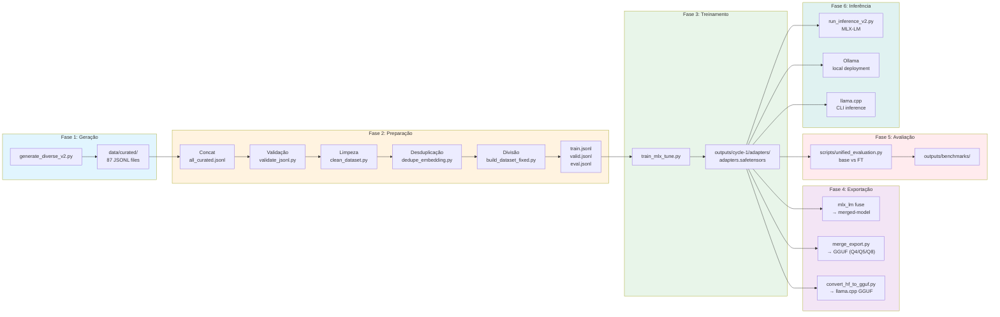

# OCI Specialist LLM

[🇺🇸 English](README.en-US.md) | [🇧🇷 Português](README.md)

Large Language Model (LLM) fine-tuned para Oracle Cloud Infrastructure (OCI) usando Apple Silicon, MLX e LoRA.

[](LICENSE)
[](https://www.python.org)
[](https://mlx.ai)
[](https://huggingface.co/mlx-community/Meta-Llama-3.1-8B-Instruct-4bit)
[](docs/taxonomy.md)

> **Idioma**: Dados e prompts em Português do Brasil (PT-BR).

---

## Visão Geral

Este projeto treina um LLM especializado para Oracle Cloud Infrastructure utilizando o framework MLX da Apple em Apple Silicon. O pipeline abrange a geração do dataset, validação, fine-tuning via MLX LoRA e avaliação.



**Stack Tecnológica**: Python 3.12, MLX 0.31.1, MLX-LM 0.31.1, MLX-Tune 0.4.18, formato de chat JSONL.

---

## Funcionalidades

- **LoRA Fine-tuning**: Adaptação de baixo ranque (low-rank adaptation) com modelo base quantizado em 4 bits
- **Otimizado para Apple Silicon**: Roda nativamente em Macs M1/M2/M3/M4/M5
- **Avaliação Abrangente**: Pontuação automatizada com similaridade semântica
- **Múltiplos Formatos de Exportação**: Fusão (merge) com o modelo base e conversão para GGUF (Q4/Q5/Q8)
- **Inferência Local**: Deploy com MLX-LM, Ollama ou llama.cpp para inferência offline
- **Metadados Enriquecidos**: Intenção (intent), persona, restrição (constraint) e estágio do ciclo de vida para RAG

---

## Dataset

| Métrica | Valor |
|--------|-------|
| **Total Gerado** | 21.750 exemplos (87 categorias × 250) |
| **Após Limpeza/Desduplicação** | 21.327 exemplos |
| **Treino (Train)** | 15.995 exemplos (75%) |
| **Validação (Valid)** | 3.199 exemplos (15%) |
| **Avaliação (Eval)** | 2.133 exemplos (10%) |
| **Categorias** | 87 tópicos do OCI |
| **Metadados** | intent, persona, constraint, lifecycle_stage |

### Divisão (Split)

| Split | Exemplos | % |
|-------|----------|---|
| Treino (Train) | 15.995 | 75% |
| Validação (Valid) | 3.199 | 15% |
| Avaliação (Eval) | 2.133 | 10% |

### Categorias

- **OCI Core** (compute, storage, networking, lb, database, container, serverless) - 20 tópicos
- **Security** (iam, policies, vault, encryption, cloud-guard, waf, zero-trust, posture-management) - 10 tópicos
- **Migration** (AWS/Azure/GCP/On-prem → OCI) - 14 tópicos
- **Terraform** (provider, compute, storage, networking, etc) - 12 tópicos
- **Observability** (logging, monitoring, stack-monitoring, apm) - 4 tópicos
- **Troubleshooting** (connectivity, performance, authentication, database, compute, storage, oke, functions) - 8 tópicos
- **DevOps** (ci-cd, resource-manager, artifacts, secrets) - 4 tópicos
- **Governance** (landing-zone, compartments, tagging, budgets-cost, policies-guardrails, compliance, audit-readiness, resource-discovery) - 8 tópicos
- **FinOps** (cost-optimization, showback-chargeback, rightsizing, storage-tiering) - 4 tópicos
- **Platform** (backup-governance, sre-operations) - 2 tópicos

---

## Começando

### Pré-requisitos

- Mac com Apple Silicon (M1/M2/M3/M4/M5)
- Python 3.12

### 1. Ambiente de Treinamento (LLM)

```bash
python3.12 -m venv venv
source venv/bin/activate
pip install -r requirements.txt
```

### 2. Ambiente OCI Copilot (RAG)

```bash
python3.12 -m venv venv-rag
source venv-rag/bin/activate
pip install -r requirements-rag.txt
pip install langgraph chainlit
```

### Início Rápido

```bash
# 1. Gerar dataset
python scripts/generate_diverse_v2.py

# 2. Validar, limpar, desduplicar e gerar os splits
bash scripts/prepare_data.sh

# 3. Treinar (Ciclo 1)
bash training/run_all_cycles.sh --fresh

# 4. Exportar para GGUF
python scripts/merge_export.py --cycle cycle-1 --quant q4 --name oci-specialist
```

---

## Treinamento

```bash
# Ciclo 1 (original)
bash training/run_all_cycles.sh --fresh

# Ciclo 2 (com LORA_RANK=16)
CYCLE=cycle-2 bash training/run_all_cycles.sh --fresh
```

**Configuração**: Veja `config/cycle-1.env` (Ciclo 1) ou `config/cycle-2.env` (Ciclo 2)

### Ciclo 1

| Parâmetro | Valor |
|-----------|-------|
| LORA_RANK | 8 |
| LORA_ALPHA | 16 |

### Ciclo 2

| Parâmetro | Valor |
|-----------|-------|
| LORA_RANK | 16 |
| LORA_ALPHA | 32 |
| LORA_DROPOUT | 0.05 |
| NUM_LAYERS | 16 |
| GRADIENT_CHECKPOINTING | true |
| GRADIENT_ACCUMULATION | 4 |
| WARMUP_STEPS | 300 |
| ITERS | 3618 |
| MAX_SEQ_LENGTH | 2048 |
| WEIGHT_DECAY | 0.01 |
| LR_SCHEDULER | cosine |

---

## Avaliação

```bash
# Modo rápido/small (10 amostras de categorias diferentes, ~5 min)
python scripts/unified_evaluation.py --cycle cycle-1 --mode small

# Avaliação média (200 amostras estratificadas, ~30-40 min) - Recomendado
python scripts/unified_evaluation.py --cycle cycle-1 --mode medium --fresh

# Avaliação completa (1930 amostras, ~4-6 horas)
python scripts/unified_evaluation.py --cycle cycle-1 --mode full --fresh
```

As saídas incluem:
- Resultados JSON com pontuação detalhada
- Relatório de comparação em Markdown
- Gráficos de radar (comparação de métricas)
- Gráficos de barras por categorias

---

## RAG (Retrieval-Augmented Generation)

*(Nota: Certifique-se de ter ativado o ambiente `venv-rag` conforme a seção Começando)*

```bash
# Testes do RAG
pytest tests/ -v
```

### Estrutura

```text
rag/
├── config.py          # Carrega config YAML
├── loaders.py         # Document loaders
├── splitter.py        # Text splitter
├── dense_retriever.py # FAISS + embeddings (persistido)
├── sparse_retriever.py# BM25 (persistido)
├── hybrid_retriever.py# RRF fusion + Cross-Encoder reranking
├── tools.py           # LangChain tools
├── api.py             # FastAPI service (Backend RAG)
├── app_chainlit.py    # Chainlit UI (Frontend OCI Copilot)
├── orchestrator.py    # Máquina de Estados LangGraph (Orquestrador)
└── demo.py            # Demo script
```

### Ingestão Offline

Para economizar RAM (especialmente em M3 Pro 18GB), a ingestão de documentos para o RAG deve ser feita offline e salva no disco (`.faiss` e `.pkl`).

```bash
python scripts/update_rag.py
```

### API Backend (RAG)

```bash
# Iniciar servidor FastAPI (sobe os índices do disco)
uvicorn rag.api:app --host 0.0.0.0 --port 8000

# Buscar
curl -X POST "http://localhost:8000/rag/retrieve" \
  -H "Content-Type: application/json" \
  -d '{"query": "Como criar instance no OCI?", "strategy": "migracao"}'
```

### UI Recomendada: Chainlit

A interface oficial do **OCI Copilot** é construída com **Chainlit**. Ela se conecta ao backend RAG e expõe o raciocínio dos agentes, permitindo anexar arquivos, mudar a estratégia de busca on-the-fly e possui botões de ação para executar scripts OCI/Terraform de forma segura (Human-In-The-Loop).

```bash
# Iniciar a Interface Gráfica
chainlit run rag/app_chainlit.py -w
# Acesse: http://localhost:8000
```

---

## Inferência

> Todos os métodos usam o modelo fine-tuned e expõem uma API compatível com OpenAI ou uma interface (UI) integrada em `http://localhost:8080`.

### MLX-LM — Servidor API (Apple Silicon)

```bash
# Iniciar o servidor com os adaptadores LoRA fine-tuned
mlx_lm.server \
  --model mlx-community/Meta-Llama-3.1-8B-Instruct-4bit \
  --adapter outputs/cycle-1/adapters \
  --port 8080
```

Conectar via **Open WebUI** (Interface Gráfica):

```bash
docker run -d -p 3000:8080 \
  -e OPENAI_API_BASE_URL=http://host.docker.internal:8080/v1 \
  -e OPENAI_API_KEY=ignore \
  ghcr.io/open-webui/open-webui:main
# Acesse: http://localhost:3000
```

Ou via **CLI**:

```bash
curl http://localhost:8080/v1/chat/completions \
  -H "Content-Type: application/json" \
  -d '{"model":"oci-specialist","messages":[{"role":"user","content":"Liste 3 serviços do OCI"}]}'
```

### Ollama — Servidor Local + WebUI

```bash
# 1. Criar e importar o modelo (apenas uma vez)
cat > ./outputs/cycle-1/gguf/Modelfile << 'EOF'
FROM ./oci-specialist-Q4_K_M.gguf
PARAMETER temperature 0.1
PARAMETER top_p 0.9
PARAMETER top_k 40
SYSTEM Você é um especialista em OCI (Oracle Cloud Infrastructure).
EOF

ollama create oci-specialist -f ./outputs/cycle-1/gguf/Modelfile

# 2. Conectar ao Open WebUI
docker run -d -p 3000:8080 \
  --add-host=host.docker.internal:host-gateway \
  -e OLLAMA_BASE_URL=http://host.docker.internal:11434 \
  ghcr.io/open-webui/open-webui:main
# Acesse: http://localhost:3000

# Ou rodar interativamente no CLI
ollama run oci-specialist
```

### llama.cpp — Servidor HTTP + WebUI Integrada

```bash
# Compilar o llama.cpp
git clone https://github.com/ggerganov/llama.cpp.git
cd llama.cpp
make -j

# Iniciar servidor com o GGUF fine-tuned
./llama-server \
  -m ../outputs/cycle-1/gguf/oci-specialist-Q4_K_M.gguf \
  --host 0.0.0.0 --port 8080 --ctx-size 4096

# WebUI:  http://localhost:8080
# API:    http://localhost:8080/v1
```

> [!NOTE]
> O tamanho do modelo é de aproximadamente 4.7GB quando exportado para o formato GGUF Q4.

---

## Estrutura do Projeto

```text
├── config/                  # Arquivos de configuração
│   ├── cycle-1.env         # Configuração de treinamento
│   ├── inference_prompts.yaml
│   └── gguf.env
├── data/                    # Datasets
│   ├── curated/            # 87 arquivos de tópicos
│   ├── train.jsonl         # 14.470 exemplos
│   ├── valid.jsonl         # 2.894 exemplos
│   └── eval.jsonl          # 1.930 exemplos
├── docs/                   # Documentação
│   ├── taxonomy.md
│   ├── quality-rules.md
│   └── eval-rubric.md
├── scripts/                # Scripts do pipeline
│   ├── generate_diverse_v2.py
│   ├── validate_jsonl.py
│   ├── clean_dataset.py
│   ├── dedupe_embedding.py
│   ├── build_dataset_fixed.py
│   ├── merge_export.py
│   ├── convert_hf_to_gguf.py
│   ├── unified_evaluation.py
│   └── run_inference_v2.py
├── training/               # Scripts de treinamento
│   ├── train_mlx_tune.py
│   └── run_all_cycles.sh
├── outputs/                # Saídas geradas
│   └── cycle-1/
│       ├── adapters/      # Adaptadores LoRA
│       └── gguf/          # Modelos exportados
└── venv/                   # Ambiente virtual Python
```

---

## Roadmap

As seguintes melhorias estão em progresso ou planejadas:

1. ~~**Implementar RAG**~~ ✅ **IMPLEMENTADO** - Veja seção RAG acima.

2. ~~**Ciclo 2 de Fine-Tuning**~~ 🏃 **EM ANDAMENTO**:
    - **Auditoria do Dataset**: ✅ Concluída para categorias com regressão (Terraform, Governance)
    - **Geração**: ✅ 500 novos exemplos com tom conversacional
    - **Preparação**: ✅ Dataset mesclado (5500 exemplos: 5000 cycle-1 + 500 cycle-2)
    - **Configuração**: LORA_RANK=16, LORA_ALPHA=32 (em config/cycle-2.env)
    - **Treinamento**: Execute `CYCLE=cycle-2 bash training/run_all_cycles.sh --fresh`

3. **Integração com o Hugging Face Hub**: Upload dos adaptadores e modelos GGUF para o Hugging Face Hub (futuro).

---

## Recursos

- [Documentação MLX](https://mlx.ai)
- [MLX-LM GitHub](https://github.com/ml-explore/mlx-lm)
- [llama.cpp](https://github.com/ggerganov/llama.cpp)
- [Documentação Oficial do OCI](https://docs.oracle.com/en-us/iaas/Content/home.htm)
- [Modelo Base no HuggingFace](https://huggingface.co/mlx-community/Meta-Llama-3.1-8B-Instruct-4bit)

---

## Licença

Este projeto está licenciado sob a Licença MIT.

---

## Resumo da Avaliação

Após completar o treinamento (`cycle-1`), o modelo fine-tuned foi avaliado contra o modelo base. Aqui está o resumo da avaliação (baseado em 200 amostras):

| Métrica | Modelo Base | Fine-Tuned | Delta |
|--------|-------------|------------|-------|
| technical_correctness | 3.40 | 3.40 | +0.00 |
| depth | 2.60 | 2.60 | +0.00 |
| structure | 3.93 | 4.23 | +0.30 |
| hallucination | 3.25 | 3.87 | +0.62 |
| clarity | 3.49 | 3.19 | -0.30 |
| overall | 3.33 | 3.46 | +0.12 |

### Comparação de Modelos


### Categorias


### Principais Melhorias & Regressões

**Top 5 Ganhos:**
1. `troubleshooting/functions` (+0.65)
2. `networking/vcn` (+0.62)
3. `storage/file` (+0.57)
4. `troubleshooting/compute` (+0.57)
5. `migration/azure-storage` (+0.55)

**Áreas para Melhoria (Quedas):**
1. `troubleshooting/performance` (-0.31)
2. `terraform/networking` (-0.27)
3. `governance/tagging` (-0.22)
4. `terraform/compute` (-0.21)
5. `terraform/serverless` (-0.19)

### Resultados Detalhados por Categoria

<details>
<summary>Clique para expandir as 87 categorias</summary>

| # | Categoria | Base | FT | Delta |
|---|---------|------|----|-------|
| 1 | compute/custom-images | 3.38 | 3.66 | +0.27 |
| 2 | compute/instances | 3.44 | 3.58 | +0.14 |
| 3 | compute/scaling | 3.55 | 3.56 | +0.01 |
| 4 | container/instances | 3.42 | 3.25 | -0.17 |
| 5 | container/oke | 3.24 | 3.27 | +0.03 |
| 6 | database/autonomous | 3.23 | 3.46 | +0.24 |
| 7 | database/autonomous-json | 3.38 | 3.60 | +0.22 |
| 8 | database/exadata | 3.33 | 3.56 | +0.23 |
| 9 | database/mysql | 3.24 | 3.48 | +0.24 |
| 10 | database/nosql | 3.38 | 3.41 | +0.02 |
| 11 | database/postgresql | 3.33 | 3.66 | +0.33 |
| 12 | devops/artifacts | 3.38 | 3.29 | -0.09 |
| 13 | devops/ci-cd | 3.43 | 3.86 | +0.43 |
| 14 | devops/resource-manager | 3.54 | 3.55 | +0.01 |
| 15 | devops/secrets | 3.41 | 3.61 | +0.20 |
| 16 | finops/cost-optimization | 3.23 | 3.47 | +0.24 |
| 17 | finops/rightsizing | 3.47 | 3.40 | -0.07 |
| 18 | finops/showback-chargeback | 3.49 | 3.32 | -0.17 |
| 19 | finops/storage-tiering | 3.26 | 3.22 | -0.04 |
| 20 | governance/audit-readiness | 3.52 | 3.56 | +0.04 |
| 21 | governance/budgets-cost | 3.53 | 3.38 | -0.15 |
| 22 | governance/compartments | 3.42 | 3.27 | -0.14 |
| 23 | governance/compliance | 3.33 | 3.25 | -0.08 |
| 24 | governance/landing-zone | 3.30 | 3.23 | -0.07 |
| 25 | governance/policies-guardrails | 3.34 | 3.33 | -0.02 |
| 26 | governance/resource-discovery | 3.21 | 3.33 | +0.12 |
| 27 | governance/tagging | 3.63 | 3.41 | -0.22 |
| 28 | lb/load-balancer | 3.42 | 3.35 | -0.07 |
| 29 | migration/aws-compute | 3.24 | 3.66 | +0.42 |
| 30 | migration/aws-database | 3.17 | 3.37 | +0.19 |
| 31 | migration/aws-storage | 3.25 | 3.76 | +0.51 |
| 32 | migration/azure-compute | 3.38 | 3.37 | -0.00 |
| 33 | migration/azure-database | 3.38 | 3.35 | -0.03 |
| 34 | migration/azure-storage | 3.21 | 3.76 | +0.55 |
| 35 | migration/data-transfer | 3.32 | 3.56 | +0.23 |
| 36 | migration/gcp-compute | 3.20 | 3.66 | +0.46 |
| 37 | migration/gcp-database | 3.22 | 3.45 | +0.23 |
| 38 | migration/gcp-storage | 3.40 | 3.41 | +0.00 |
| 39 | migration/onprem-compute | 3.36 | 3.53 | +0.17 |
| 40 | migration/onprem-database | 3.30 | 3.42 | +0.12 |
| 41 | migration/onprem-storage | 3.34 | 3.66 | +0.32 |
| 42 | migration/onprem-vmware | 3.13 | 3.49 | +0.35 |
| 43 | networking/connectivity | 3.32 | 3.68 | +0.36 |
| 44 | networking/security | 3.38 | 3.66 | +0.28 |
| 45 | networking/vcn | 3.24 | 3.86 | +0.62 |
| 46 | observability/apm | 3.14 | 3.43 | +0.29 |
| 47 | observability/logging | 3.37 | 3.50 | +0.13 |
| 48 | observability/monitoring | 3.32 | 3.56 | +0.24 |
| 49 | observability/stack-monitoring | 3.27 | 3.33 | +0.06 |
| 50 | platform/backup-governance | 3.52 | 3.52 | -0.00 |
| 51 | platform/sre-operations | 3.37 | 3.37 | +0.01 |
| 52 | security/cloud-guard | 3.51 | 3.62 | +0.11 |
| 53 | security/dynamic-groups | 3.35 | 3.24 | -0.11 |
| 54 | security/encryption | 3.38 | 3.24 | -0.15 |
| 55 | security/federation | 3.45 | 3.86 | +0.41 |
| 56 | security/iam-basics | 3.43 | 3.31 | -0.12 |
| 57 | security/policies | 3.36 | 3.36 | +0.00 |
| 58 | security/posture-management | 3.40 | 3.39 | -0.00 |
| 59 | security/vault-keys | 3.43 | 3.56 | +0.13 |
| 60 | security/vault-secrets | 3.23 | 3.68 | +0.46 |
| 61 | security/waf | 3.32 | 3.56 | +0.24 |
| 62 | security/zero-trust | 3.27 | 3.56 | +0.29 |
| 63 | serverless/api-gateway | 3.36 | 3.21 | -0.15 |
| 64 | serverless/functions | 3.11 | 3.55 | +0.43 |
| 65 | storage/block | 3.26 | 3.27 | +0.00 |
| 66 | storage/file | 3.29 | 3.86 | +0.57 |
| 67 | storage/object | 3.26 | 3.22 | -0.05 |
| 68 | terraform/compute | 3.41 | 3.20 | -0.21 |
| 69 | terraform/container | 3.10 | 3.01 | -0.08 |
| 70 | terraform/database | 3.43 | 3.38 | -0.05 |
| 71 | terraform/devops | 3.44 | 3.33 | -0.11 |
| 72 | terraform/load-balancer | 3.21 | 3.33 | +0.12 |
| 73 | terraform/networking | 3.64 | 3.37 | -0.27 |
| 74 | terraform/observability | 3.41 | 3.57 | +0.16 |
| 75 | terraform/provider | 3.40 | 3.31 | -0.09 |
| 76 | terraform/security | 3.49 | 3.34 | -0.15 |
| 77 | terraform/serverless | 3.23 | 3.04 | -0.19 |
| 78 | terraform/state | 3.37 | 3.20 | -0.17 |
| 79 | terraform/storage | 3.37 | 3.38 | +0.00 |
| 80 | troubleshooting/authentication | 3.36 | 3.36 | +0.00 |
| 81 | troubleshooting/compute | 3.13 | 3.70 | +0.57 |
| 82 | troubleshooting/connectivity | 3.26 | 3.66 | +0.40 |
| 83 | troubleshooting/database | 3.32 | 3.59 | +0.27 |
| 84 | troubleshooting/functions | 3.01 | 3.66 | +0.65 |
| 85 | troubleshooting/oke | 3.30 | 3.56 | +0.26 |
| 86 | troubleshooting/performance | 3.51 | 3.21 | -0.31 |
| 87 | troubleshooting/storage | 3.39 | 3.27 | -0.13 |

</details>