<!-- prettier-ignore -->
<div align="center">

# OCI Specialist LLM

Fine-tuning pipeline para um LLM especialista em OCI usando Apple Silicon, MLX e LoRA.

[](LICENSE)
[](https://www.python.org)
[](https://mlx.ai)
[](https://huggingface.co/mlx-community/Llama-3.2-3B-Instruct-4bit)
[](docs/taxonomy.md)

</div>

> **Idioma**: 🇧🇷 PT-BR (padrão) | [🇺🇸 EN-US](README.en-US.md)

---

## Visão Geral

Este projeto constrói um LLM especializado em Oracle Cloud Infrastructure (OCI). O pipeline prioriza qualidade do dataset, baixo custo, validação rigorosa e segue regras de qualidade para garantir respostas precisas e úteis.

O modelo foi projetado para ajudar com:
- Explicar serviços OCI, arquitetura e melhores práticas
- Solucionar problemas de cargas de trabalho OCI
- Guiar migração de AWS, Azure, GCP e on-premises para OCI
- Escrever configurações OCI Terraform
- Fornecer orientação de segurança e IAM

---

## Resultados de Treinamento

Treinamento multi-cycle com learning rate decrescente completado com sucesso:

| Ciclo | LR | Iters | Val Loss | Train Loss | Status |
|-------|-----|-------|----------|------------|--------|
| cycle-1 | 5e-5 | 200 | 0.163 | 0.161 | ✅ From scratch |
| cycle-2 | 1e-5 | 200 | 0.119 | 0.104 | ✅ Resume cycle-1 |
| cycle-3 | 5e-6 | 200 | **0.114** | **0.089** | ✅ Melhor (resume cycle-2) |

**Melhor adapter**: `outputs/cycle-3/adapters.safetensors` (menor val loss: 0.114)
**Modelo fundido**: `outputs/merged-model/` (~1.8GB)

### Progressão de Treinamento

```
Val Loss:  0.163 → 0.119 → 0.114  (30% improvement)
Train Loss: 0.161 → 0.104 → 0.089  (45% improvement)
```

---

## Dataset

O dataset contém 9.940 exemplos únicos gerados com diversidade estrutural e validação rigorosa.

| Métrica | Valor |
|---------|-------|
| **Total de Exemplos** | 9,940 |
| **Categorias** | 71 topics OCI |
| **Exemplos por Categoria** | 140 |
| **Duplicatas** | 0 (exatas + próximas) |
| **Comandos CLI Falsos** | 0 |
| **Classes SDK Falsas** | 0 |
| **Resources TF Falsos** | 0 |

### Split Distribution

| Split | Exemplos | Percentual |
|-------|----------|------------|
| Train | 7,455 | 75.0% |
| Valid | 1,491 | 15.0% |
| Eval | 994 | 10.0% |
| **Total** | **9,940** | **100%** |

### Difficulty Distribution (Train)

| Dificuldade | Count | Percentual |
|-------------|-------|------------|
| Beginner | 2,223 | 29.8% |
| Intermediate | 3,731 | 50.0% |
| Advanced | 1,501 | 20.1% |

### Categorias por Grupo

| Grupo | Topics | Exemplos |
|-------|--------|----------|
| OCI Core (compute, storage, networking, lb, database, container, serverless) | 20 | 2,800 |
| Security (iam-basics, policies, vault, encryption, cloud-guard, waf) | 9 | 1,260 |
| Migration (AWS/Azure/GCP/On-prem → OCI) | 14 | 1,960 |
| Terraform (provider, compute, storage, networking, lb, database, container, serverless, security, observability, devops, state) | 12 | 1,680 |
| Observability | 4 | 560 |
| Troubleshooting | 8 | 1,120 |
| DevOps | 4 | 560 |

### Formato dos Dados

Cada exemplo segue o formato JSON chat:

```json
{
  "messages": [
    {"role": "system", "content": "You are an OCI specialist..."},
    {"role": "user", "content": "How do I configure..."},
    {"role": "assistant", "content": "## Solution\n\n### Steps..."}
  ],
  "metadata": {"category": "compute/instances", "difficulty": "intermediate", "source": "generated"}
}
```

---

## Regras de Qualidade

Aplicamos regras de qualidade rigorosas para garantir precisão do dataset:

- **NUNCA** copiar documentação OCI verbatim
- **NUNCA** inventar serviços Oracle inexistentes
- **NUNCA** usar preços ou limites sem marcar como mutável
- **NUNCA** criar exemplos vagos como "usar melhores práticas"
- **NUNCA** gerar respostas arquiteturais sem passos, riscos ou justificativas
- **SEMPRE** validar JSONL antes de exportar
- **SEMPRE** usar comandos CLI, SDK e Terraform verificados

---

## Pré-requisitos

- **Apple Silicon Mac** (M1/M2/M3/M4) para treinamento MLX
- **Python 3.12** (recomendado via venv)

### Configurar Ambiente Virtual

```bash
python3.12 -m venv venv
source venv/bin/activate
pip install -r requirements.txt
```

---

## Início Rápido

### Pipeline Completo

```bash
# 0. Ativar ambiente virtual
source venv/bin/activate

# ========== 1. PREPARAÇÃO DE DADOS ==========

# 1.1 Concatenar todos os JSONL curados
cat data/curated/*.jsonl > data/all_curated.jsonl

# 1.2 Validar dataset
python scripts/validate_jsonl.py data/all_curated.jsonl

# 1.3 Deduplicar
python scripts/dedupe_dataset.py data/all_curated.jsonl --remove

# 1.4 Criar splits (train/valid/eval)
python scripts/build_dataset_fixed.py --input data/all_curated.jsonl

# Ou usar o script completo que faz tudo acima:
# bash scripts/prepare_data.sh

# ========== 2. TREINAMENTO ==========

# 2.1 Treinamento multi-cycle (recomendado)
bash training/run_all_cycles.sh

# ========== 3. PÓS-TREINAMENTO ==========

# 3.1 Exportar/Merge adapter (usa venv automaticamente)
# Verifique qual ciclo tem menor val loss em outputs/logs/cycle-*/metrics.csv
# O cycle-3 é o melhor do treinamento atual (val loss: 0.114)
ADAPTER_DIR=outputs/cycle-3 bash training/export_adapter.sh

# 3.2 Testar inference
bash training/run_inference.sh

# 3.3 Avaliar (completo — 9,940 exemplos, recomendado)
python scripts/evaluate_model.py "mlx-community/Llama-3.2-3B-Instruct-4bit" "outputs/merged-model" data/all_curated_clean.jsonl outputs/benchmarks

# 3.3 Avaliar (rápido — 994 exemplos do split eval)
# python scripts/evaluate_model.py "mlx-community/Llama-3.2-3B-Instruct-4bit" "outputs/merged-model" data/eval.jsonl outputs/benchmarks
```

### Treinamento Multi-Cycle

O pipeline suporta treinamento em múltiplos ciclos com learning rate decrescente:

| Variável | cycle-1 | cycle-2 | cycle-3 |
|----------|---------|---------|---------|
| `LEARNING_RATE` | 5e-5 | 1e-5 | 5e-6 |
| `ITERS` | 200 | 200 | 200 |
| `RESUME` | scratch | cycle-1 | cycle-2 |

> ⚠️ **Nota**: O script `training/run_all_cycles.sh` usa iterações menores (200/100/50) por padrão.
> Os valores acima refletem o treinamento real executado. Para reproduzir, ajuste `ITERS` nos arquivos `config/cycle-*.env`.

```bash
# Executar todos os ciclos sequencialmente
bash training/run_all_cycles.sh

# Acompanhar progresso do treinamento (push para GitHub)
bash scripts/push_training_progress.sh cycle-1  # ou cycle-2, cycle-3
```

### Configuração do Ciclo (`config/cycle-1.env`)

| Variável | Descrição | Padrão |
|----------|-----------|--------|
| `MODEL` | Modelo base do MLX (HuggingFace) | `mlx-community/Llama-3.2-3B-Instruct-4bit` |
| `TRAIN_DATA` | Arquivo de dados para treinamento | `data/train.jsonl` |
| `VALID_DATA` | Arquivo de dados para validação | `data/valid.jsonl` |
| `OUTPUT_DIR` | Pasta para salvar os adapters LoRA | `outputs/cycle-1` |
| `EPOCHS` | Número de épocas de treinamento | `2` |
| `BATCH_SIZE` | Tamanho do batch | `1` |
| `LEARNING_RATE` | Taxa de aprendizado | `5e-5` |
| `LORA_RANK` | Rank da matriz LoRA | `8` |
| `LORA_ALPHA` | Escala do LoRA | `16` |
| `LORA_DROPOUT` | Taxa de dropout para regularização | `0.05` |
| `GRADIENT_ACCUMULATION` | Passos de gradiente antes do update | `4` |

> 💡 **Dica**: Para criar um novo ciclo de treinamento, copie `config/cycle-1.env` para `config/cycle-N.env` e ajuste os valores.

### Fluxo do Pipeline

```mermaid
flowchart LR
    subgraph DataPrep["1. Preparação de Dados"]
        DP1[Gerar Prompts] --> DP2{Executar Prompts}
        DP2 -->|Generate| DP3[JSONL Data]
        DP3 --> DP4[Salvar JSONL]
        DP4 --> DP5[Validar]
        DP5 --> DP6[Deduplicar]
        DP6 --> DP7[Criar Splits]
        DP7 --> Train[train.jsonl]
        DP7 --> Valid[valid.jsonl]
        DP7 --> Eval[eval.jsonl]
    end
    
    subgraph Training["2. Treinamento Multi-Cycle"]
        Train --> T1[Selecionar Base Model]
        Valid --> T1
        T1 --> T2[Cycle 1: LR=5e-5]
        T2 --> T3[Cycle 2: LR=1e-5]
        T3 --> T4[Cycle 3: LR=5e-6]
    end
    
    subgraph PostProcess["3. Pós-Treinamento"]
        T4 --> P1[Export/Merge Adapter]
        P1 --> P2[Testar Inference]
        P2 --> P3[Avaliar com eval.jsonl]
    end
    
    P1 --> outputs/merged-model
    P3 --> outputs/benchmarks
    
    style DP2 fill:#e1f5fe,stroke:#01579b
    style DP3 fill:#fff3e0,stroke:#e65100
    style DP4 fill:#fff3e0,stroke:#e65100
    style Train fill:#e8f5e9,stroke:#2e7d32
    style Valid fill:#e8f5e9,stroke:#2e7d32
    style Eval fill:#e8f5e9,stroke:#2e7d32
    style T4 fill:#c8e6c9,stroke:#1b5e20
```



---

## Estrutura do Projeto

```
olia-2-oci/
├── AGENTS.md                      # Diretrizes do agente
├── README.md                      # Este arquivo
├── CONTRIBUTING.md                # Guia de contribuição
├── LICENSE                        # Licença MIT
├── requirements.txt               # Dependências pinadas
├── docs/                          # Documentação do projeto
│   ├── taxonomy.md               # Topics do dataset (71 categorias)
│   ├── quality-rules.md          # Regras de qualidade
│   ├── eval-rubric.md            # Critérios de avaliação
│   ├── scope.md                  # Escopo v1 vs v2
│   └── pdca-cycle1-diagnostico.md # Diagnóstico PDCA
├── config/                        # Configurações de treinamento
│   ├── cycle-1.env               # Ciclo 1: LR=5e-5
│   ├── cycle-2.env               # Ciclo 2: LR=1e-5 (resume)
│   └── cycle-3.env               # Ciclo 3: LR=5e-6 (resume)
├── data/                          # Dataset
│   ├── curated/                  # 71 topic files (140 examples each)
│   ├── all_curated.jsonl         # Combined dataset (9,940)
│   ├── all_curated_clean.jsonl   # Validated + deduplicated (9,940)
│   ├── train.jsonl               # Training split (7,455)
│   ├── valid.jsonl               # Validation split (1,491)
│   ├── eval.jsonl                # Evaluation split (994)
│   └── TEMPLATE.jsonl            # Formato de referência
├── scripts/                       # Scripts de pipeline
│   ├── generate_prompt.py        # Gerar prompts a partir da taxonomy
│   ├── generate_diverse_v2.py    # Dataset generator (9,940 examples)
│   ├── validate_jsonl.py         # Validar formato JSONL
│   ├── dedupe_dataset.py         # Remover duplicatas
│   ├── build_dataset_fixed.py    # Criar splits train/valid/eval
│   ├── prepare_data.sh           # Pipeline orchestrator
│   ├── evaluate_model.py         # Benchmarks com checkpoint/resume
│   └── push_progress.sh          # Push progresso para GitHub
├── training/                      # Scripts de treinamento MLX
│   ├── train_mlx_v2.sh           # Treinamento com logging e resume
│   ├── run_all_cycles.sh         # Orquestrador multi-cycle
│   ├── export_adapter.sh         # Fundir adapter com base model
│   ├── run_inference.sh          # Testar inferência
│   └── log_metrics.py            # Capturar métricas em CSV
└── outputs/                       # Artefatos de saída
    ├── cycle-1/                  # Adapter cycle 1
    ├── cycle-2/                  # Adapter cycle 2
    ├── cycle-3/                  # Adapter cycle 3 (BEST)
    ├── merged-model/             # Modelo fundido final (~1.8GB)
    ├── logs/                     # Logs e métricas CSV por ciclo
    └── benchmarks/               # Relatórios de avaliação + progresso
```

---

## Pipeline

1. **Documentação** → Escopo, taxonomia, regras de qualidade
2. **Geração de Dados** → MASTER_PROMPT → curated/ (9,940 exemplos)
3. **Validação** → JSONL validator, deduplicação
4. **Construção do Dataset** → train (~75%), valid (~15%), eval (~10%)
5. **Treinamento** → Fine-tuning MLX LoRA no Apple Silicon (multi-cycle, LR decay)
6. **Avaliação** → Benchmark comparing base vs fine-tuned

---

## Outputs

Após o treinamento:

- `outputs/cycle-{1,2,3}/` - Adaptadores LoRA por ciclo
- `outputs/merged-model/` - Modelo fundido (base + adapter)
- `outputs/logs/cycle-{1,2,3}/` - Logs e métricas CSV por ciclo
- `outputs/benchmarks/` - Relatórios de avaliação
- `backup_pre_expansao/` - Backup do dataset antes de expansões

---

## Melhorias Futuras

1. **Camada RAG**: Para precisão factual em comandos CLI, classes SDK e resources Terraform, adicionar uma camada RAG com documentação em tempo real.
2. **Diversidade de Respostas**: Expandir de 8 para 20+ estruturas de resposta.
3. **Modelo Maior**: Considerar Llama-3.1-8B para melhor raciocínio em cenários arquiteturais.
4. **Avaliação Humana**: Revisão humana das respostas geradas para avaliação de qualidade nuances.
5. **Treinamento Contínuo**: Pipeline suporta adicionar novos exemplos e retreinar.
