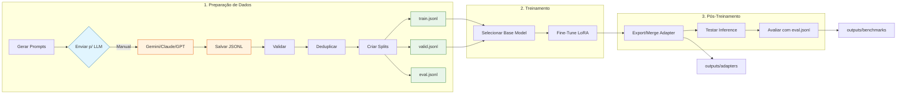

<!-- prettier-ignore -->
<div align="center">

# OCI Specialist LLM

Fine-tuning pipeline para um LLM especialista em OCI usando Apple Silicon, MLX e LoRA.

[](LICENSE)
[](https://www.python.org)
[](https://mlx.ai)
[](docs/taxonomy.md)

</div>

> **Idioma**: 🇧🇷 PT-BR (padrão) | [🇺🇸 EN-US](README.en-US.md)

---

## Visão Geral

Este projeto constrói um LLM especializado em Oracle Cloud Infrastructure (OCI). O pipeline prioriza qualidade do dataset, baixo custo, validação rigorosa e segue regras de qualidade para garantir respostas precisas e úteis.

O modelo foi projetado para ajudar com:
- Explicar serviços OCI, arquitetura e melhores práticas
- Solucionar problemas de cargas de trabalho OCI
- Guiar migração de AWS, Azure, GCP e on-premises para OCI
- Escrever configurações OCI Terraform
- Fornecer orientação de segurança e IAM

---

## Dataset

O dataset contém exemplos gerados via MASTER_PROMPT. Veja `docs/taxonomy.md` para todos os topics.

| Categoria | Topics |
|-----------|--------|
| OCI Core (compute, storage, networking, lb, database, container, serverless) | 20 |
| Security (iam-basics, policies, vault, encryption, cloud-guard, waf) | 9 |
| Migration (AWS/Azure/GCP/On-prem → OCI) | 14 |
| Terraform (provider, compute, storage, networking, lb, database, container, serverless, security, observability, devops, state) | 12 |
| Observability | 4 |
| Troubleshooting | 8 |
| DevOps | 4 |

> **Total: 71 topics × 10 exemplos = 710 exemplos**

### Formato dos Dados

Cada exemplo segue o formato OpenAI chat:

```json
{
  "messages": [
    {"role": "system", "content": "You are an OCI specialist..."},
    {"role": "user", "content": "How do I configure..."},
    {"role": "assistant", "content": "## Solution\n\n### Steps..."}
  ],
  "metadata": {"category": "compute/instances", "difficulty": "intermediate", "source": "generated"}
}
```

---

## Regras de Qualidade

Aplicamos regras de qualidade rigorosas para garantir precisão do dataset:

- **NUNCA** copiar documentação OCI verbatim
- **NUNCA** inventar serviços Oracle inexistentes
- **NUNCA** usar preços ou limites sem marcar como mutável
- **NUNCA** criar exemplos vagos como "usar melhores práticas"
- **NUNCA** gerar respostas arquiteturais sem passos, riscos ou justificativas

---

## Pré-requisitos

- **Apple Silicon Mac** (M1/M2/M3/M4) para treinamento MLX
- **Python 3.12** (recomendado via venv)

### Configurar Ambiente Virtual

```bash
python3.12 -m venv venv
source venv/bin/activate
pip install -r requirements.txt
```

---

## Início Rápido

### Gerar Dados Curados

Use o **MASTER_PROMPT** com qualquer LLM externo (Gemini, Claude, GPT):

```bash
# Listar topics disponíveis
python scripts/generate_prompt.py --list

# Gerar prompt para um topic específico
python scripts/generate_prompt.py compute/instances

# Gerar TODOS os prompts de uma vez
python scripts/generate_prompt.py --all
```

O prompt gerado deve ser enviado para um LLM, e o resultado salvo em `data/curated/[topic].jsonl`.

### Pipeline Completo

```bash
# 0. Ativar ambiente virtual
source venv/bin/activate

# ========== 1. PREPARAÇÃO DE DADOS ==========

# 1.1 Gerar TODOS os prompts
python scripts/generate_prompt.py --all

# 1.2 Na sua LLM de escolha, solicite execução do prompt e salvar em data/curated/
 Para cada arquivo em tmp/prompt_*.md:
   1. Execute o tmp/prompt_*.md
   2. Salve o resultado em data/curated/[topic].jsonl
 Formato: 1 arquivo por tópico (71 topics = 71 arquivos), 10 exemplos por arquivo

# 1.3 Concatenar todos os JSONL
cat data/curated/*.jsonl > data/all_curated.jsonl

# 1.4 Validar dataset
python3 scripts/validate_jsonl.py data/all_curated.jsonl --filter
mv data/all_curated_valid.jsonl data/all_curated.jsonl

# 1.5 Deduplicar
python3 scripts/dedupe_dataset.py data/all_curated.jsonl --remove

# 1.6 Criar splits (train/valid/eval)
python3 scripts/build_dataset_fixed.py -i data/all_curated.jsonl -o data/

# ========== 2. TREINAMENTO ==========

# ⚠️ ATENÇÃO: Valide as variáveis em config/cycle-1.env antes de executar
# 2.1 Carregar configuração do ciclo
source config/cycle-1.env

# 2.2 Fine-Tune LoRA
bash training/train_mlx.sh

# ========== 3. PÓS-TREINAMENTO ==========

# 3.1 Exportar/Merge adapter
bash training/export_adapter.sh

# 3.2 Testar inference
bash training/run_inference.sh

# 3.3 Avaliar
python scripts/evaluate_model.py outputs/adapters data/eval.jsonl outputs/benchmarks
```

### Configuração do Ciclo (`config/cycle-1.env`)

| Variável | Descrição | Padrão |
|----------|-----------|--------|
| `MODEL` | Modelo base do MLX (HuggingFace) | `mlx-community/Llama-3.2-3B-Instruct-4bit` |
| `TRAIN_DATA` | Arquivo de dados para treinamento | `data/train.jsonl` |
| `VALID_DATA` | Arquivo de dados para validação | `data/valid.jsonl` |
| `OUTPUT_DIR` | Pasta para salvar os adapters LoRA | `outputs/cycle-1` |
| `EPOCHS` | Número de épocas de treinamento | `2` |
| `BATCH_SIZE` | Tamanho do batch | `4` |
| `LEARNING_RATE` | Taxa de aprendizado | `5e-5` |
| `LORA_RANK` | Rank da matriz LoRA (maior = mais parâmetros) | `16` |
| `LORA_ALPHA` | Escala do LoRA (geralmente 2x o rank) | `32` |
| `LORA_DROPOUT` | Taxa de dropout para regularização | `0.05` |
| `GRADIENT_ACCUMULATION` | Passos de gradiente antes do update | `2` |

> ⚠️ **Nota**: Este pipeline usa LoRA (fine-tuning). Para produção com modelo full-weight (base model + adapters fundidos), basta aumentar o dataset seguindo os mesmos passos.

> 💡 **Dica**: Para criar um novo ciclo de treinamento, copie `config/cycle-1.env` para `config/cycle-2.env` e ajuste os valores.

> ⚠️ **Nota**: Este é um pipeline para treinamento **local** (LoRA com dataset pequeno ~710 exemplos). Para **produção**, basta aumentar o dataset para ~10k+ exemplos e seguir os mesmos passos - o restante do pipeline permanece idêntico.

### Fluxo do Pipeline



---

---

## Estrutura do Projeto

```
olia-2-oci/
├── AGENTS.md                      # Diretrizes do agente
├── README.md                      # Este arquivo
├── README.en-US.md                # Versão em inglês
├── CONTRIBUTING.md                # Guia de contribuição
├── docs/                          # Documentação do projeto
│   ├── taxonomy.md               # Topics do dataset
│   ├── quality-rules.md          # Regras de qualidade
│   └── eval-rubric.md            # Critérios de avaliação
├── scripts/                      # Scripts de pipeline
│   ├── generate_prompt.py       # Gerar prompts para LLM
│   ├── validate_jsonl.py         # Validar formato JSONL
│   ├── dedupe_dataset.py         # Remover duplicatas
│   ├── build_dataset_fixed.py    # Criar splits train/valid/eval
│   └── evaluate_model.py         # Executar benchmarks
├── .agents/skills/               # Skills para geração de dados
│   └── generate-oci-dataset/
│       ├── MASTER_FORMAT.md
│       └── prompts/              # Prompts por topic
└── training/                     # Scripts de treinamento MLX
    ├── train_mlx.sh
    └── run_inference.sh
```

---

## Pipeline

1. **Documentação** → Escopo, taxonomia, regras de qualidade
2. **Geração de Dados** → MASTER_PROMPT + LLM externo → curated/
3. **Validação** → JSONL validator, deduplicação
4. **Construção do Dataset** → train (~75%), valid (~15%), eval (~10%)
5. **Treinamento** → Fine-tuning MLX LoRA no Apple Silicon
6. **Avaliação** → Benchmark comparing base vs fine-tuned

---

## Outputs

Após o treinamento:

- `outputs/adapters/` - Adaptadores LoRA treinados
- `outputs/benchmarks/` - Relatórios de avaliação
- `outputs/logs/` - Logs de treinamento
