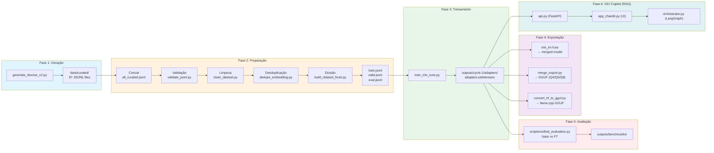

# OCI Specialist LLM

[🇺🇸 English](README.en-US.md) | [🇧🇷 Português](README.md)

Large Language Model (LLM) fine-tuned para Oracle Cloud Infrastructure (OCI) usando Apple Silicon, MLX e LoRA.

[](LICENSE)
[](https://www.python.org)
[](https://mlx.ai)
[](https://huggingface.co/mlx-community/Qwen2.5-Coder-7B-Instruct-4bit)
[](docs/taxonomy.md)

> **Idioma**: Dados e prompts em Português do Brasil (PT-BR).

---

## Visão Geral

Este projeto treina um LLM especializado para Oracle Cloud Infrastructure utilizando o framework MLX da Apple em Apple Silicon. O pipeline abrange a geração do dataset, validação, fine-tuning via MLX LoRA e integração com uma camada de RAG (OCI Copilot).



**Stack Tecnológica**: Python 3.12, MLX 0.31.1, Qwen 2.5 Coder 7B, LangGraph, Chainlit, FAISS.

---

## Funcionalidades

- **LoRA Fine-tuning**: Adaptação de baixo ranque com modelo base Qwen 2.5 Coder 7B (4-bit).
- **Otimizado para M3 Pro**: Configurações hiper-otimizadas para 18GB de RAM, usando BF16 nativo e sem Swap.
- **RAG Híbrido**: Busca semântica (FAISS) + lexical (BM25) com persistência em disco e Ingestão Offline.
- **Multi-Agentes**: Orquestração via LangGraph (Router, Descoberta, Arquitetura, Execução).
- **UI Avançada**: Interface Chainlit com suporte a anexos, streaming e Human-in-the-loop para comandos CLI.

---

## Dataset

| Métrica | Valor |
|--------|-------|
| **Total Gerado** | 21.750 exemplos (87 categorias × 250) |
| **Após Limpeza/Desduplicação** | 21.327 exemplos |
| **Treino (Train)** | 15.995 exemplos (75%) |
| **Validação (Valid)** | 3.199 exemplos (15%) |
| **Avaliação (Eval)** | 2.133 exemplos (10%) |
| **Categorias** | 87 tópicos do OCI |

### Divisão (Split)

| Split | Exemplos | % |
|-------|----------|---|
| Treino (Train) | 15.995 | 75% |
| Validação (Valid) | 3.199 | 15% |
| Avaliação (Eval) | 2.133 | 10% |

---

## Começando

### 1. Ambiente de Treinamento (LLM)

```bash
python3.12 -m venv venv
source venv/bin/activate
pip install -r requirements.txt
```

### 2. Ambiente OCI Copilot (RAG)

```bash
python3.12 -m venv venv-rag
source venv-rag/bin/activate
pip install -r requirements-rag.txt
pip install langgraph chainlit
```

### Início Rápido

```bash
# 1. Preparar dados
bash scripts/prepare_data.sh

# 2. Ingerir Documentação (RAG Offline)
python scripts/update_rag.py

# 3. Treinar Modelo
bash training/run_all_cycles.sh --fresh

# 4. Subir Interface
# Terminal 1: API RAG
uvicorn rag.api:app --port 8000
# Terminal 2: UI Copilot
chainlit run rag/app_chainlit.py
```

---

## Treinamento

O treinamento utiliza o modelo **Qwen 2.5 Coder 7B Instruct** (4-bit), otimizado para o chip M3 Pro.

```bash
bash training/run_all_cycles.sh --fresh
```

**Configuração Atual** (`config/cycle-1.env`):

| Parâmetro | Valor |
|-----------|-------|
| MODEL | mlx-community/Qwen2.5-Coder-7B-Instruct-4bit |
| NUM_LAYERS | 14 |
| BATCH_SIZE | 1 |
| GRADIENT_ACCUMULATION | 4 |
| BF16 | true |
| GRADIENT_CHECKPOINTING | false |
| ITERS | 4000 |
| MAX_SEQ_LENGTH | 768 |
| LEARNING_RATE | 2e-4 |
| LORA_RANK | 8 |
| LORA_ALPHA | 16 |

---

## OCI Copilot (RAG)

O sistema de RAG agora opera de forma persistente e orquestrada.

### Ingestão Offline
Para economizar RAM, gere os índices antes do uso:
```bash
python scripts/update_rag.py
```

### Orquestração LangGraph
O arquivo `rag/orchestrator.py` gerencia o fluxo entre os agentes:
- **Router**: Classifica a intenção do usuário.
- **Especialistas**: Consultam o RAG com pesos dinâmicos (Híbrido).
- **Execução**: Gera comandos e aguarda aprovação manual (HITL).

---

## Inferência e UI

A interface oficial é o **Chainlit**, acessível em `http://localhost:8000` após iniciar o script.

```bash
chainlit run rag/app_chainlit.py -w
```

---

## Roadmap

1. ~~**Implementar RAG**~~ ✅ **CONCLUÍDO**
2. ~~**Migração para Qwen 2.5 Coder**~~ ✅ **CONCLUÍDO**
3. **Integração com Hugging Face Hub**: Upload de adaptadores e modelos GGUF.

---

## Licença

Este projeto está licenciado sob a Licença MIT.

---

## Resumo da Avaliação (Resultados Iniciais)

| Métrica | Modelo Base | Fine-Tuned (Cycle 1) | Delta |
|--------|-------------|------------|-------|
| technical_correctness | 3.40 | 3.40 | +0.00 |
| depth | 2.60 | 2.60 | +0.00 |
| structure | 3.93 | 4.23 | +0.30 |
| hallucination | 3.25 | 3.87 | +0.62 |
| clarity | 3.49 | 3.19 | -0.30 |
| overall | 3.33 | 3.46 | +0.12 |
