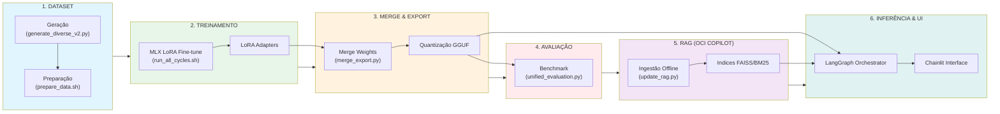
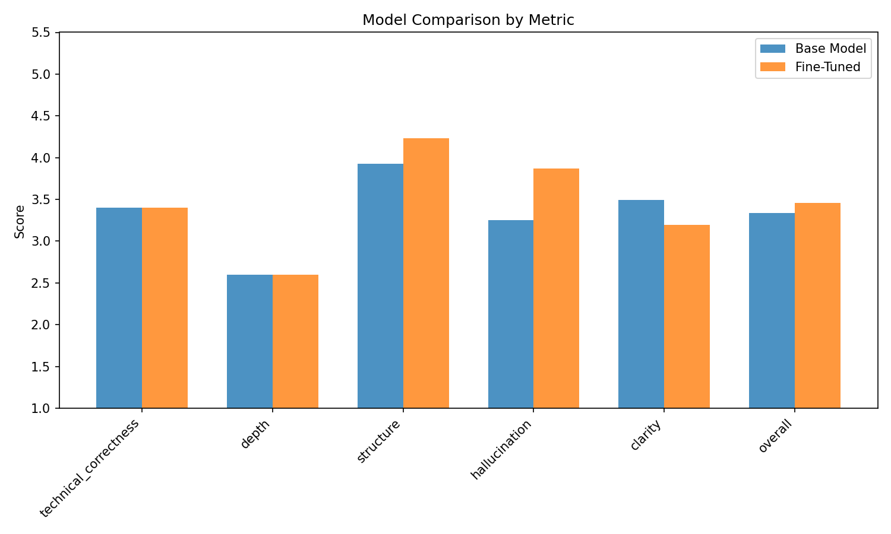
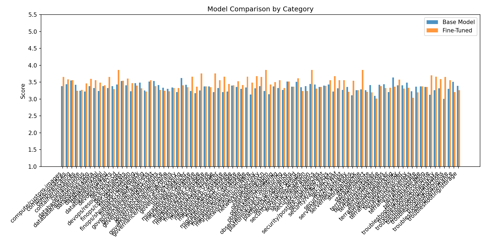

# OCI Specialist LLM

[🇺🇸 English](README.en-US.md) | [🇧🇷 Português](README.md)

Large Language Model (LLM) fine-tuned para Oracle Cloud Infrastructure (OCI) usando Apple Silicon, MLX e LoRA.

[](LICENSE)
[](https://www.python.org)
[](https://mlx.ai)
[](https://github.com/Aaronipher/mlx-tune)
[](https://huggingface.co/mlx-community/Qwen2.5-Coder-7B-Instruct-4bit)
[](docs/taxonomy.md)
[](https://python.langchain.com/docs/langgraph)
[](https://chainlit.io)
[](https://fastapi.tiangolo.com)
[](https://github.com/facebookresearch/faiss)
[](https://github.com/dorianbrown/rank_bm25)
[](https://www.sbert.net/docs/pretrained_models.html#cross-encoders)
[](https://huggingface.co)

---

> **Idioma**: Dados e prompts em Português do Brasil (PT-BR).

### 🚀 Core Stack & Componentes
- **LLM Base**: [Qwen 2.5 Coder 7B Instruct](https://huggingface.co/Qwen/Qwen2.5-Coder-7B-Instruct) (4-bit).
- **Orquestração**: [LangGraph](https://python.langchain.com/docs/langgraph) (Multi-Agent State Machine).
- **Framework Agentes**: [LangChain](https://langchain.com) (Chain of Thought).
- **Interface OCI Copilot**: [Chainlit](https://chainlit.io) (Interactive UI com HITL).
- **Treinamento**: [MLX-Tune](https://github.com/Aaronipher/mlx-tune) (SFTTrainer API).
- **Inferência**: [MLX Framework](https://mlx.ai) (Apple Silicon Native).
- **RAG Dense**: [FAISS](https://github.com/facebookresearch/faiss) (Busca Semântica).
- **RAG Sparse**: [Rank-BM25](https://github.com/dorianbrown/rank_bm25) (Busca Lexical).
- **RAG Re-ranking**: [Sentence-Transformers](https://sbert.net) (Cross-Encoder).
- **RAG Fusion**: Reciprocal Rank Fusion (RRF).
- **Backend API**: [FastAPI](https://fastapi.tiangolo.com).
- **Embeddings**: [Hugging Face](https://huggingface.co) (all-MiniLM-L6-v2).
- **Hardware**: Otimizado para Apple Silicon (M3 Pro 18GB).
- **Desenvolvimento**: Python 3.12.

---

## Visão Geral

O processo de desenvolvimento do OCI Specialist LLM segue uma ordem rigorosa de pipeline para garantir a precisão técnica e a performance no Apple Silicon.



---

## Funcionalidades

- **LoRA Fine-tuning**: Adaptação de baixo ranque com modelo base **Qwen 2.5 Coder 7B Instruct** (4-bit).
- **Otimizado para M3 Pro**: Configurações hiper-otimizadas para 18GB de RAM, usando **BF16 nativo** e sem Swap em disco.
- **Merge & Export Nativo**: Sistema de fusão de adaptadores para gerar modelos GGUF prontos para produção local.
- **RAG Híbrido Avançado**: Busca semântica (FAISS) + lexical (BM25) com persistência local e **Ingestão Offline**.
- **Re-ranking Semântico**: Uso de **Cross-Encoders** para validar a relevância dos documentos recuperados.
- **Sistema Multi-Agentes**: Orquestração via **LangGraph** (Router, Descoberta, Arquitetura, Execução).
- **Interface OCI Copilot**: UI construída com **Chainlit**, suportando anexos de arquivos, streaming de tokens e **Human-in-the-loop** para segurança em comandos CLI.
- **Avaliação Automatizada**: Pipeline de benchmark para medir precisão técnica, alucinação e profundidade.

---

## Dataset

| Métrica | Valor |
|--------|-------|
| **Total Gerado** | 21.750 exemplos (87 categorias × 250) |
| **Após Limpeza/Desduplicação** | 21.327 exemplos |
| **Treino (Train)** | 15.995 exemplos (75%) |
| **Validação (Valid)** | 3.199 exemplos (15%) |
| **Avaliação (Eval)** | 2.133 exemplos (10%) |
| **Categorias** | 87 tópicos do OCI |

### Divisão (Split)

| Split | Exemplos | % |
|-------|----------|---|
| Treino (Train) | 15.995 | 75% |
| Validação (Valid) | 3.199 | 15% |
| Avaliação (Eval) | 2.133 | 10% |

---

## Treinamento

O treinamento utiliza o framework MLX-Tune, focado na arquitetura do Apple Silicon.

### 1. Setup do Ambiente de Treino

```bash
python3.12 -m venv venv
source venv/bin/activate
pip install -r requirements.txt
```

### 2. Execução do Treino (Fine-Tuning)

```bash
# Executa o ciclo consolidado de treinamento (Ciclo 1)
bash training/run_all_cycles.sh --fresh
```

### 3. Fusão de Pesos (Merge) & Exportação

Após gerar os adaptadores LoRA, é obrigatório realizar a fusão com o modelo base para uso em inferência.

```bash
# Fundir adaptadores e exportar para GGUF (Q4_K_M)
python scripts/merge_export.py --cycle cycle-1 --quant q4 --name oci-specialist
```

### Configuração Otimizada (`config/cycle-1.env`)

<details>
<summary><b>Clique para ver a Configuração Completa do .env (26 parâmetros)</b></summary>
<sub>

| Parâmetro | Valor | Descrição |
|-----------|-------|-----------|
| **MODEL** | `mlx-community/Qwen2.5-Coder-7B-Instruct-4bit` | Modelo base otimizado |
| **TRAIN_DATA** | `data/train.jsonl` | Dataset de treinamento |
| **VALID_DATA** | `data/valid.jsonl` | Dataset de validação |
| **OUTPUT_DIR** | `outputs/cycle-1` | Diretório de saída |
| **PREV_ADAPTER** | `""` | Adaptador prévio (se houver) |
| **BATCH_SIZE** | 1 | Tamanho do lote por iteração |
| **LEARNING_RATE** | 2e-4 | Taxa de aprendizado |
| **LORA_RANK** | 8 | Ranque do LoRA |
| **LORA_ALPHA** | 16 | Alfa do LoRA |
| **LORA_DROPOUT** | 0.05 | Dropout do LoRA |
| **GRADIENT_ACCUMULATION** | 4 | Acúmulo de gradientes |
| **NUM_LAYERS** | 14 | Número de camadas LoRA (50%) |
| **TARGET_MODULES** | `"q_proj,k_proj,v_proj,o_proj,gate_proj,up_proj,down_proj"` | Módulos alvo |
| **ITERS** | 4000 | Total de iterações |
| **MAX_SEQ_LENGTH** | 768 | Comprimento máximo de sequência |
| **VAL_BATCHES** | 5 | Batches de validação |
| **EVAL_STEPS** | 250 | Passos entre avaliações |
| **LOGGING_STEPS** | 1 | Passos entre logs |
| **SAVE_STEPS** | 500 | Passos entre salvamentos |
| **WARMUP_STEPS** | 320 | Passos de warmup |
| **GRADIENT_CHECKPOINTING**| false | Checkpointing de gradiente |
| **LR_SCHEDULER** | `cosine` | Scheduler de LR |
| **WEIGHT_DECAY** | 0.01 | Decaimento de peso |
| **SEED** | 42 | Semente aleatória |
| **GRAD_CLIP_NORM** | 1.0 | Clipping de gradiente |
| **BF16** | true | Aceleração nativa M3 |

</sub>
</details>

---

## Avaliação

O pipeline de avaliação compara o modelo fine-tuned contra o modelo base para validar a evolução do aprendizado.

```bash
# Avaliação Recomendada (200 amostras estratificadas, ~30 min)
python scripts/unified_evaluation.py --cycle cycle-1 --mode medium --fresh

# Avaliação Completa (2133 amostras, ~4-6 horas)
python scripts/unified_evaluation.py --cycle cycle-1 --mode full --fresh
```

### Resumo dos Resultados (Iniciais)

| Métrica | Modelo Base | Fine-Tuned (Cycle 1) | Delta |
|--------|-------------|------------|-------|
| technical_correctness | 3.40 | 3.40 | +0.00 |
| depth | 2.60 | 2.60 | +0.00 |
| structure | 3.93 | 4.23 | +0.30 |
| hallucination | 3.25 | 3.87 | +0.62 |
| clarity | 3.49 | 3.19 | -0.30 |
| **Overall** | **3.33** | **3.46** | **+0.12** |

Resultados: [benchmark](#benchmark)

---

## RAG (Retrieval-Augmented Generation)

O OCI Copilot utiliza uma camada de RAG Híbrida persistente para acessar a documentação Oracle em tempo real.

### 1. Setup do Ambiente RAG

```bash
python3.12 -m venv venv-rag
source venv-rag/bin/activate
pip install -r requirements-rag.txt
```

### 2. Ingestão Offline (Obrigatória)
Para economizar RAM durante o chat, os índices devem ser gerados offline antes do uso:
```bash
python scripts/update_rag.py
```

### 3. Orquestração e Agentes
O ecossistema é orquestrado via **LangGraph** e servido via **FastAPI**.

**Subir API Backend (RAG Indices):**
```bash
uvicorn rag.api:app --host 0.0.0.0 --port 8000
```

**Subir Orquestrador e UI (Interface Copilot):**
```bash
chainlit run rag/app_chainlit.py -w
```

---

## Inferência e UI

A inferência local é realizada utilizando o modelo após o processo de **Merge**.

### 1. Servidor de Inferência (MLX)
```bash
mlx_lm.server --model mlx-community/Qwen2.5-Coder-7B-Instruct-4bit --adapter outputs/cycle-1/adapters
```

### 2. OCI Copilot UI
Com o backend RAG rodando, inicie a interface visual:
```bash
chainlit run rag/app_chainlit.py --port 8001
```

---

## Benchmark

### Como avaliar
Para gerar novos relatórios, utilize os comandos detalhados na seção [Avaliação](#avaliação).

### Comparação de Métricas


### Performance por Categoria


### Resumo Geral

| Métrica | Modelo Base | Fine-Tuned | Delta |
|--------|-------------|------------|-------|
| technical_correctness | 3.40 | 3.40 | +0.00 |
| depth | 2.60 | 2.60 | +0.00 |
| structure | 3.93 | 4.23 | +0.30 |
| hallucination | 3.25 | 3.87 | +0.62 |
| clarity | 3.49 | 3.19 | -0.30 |
| **Overall** | **3.33** | **3.46** | **+0.12** |

### Principais Ganhos por Tópico (Top 5)
1. **Troubleshooting Functions**: +0.65
2. **Networking VCN**: +0.62
3. **Storage File**: +0.57
4. **Troubleshooting Compute**: +0.57
5. **Migration Azure Storage**: +0.55

### Resultados Detalhados por Categoria (87 Tópicos)

<details>
<summary>Clique para expandir a tabela de performance por categoria</summary>
<sub>

| # | Categoria | Base | FT | Delta |
|---|---------|------|----|-------|
| 1 | compute/custom-images | 3.38 | 3.66 | +0.27 |
| 2 | compute/instances | 3.44 | 3.58 | +0.14 |
| 3 | compute/scaling | 3.55 | 3.56 | +0.01 |
| 4 | container/instances | 3.42 | 3.25 | -0.17 |
| 5 | container/oke | 3.24 | 3.27 | +0.03 |
| 6 | database/autonomous | 3.23 | 3.46 | +0.24 |
| 7 | database/autonomous-json | 3.38 | 3.60 | +0.22 |
| 8 | database/exadata | 3.33 | 3.56 | +0.23 |
| 9 | database/mysql | 3.24 | 3.48 | +0.24 |
| 10 | database/nosql | 3.38 | 3.41 | +0.02 |
| 11 | database/postgresql | 3.33 | 3.66 | +0.33 |
| 12 | devops/artifacts | 3.38 | 3.29 | -0.09 |
| 13 | devops/ci-cd | 3.43 | 3.86 | +0.43 |
| 14 | devops/resource-manager | 3.54 | 3.55 | +0.01 |
| 15 | devops/secrets | 3.41 | 3.61 | +0.20 |
| 16 | finops/cost-optimization | 3.23 | 3.47 | +0.24 |
| 17 | finops/rightsizing | 3.47 | 3.40 | -0.07 |
| 18 | finops/showback-chargeback | 3.49 | 3.32 | -0.17 |
| 19 | finops/storage-tiering | 3.26 | 3.22 | -0.04 |
| 20 | governance/audit-readiness | 3.52 | 3.56 | +0.04 |
| 21 | governance/budgets-cost | 3.53 | 3.38 | -0.15 |
| 22 | governance/compartments | 3.42 | 3.27 | -0.14 |
| 23 | governance/compliance | 3.33 | 3.25 | -0.08 |
| 24 | governance/landing-zone | 3.30 | 3.23 | -0.07 |
| 25 | governance/policies-guardrails | 3.34 | 3.33 | -0.02 |
| 26 | governance/resource-discovery | 3.21 | 3.33 | +0.12 |
| 27 | governance/tagging | 3.63 | 3.41 | -0.22 |
| 28 | lb/load-balancer | 3.42 | 3.35 | -0.07 |
| 29 | migration/aws-compute | 3.24 | 3.66 | +0.42 |
| 30 | migration/aws-database | 3.17 | 3.37 | +0.19 |
| 31 | migration/aws-storage | 3.25 | 3.76 | +0.51 |
| 32 | migration/azure-compute | 3.38 | 3.37 | -0.00 |
| 33 | migration/azure-database | 3.38 | 3.35 | -0.03 |
| 34 | migration/azure-storage | 3.21 | 3.76 | +0.55 |
| 35 | migration/data-transfer | 3.32 | 3.56 | +0.23 |
| 36 | migration/gcp-compute | 3.20 | 3.66 | +0.46 |
| 37 | migration/gcp-database | 3.22 | 3.45 | +0.23 |
| 38 | migration/gcp-storage | 3.40 | 3.41 | +0.00 |
| 39 | migration/onprem-compute | 3.36 | 3.53 | +0.17 |
| 40 | migration/onprem-database | 3.30 | 3.42 | +0.12 |
| 41 | migration/onprem-storage | 3.34 | 3.66 | +0.32 |
| 42 | migration/onprem-vmware | 3.13 | 3.49 | +0.35 |
| 43 | networking/connectivity | 3.32 | 3.68 | +0.36 |
| 44 | networking/security | 3.38 | 3.66 | +0.28 |
| 45 | networking/vcn | 3.24 | 3.86 | +0.62 |
| 46 | observability/apm | 3.14 | 3.43 | +0.29 |
| 47 | observability/logging | 3.37 | 3.50 | +0.13 |
| 48 | observability/monitoring | 3.32 | 3.56 | +0.24 |
| 49 | observability/stack-monitoring | 3.27 | 3.33 | +0.06 |
| 50 | platform/backup-governance | 3.52 | 3.52 | -0.00 |
| 51 | platform/sre-operations | 3.37 | 3.37 | +0.01 |
| 52 | security/cloud-guard | 3.51 | 3.62 | +0.11 |
| 53 | security/dynamic-groups | 3.35 | 3.24 | -0.11 |
| 54 | security/encryption | 3.38 | 3.24 | -0.15 |
| 55 | security/federation | 3.45 | 3.86 | +0.41 |
| 56 | security/iam-basics | 3.43 | 3.31 | -0.12 |
| 57 | security/policies | 3.36 | 3.36 | +0.00 |
| 58 | security/posture-management | 3.40 | 3.39 | -0.00 |
| 59 | security/vault-keys | 3.43 | 3.56 | +0.13 |
| 60 | security/vault-secrets | 3.23 | 3.68 | +0.46 |
| 61 | security/waf | 3.32 | 3.56 | +0.24 |
| 62 | security/zero-trust | 3.27 | 3.56 | +0.29 |
| 63 | serverless/api-gateway | 3.36 | 3.21 | -0.15 |
| 64 | serverless/functions | 3.11 | 3.55 | +0.43 |
| 65 | storage/block | 3.26 | 3.27 | +0.00 |
| 66 | storage/file | 3.29 | 3.86 | +0.57 |
| 67 | storage/object | 3.26 | 3.22 | -0.05 |
| 68 | terraform/compute | 3.41 | 3.20 | -0.21 |
| 69 | terraform/container | 3.10 | 3.01 | -0.08 |
| 70 | terraform/database | 3.43 | 3.38 | -0.05 |
| 71 | terraform/devops | 3.44 | 3.33 | -0.11 |
| 72 | terraform/load-balancer | 3.21 | 3.33 | +0.12 |
| 73 | terraform/networking | 3.64 | 3.37 | -0.27 |
| 74 | terraform/observability | 3.41 | 3.57 | +0.16 |
| 75 | terraform/provider | 3.40 | 3.31 | -0.09 |
| 76 | terraform/security | 3.49 | 3.34 | -0.15 |
| 77 | terraform/serverless | 3.23 | 3.04 | -0.19 |
| 78 | terraform/state | 3.37 | 3.20 | -0.17 |
| 79 | terraform/storage | 3.37 | 3.38 | +0.00 |
| 80 | troubleshooting/authentication | 3.36 | 3.36 | +0.00 |
| 81 | troubleshooting/compute | 3.13 | 3.70 | +0.57 |
| 82 | troubleshooting/connectivity | 3.26 | 3.66 | +0.40 |
| 83 | troubleshooting/database | 3.32 | 3.59 | +0.27 |
| 84 | troubleshooting/functions | 3.01 | 3.66 | +0.65 |
| 85 | troubleshooting/oke | 3.30 | 3.56 | +0.26 |
| 86 | troubleshooting/performance | 3.51 | 3.21 | -0.31 |
| 87 | troubleshooting/storage | 3.39 | 3.27 | -0.13 |

</sub>
</details>

---

## Roadmap

As seguintes melhorias estão planejadas:

1. **Integração com OpenRouter**: Roteamento para modelos de fronteira (Claude/GPT-4) em tarefas complexas.
2. **Exportação para Hugging Face Hub**: Publicação dos adaptadores treinados e modelos quantizados.

---

## Agradecimentos

Este projeto foi desenvolvido integrando as seguintes tecnologias de ponta:

- **Hardware**: Apple Silicon (M3 Pro) com Memória Unificada.
- **Treinamento e Inferência**: [MLX Framework](https://mlx.ai) e [MLX-Tune](https://github.com/Aaronipher/mlx-tune).
- **Modelo Base**: [Qwen 2.5 Coder 7B Instruct](https://huggingface.co/Qwen/Qwen2.5-Coder-7B-Instruct) (Alibaba Cloud).
- **Orquestração de Agentes**: [LangGraph](https://python.langchain.com/docs/langgraph) e [LangChain](https://langchain.com).
- **Interface do Usuário**: [Chainlit](https://chainlit.io).
- **Serviços de Backend**: [FastAPI](https://fastapi.tiangolo.com).
- **Motores de Busca (RAG Híbrida)**: [FAISS](https://github.com/facebookresearch/faiss) (Dense) e [Rank-BM25](https://github.com/dorianbrown/rank_bm25) (Sparse).
- **Embeddings e Re-ranking**: [Hugging Face](https://huggingface.co) e [Sentence-Transformers](https://sbert.net) (Cross-Encoder).
- **Desenvolvimento**: [Python 3.12](https://www.python.org).
- **Dados**: Sintetizados e validados especificamente para cenários de Oracle Cloud Infrastructure (OCI).

---

## Licença

Este projeto está licenciado sob a Licença MIT. Veja o arquivo [LICENSE](LICENSE) para detalhes.
