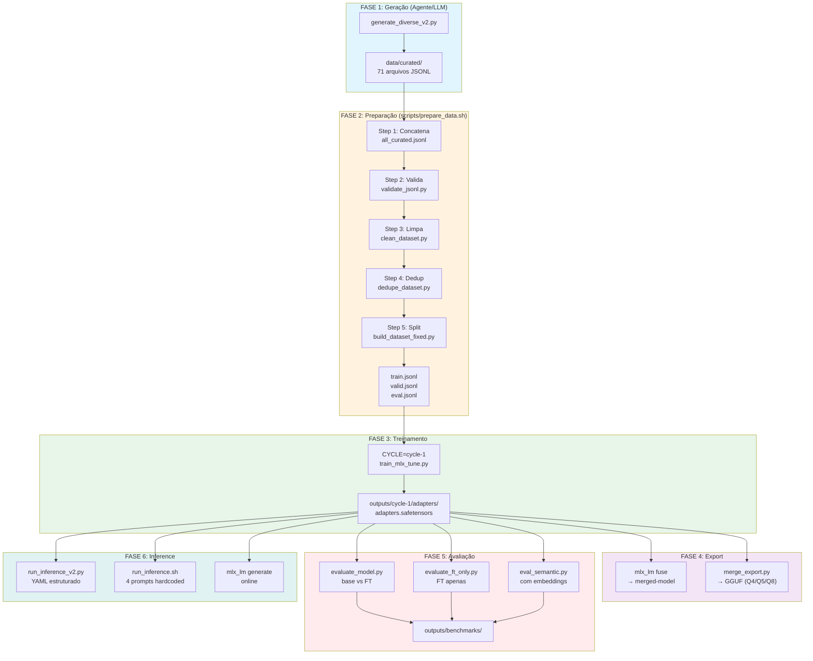

# OCI Specialist LLM

Fine-tuning de LLM especialista em Oracle Cloud Infrastructure (OCI) usando Apple Silicon, MLX e LoRA.

[](LICENSE)
[](https://www.python.org)
[](https://mlx.ai)
[](https://huggingface.co/mlx-community/Meta-Llama-3.1-8B-Instruct-4bit)
[](docs/taxonomy.md)

> **Idioma**: Dados e prompts em PT-BR.

---

## Visão Geral

Pipeline completo: geração dataset → validação → treino MLX LoRA → avaliação.



**Stack:** Python 3.12, MLX 0.31.1, MLX-LM 0.31.1, MLX-Tune 0.4.18, JSONL chat format.

---

## Dataset

| Métrica | Valor |
|---------|-------|
| **Total** | 3,403 exemplos |
| **Categorias** | 71 topics OCI |
| **Removidos na limpeza** | 6,473 (templates genéricos, duplicatas) |

### Split

| Split | Exemplos | % |
|-------|----------|---|
| Train | 2,583 | 75.9% |
| Valid | 495 | 14.5% |
| Eval | 325 | 9.6% |

### Categorias

- OCI Core (compute, storage, networking, lb, database, container, serverless) - 20 topics
- Security (iam, policies, vault, encryption, cloud-guard, waf) - 9 topics
- Migration (AWS/Azure/GCP/On-prem → OCI) - 14 topics
- Terraform (provider, compute, storage, networking, etc) - 12 topics
- Observability - 4 topics
- Troubleshooting - 8 topics
- DevOps - 4 topics

---

## Pipeline

### 1. Geração

```bash
python scripts/generate_diverse_v2.py
```

Saída: `data/curated/*.jsonl` (71 arquivos) + `data/all_curated.jsonl`

### 2. Validação e Limpeza

```bash
# Pipeline completo
bash scripts/prepare_data.sh

# Ou manual
python3 scripts/validate_jsonl.py data/all_curated.jsonl
python3 scripts/clean_dataset.py --input data/all_curated.jsonl --output data/all_curated_clean.jsonl --all
python3 scripts/dedupe_dataset.py data/all_curated_clean.jsonl --remove
```

### 3. Construção Dataset

```bash
python scripts/build_dataset_fixed.py --input data/all_curated_clean.jsonl
```

### 4. Treinamento

```bash
# Com clean (recomendado)
bash training/run_all_cycles.sh --fresh
```

**Nota:** O script cria logs em `outputs/logs/cycle-1/` e métricas CSV automaticamente.

**Config:** `config/cycle-1.env`

| Parâmetro | Valor |
|-----------|-------|
| MODEL | mlx-community/Meta-Llama-3.1-8B-Instruct-4bit |
| LEARNING_RATE | 2e-4 |
| LORA_RANK | 8 |
| LORA_ALPHA | 16 |
| LORA_DROPOUT | 0.05 |
| ITERS | 646 |
| BATCH_SIZE | 1 |
| GRADIENT_ACCUMULATION | 4 |
| MAX_SEQ_LENGTH | 2048 |
| WARMUP_STEPS | 200 |

### 5. Export

#### merge_export.py (Script Recomendado)

```bash
# Export Q4 com nome customizado (gera: oci-specialist-Q4_K_M.gguf)
python scripts/merge_export.py --cycle cycle-1 --quant q4 --name oci-specialist

# Export múltiplos formatos (gera: oci-specialist-Q4_K_M.gguf, Q5_K_M.gguf, Q8_0.gguf)
python scripts/merge_export.py --cycle cycle-1 --quant q4,q5,q8 --name oci-specialist

# Sem nome customizado (gera: cycle-1-q4.gguf)
python scripts/merge_export.py --cycle cycle-1 --quant q4
```

**Parâmetros:**
| Parâmetro | Descrição |
|-----------|-----------|
| `--cycle` | Nome do ciclo (obrigatório) |
| `--quant` | Tipos de quantização: q4, q5, q8 (padrão: q4) |
| `--name` | Nome do arquivo GGUF (padrão: nome do cycle) |

**Nota:** O script usa `--dequantize` automaticamente ao fundir o modelo 4bit, garantindo dimensões corretas (4096 em vez de 512).

### 6. Avaliação

```bash
# Comparação entre base model e fine-tuned (métricas: loss, perplexity)
python scripts/evaluate_model.py --cycle cycle-1 outputs/cycle-1 data/eval.jsonl outputs/benchmarks

# Avaliação apenas do fine-tuned (métricas no dataset de eval)
python scripts/evaluate_ft_only.py --cycle cycle-1 outputs/cycle-1 data/eval.jsonl outputs/benchmarks

# Avaliação com similarity semântica (usando embeddings)
python scripts/eval_semantic.py data/eval.jsonl  # Avaliação com similarity semântica
```

### 7. Inference

```bash
# Modo 1: Base model (sem LoRA)
python scripts/run_inference_v2.py --config config/inference_prompts.yaml --model mlx-community/Meta-Llama-3.1-8B-Instruct-4bit

# Modo 2: Base + LoRA adapter (fine-tuned)
python scripts/run_inference_v2.py --config config/inference_prompts.yaml --adapter outputs/cycle-1/adapters
```

Prompts em `config/inference_prompts.yaml`, output JSON estruturado em `outputs/inference_results.json`.

### 8. Ollama (Inference Local)

```bash
# Criar Modelfile (use caminho absoluto)
cat > outputs/cycle-1/gguf/Modelfile << 'EOF'
FROM /full/path/to/outputs/cycle-1/gguf/oci-specialist-Q4_K_M.gguf
PARAMETER temperature 0.1
PARAMETER top_p 0.9
PARAMETER top_k 40
SYSTEM Você é um especialista em OCI (Oracle Cloud Infrastructure).
EOF

# Importar para Ollama
ollama create oci-specialist -f /full/path/to/outputs/cycle-1/gguf/Modelfile

# Testar inference
echo "Liste 3 serviços do OCI" | ollama run oci-specialist
```

**Modelo disponível:** `oci-specialist` (4.7GB)

---

## Estrutura

```
├── config/
│   ├── cycle-1.env                    # Configuração do treino
│   ├── gguf.env                       # Configuração de exportação GGUF
│   └── inference_prompts.yaml        # Prompts para inference
├── data/
│   ├── curated/                       # 71 arquivos JSONL (topics)
│   ├── all_curated.jsonl              # Combinado
│   ├── all_curated_clean.jsonl        # Limpo
│   ├── train.jsonl                    # 2,583
│   ├── valid.jsonl                    # 495
│   └── eval.jsonl                     # 325
├── docs/
│   ├── taxonomy.md
│   ├── quality-rules.md
│   ├── eval-rubric.md
│   └── *.md
├── scripts/
│   ├── generate_diverse_v2.py         # Gerador de dataset
│   ├── validate_jsonl.py              # Validação estrutural
│   ├── clean_dataset.py               # Limpeza de conteúdo
│   ├── dedupe_dataset.py              # Deduplicação character-level
│   ├── build_dataset_fixed.py         # Split estratificado
│   ├── merge_export.py                 # Merge + export GGUF (recomendado)
│   ├── export_gguf.py                 # Export GGUF (deprecated)
│   ├── evaluate_model.py              # Avaliação base vs FT
│   ├── evaluate_ft_only.py            # Avaliação FT apenas
│   ├── eval_semantic.py               # Avaliação com embeddings
│   └── run_inference_v2.py            # Inference estruturado
├── training/
│   ├── train_mlx_tune.py              # Treino principal (SFTTrainer API)
│   ├── train_mlx_tune_old.py          # Treino antigo (deprecated)
│   ├── run_all_cycles.sh              # Orquestrador de ciclos
│   ├── export_adapter.sh              # Merge LoRA + base model
│   └── run_inference.sh               # Inference básico
├── outputs/
│   └── cycle-1/                       # Adapter treinado
│       ├── adapters/
│       │   └── adapters.safetensors
│       └── train.jsonl
└── venv/                              # Ambiente virtual Python 3.12
```

---

## Pré-requisitos

```bash
python3.12 -m venv venv
source venv/bin/activate
pip install -r requirements.txt
```

- Apple Silicon Mac (M1/M2/M3/M4/M5)
- Python 3.12

---

## Limitações

1. **100% single-turn** - Dataset não tem conversas multi-turn.
2. **Sem RAG** - Não há acesso à documentação OCI em tempo real.