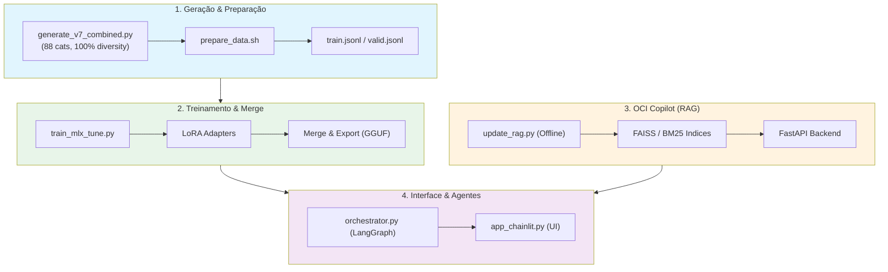
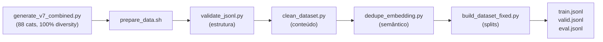

# OCI Specialist LLM

[🇺🇸 English](README.en-US.md) | [🇧🇷 Português](README.md)

Large Language Model (LLM) fine-tuned para Oracle Cloud Infrastructure (OCI) usando Apple Silicon, MLX e LoRA.

[](LICENSE)
[](https://www.python.org)
[](https://mlx.ai)
[](https://github.com/Aaronipher/mlx-tune)
[](https://huggingface.co/mlx-community/Qwen2.5-Coder-7B-Instruct-4bit)
[](docs/taxonomy.md)
[](https://python.langchain.com/docs/langgraph)
[](https://chainlit.io)
[](https://fastapi.tiangolo.com)
[](https://github.com/facebookresearch/faiss)
[](https://github.com/dorianbrown/rank_bm25)
[](https://www.sbert.net/docs/pretrained_models.html#cross-encoders)
[](https://huggingface.co)

---

> **Idioma**: Dados e prompts em Português do Brasil (PT-BR).

### 🚀 Core Stack & Componentes
- **LLM Base**: [Qwen 2.5 Coder 7B Instruct](https://huggingface.co/Qwen/Qwen2.5-Coder-7B-Instruct) (4-bit).
- **Orquestração de Agentes**: [LangGraph](https://python.langchain.com/docs/langgraph) & [LangChain](https://langchain.com).
- **Interface OCI Copilot**: [Chainlit](https://chainlit.io) (Interactive UI com HITL).
- **Treinamento e Inferência**: [MLX Framework](https://mlx.ai) & [MLX-Tune](https://github.com/Aaronipher/mlx-tune).
- **RAG (Busca Híbrida)**: [FAISS](https://github.com/facebookresearch/faiss) (Dense) + [Rank-BM25](https://github.com/dorianbrown/rank_bm25) (Sparse).
- **Backend Service**: [FastAPI](https://fastapi.tiangolo.com) (RAG API).
- **Embeddings & Rerank**: [Hugging Face](https://huggingface.co) & [Sentence-Transformers](https://sbert.net).
- **Hardware**: Otimizado para Apple Silicon (M3 Pro 18GB).
- **Linguagem**: Python 3.12.

---

## Visão Geral

O processo de desenvolvimento do OCI Specialist LLM segue uma ordem rigorosa de pipeline para garantir a precisão técnica e a performance no Apple Silicon.



---

## Funcionalidades

- **LoRA Fine-tuning**: Adaptação de baixo ranque com modelo base **Qwen 2.5 Coder 7B Instruct** (4-bit).
- **Otimizado para M3 Pro**: Configurações hiper-otimizadas para 18GB de RAM, usando **BF16 nativo** e sem Swap em disco.
- **RAG Híbrido Avançado**: Busca semântica (FAISS) + lexical (BM25) com persistência local e **Ingestão Offline**.
- **Sistema Multi-Agentes**: Orquestração via **LangGraph** (Router, Descoberta, Arquitetura, Execução).
- **Interface OCI Copilot**: UI construída com **Chainlit**, suportando anexos de arquivos, streaming de tokens e **Human-in-the-loop** para segurança em comandos CLI.
- **Merge & Export**: Pipeline para fundir adaptadores LoRA ao modelo base e exportar para GGUF (quantização local).
- **Avaliação Automatizada**: Pipeline de benchmark para medir precisão técnica, alucinação e profundidade.

---

## Dataset

| Métrica | Valor |
|--------|-------|
| **Total Gerado** | 13.200 exemplos (88 categorias × 150) |
| **Após Limpeza/Desduplicação** | 13.196 exemplos |
| **Treino (Train)** | 9.897 exemplos (75%) |
| **Validação (Valid)** | 1.979 exemplos (15%) |
| **Avaliação (Eval)** | 1.320 exemplos (10%) |
| **Categorias** | 88 tópicos do OCI |

---

## Instalação e Começando

> [!IMPORTANT]
> **Todos os comandos deste projeto devem ser executados obrigatoriamente na raiz do repositório.**
> **Lembre-se de ativar o ambiente virtual correto com `source venv/bin/activate` ou `source venv-rag/bin/activate` antes de executar qualquer comando.**

### 1. Clonagem do Repositório

```bash
git clone https://github.com/otavio-lemos/olia-2-oci.git
cd olia-2-oci
```

### 2. Ambiente de Treinamento (LLM)

```bash
python3.12 -m venv venv
source venv/bin/activate
pip install -r requirements.txt
```

### 3. Ambiente OCI Copilot (RAG)

```bash
python3.12 -m venv venv-rag
source venv-rag/bin/activate
pip install -r requirements-rag.txt
```

---

## Preparação do Dataset

Pipeline para validar, limpar, desduplicar e gerar splits do dataset.

### Fluxo Completo



### Geração do Dataset

Gera exemplos usando templates com OCI CLI commands reais e intents variados. Rápido, sem custo, sem dependência de internet.

```bash
# Gerar dataset (88 categorias × 180 exemplos = 15,840)
python scripts/generate_v7_combined.py
```

### Passo Final — Validar, Limpar e Gerar Splits

Após gerar os exemplos, execute o pipeline de preparação:

```bash
# Validar, limpar, desduplicar e gerar splits (75/15/10%)
bash scripts/prepare_data.sh
```

### Scripts do Pipeline

| Script | Função | Entrada | Saída |
|--------|--------|---------|-------|
| `validate_jsonl.py` | Valida estrutura JSONL (schema messages) | `all_curated.jsonl` | `all_curated.jsonl` (ou falha) |
| `clean_dataset.py` | Remove templates genéricos, CLI incorretas, ruído | `all_curated.jsonl` | `all_curated_clean.jsonl` |
| `dedupe_embedding.py` | Desduplicação semântica por embeddings (threshold 0.97) | `all_curated_clean.jsonl` | `all_curated_semantic_dedup.jsonl` |
| `build_dataset_fixed.py` | Gera splits (75% train, 15% valid, 10% eval) | `all_curated_semantic_dedup.jsonl` | `train.jsonl`, `valid.jsonl`, `eval.jsonl` |

---

## Treinamento

O treinamento utiliza o framework MLX-Tune, focado na arquitetura do Apple Silicon.

### 1. Execução do Treino (Fine-Tuning)

> [!NOTE]
> Execute com o ambiente **venv** ativado: `source venv/bin/activate`

```bash
# Execute o ciclo consolidado de treinamento
bash training/run_cycles.sh --all --fresh
```

### 2. Fusão de Pesos (Merge) & Exportação

> [!NOTE]
> Execute com o ambiente **venv** ativado: `source venv/bin/activate`

Após gerar os adaptadores LoRA, fundir com o modelo base para uso em inferência.

```bash
# Merge e export para GGUF Q4
python scripts/merge_export.py --cycle cycle-1 --quant q4 --name oci-specialist
```

---

## Avaliação

O pipeline de avaliação compara o modelo fine-tuned contra o modelo base usando:
- **Scoring automático**: Correctness, Depth, Structure, Hallucination, Clarity
- **Similaridade semântica**: Sentence Transformers (MiniLM-L6-v2)
- **Judge (opcional)**: LLM-as-Judge usando modelo diferente (ex: Llama 3.1 8B) para avaliação imparcial

> [!NOTE]
> Execute com o ambiente **venv** ativado: `source venv/bin/activate`

### 1. Gerar Modelos Quantizados (Pré-requisito)

Antes de avaliar, gere os modelos quantizados com o merge_export:

```bash
# Gerar versões quantizadas do modelo mergeado
# Cria: safetensors/bf16/, safetensors/q4/
python scripts/merge_export.py --cycle cycle-1 --quant q4
```

### 2. Executar Avaliação

```bash
# Avaliação Rápida (10 amostras, ~2 min) - modelo específico obrigatório
python scripts/unified_evaluation_v2.py --cycle cycle-1 --ft-model outputs/cycle-1/safetensors/q4 --mode small --fresh

# Avaliação Completa (2133 amostras, ~4-6 horas)
python scripts/unified_evaluation_v2.py --cycle cycle-1 --ft-model outputs/cycle-1/safetensors/q4 --mode full --fresh

# Avaliação com Judge (LLM-as-Judge usando modelo diferente)
python scripts/unified_evaluation_v2.py --cycle cycle-1 --ft-model outputs/cycle-1/safetensors/q4 --mode medium --external-judge --judge-lang pt --judge-tokens 768 --max-tokens 768
```

Resultados: ver [Benchmark](#benchmark)

---

## RAG (Retrieval-Augmented Generation)

O OCI Copilot utiliza uma camada de RAG persistente para acessar fatos da documentação Oracle.

### 1. Ingestão Offline (Obrigatória)
> [!NOTE]
> Execute com o ambiente **venv-rag** ativado: `source venv-rag/bin/activate`

Para economizar RAM durante o chat, os índices devem ser gerados offline:
```bash
python scripts/update_rag.py
```

### 2. Orquestração e Agentes
O ecossistema é orquestrado via **LangGraph** e servido via **FastAPI**.

**Subir API Backend (RAG Indices):**
> [!NOTE]
> Execute com o ambiente **venv-rag** ativado: `source venv-rag/bin/activate`

```bash
uvicorn rag.api:app --host 0.0.0.0 --port 8000
```

**Subir Orquestrador e UI (Interface Copilot):**
> [!NOTE]
> Execute com o ambiente **venv-rag** ativado: `source venv-rag/bin/activate`

```bash
chainlit run rag/app_chainlit.py --port 8001
```

---

## Inferência e UI

A inferência local é realizada utilizando o modelo após o processo de **Merge**.

### 1. Servidores de Inferência

#### MLX (Recomendado - Apple Silicon)
> [!TIP]
> Recomendado para Apple Silicon. Inferência local via MLX com LoRA adapter.

> [!NOTE]
> Execute com o ambiente **venv** ativado: `source venv/bin/activate`

```bash
mlx_lm.server --model mlx-community/Qwen2.5-Coder-7B-Instruct-4bit --adapter outputs/cycle-1/adapters
```

#### Ollama
```bash
# 1. Criar Modelfile
cat > ./outputs/cycle-1/gguf/Modelfile << 'EOF'
FROM ./oci-specialist-Q4_K_M.gguf
PARAMETER temperature 0.1
PARAMETER top_p 0.9
PARAMETER top_k 40
SYSTEM Você é um especialista em OCI (Oracle Cloud Infrastructure).
EOF

# 2. Criar modelo
ollama create oci-specialist -f ./outputs/cycle-1/gguf/Modelfile

# 3. Iniciar servidor em background
ollama serve &

# 4. Carregar modelo na memória
curl http://localhost:11434/api/generate -d '{"model": "oci-specialist", "keep_alive": -1}'
```

#### llama.cpp
```bash
llama-server -m outputs/cycle-1/gguf/oci-specialist-Q4_K_M.gguf --port 8080
```

### 2. OCI Copilot UI
> [!NOTE]
> Execute com o ambiente **venv-rag** ativado: `source venv-rag/bin/activate`

Com o backend RAG rodando, inicie a interface visual:
```bash
chainlit run rag/app_chainlit.py --port 8001
```

---

## Benchmark

### Resumo dos Resultados (Avaliação 200 amostras)

| Métrica | Modelo Base | Fine-Tuned (Cycle 1) | Delta |
|--------|-------------|------------|-------|
| technical_correctness | 3.40 | 3.40 | +0.00 |
| depth | 2.60 | 2.60 | +0.00 |
| structure | 4.00 | 4.44 | +0.45 |
| hallucination | 3.58 | 4.68 | +1.10 |
| clarity | 3.50 | 3.37 | -0.13 |
| **Overall** | **3.42** | **3.70** | **+0.28** |

### Como avaliar
Para gerar novos relatórios, utilize os comandos detalhados na seção [Avaliação](#avaliação).

### Comparação de Métricas


### Performance por Categoria


### Principais Ganhos por Tópico (Top 5)
1. **Troubleshooting Connectivity**: +0.66
2. **Troubleshooting Storage**: +0.66
3. **FinOps Cost-Optimization**: +0.60
4. **DevOps Secrets**: +0.50
5. **Security Encryption**: +0.50

### Resultados Detalhados por Categoria (86 Tópicos)

<details>
<summary>Clique para expandir a tabela de performance por categoria</summary>
<sub>

| # | Categoria | Base | FT | Delta |
|---|---------|------|----|-------|
| 1 | compute/custom-images | 3.59 | 3.63 | +0.05 |
| 2 | compute/instances | 3.56 | 3.60 | +0.05 |
| 3 | compute/scaling | 3.33 | 3.69 | +0.36 |
| 4 | container/instances | 3.29 | 3.61 | +0.32 |
| 5 | container/oke | 3.28 | 3.61 | +0.33 |
| 6 | database/autonomous | 3.37 | 3.68 | +0.30 |
| 7 | database/autonomous-json | 3.51 | 3.70 | +0.19 |
| 8 | database/exadata | 3.55 | 3.60 | +0.05 |
| 9 | database/exadata-cloud | 3.54 | 3.71 | +0.17 |
| 10 | database/mysql | 3.51 | 3.69 | +0.18 |
| 11 | database/nosql | 3.52 | 3.76 | +0.24 |
| 12 | database/postgresql | 3.55 | 3.66 | +0.11 |
| 13 | devops/artifacts | 3.31 | 3.67 | +0.37 |
| 14 | devops/ci-cd | 3.39 | 3.60 | +0.20 |
| 15 | devops/resource-manager | 3.55 | 3.76 | +0.21 |
| 16 | devops/secrets | 3.20 | 3.70 | +0.50 |
| 17 | finops/cost-optimization | 3.24 | 3.84 | +0.60 |
| 18 | finops/rightsizing | 3.47 | 3.79 | +0.31 |
| 19 | finops/showback-chargeback | 3.61 | 3.61 | +0.00 |
| 20 | finops/storage-tiering | 3.46 | 3.56 | +0.11 |
| 21 | governance/audit-readiness | 3.36 | 3.70 | +0.34 |
| 22 | governance/budgets-cost | 3.52 | 3.62 | +0.10 |
| 23 | governance/compartments | 3.37 | 3.70 | +0.33 |
| 24 | governance/compliance | 3.31 | 3.67 | +0.36 |
| 25 | governance/landing-zone | 3.47 | 3.67 | +0.21 |
| 26 | governance/policies-guardrails | 3.30 | 3.72 | +0.42 |
| 27 | governance/resource-discovery | 3.29 | 3.66 | +0.37 |
| 28 | governance/tagging | 3.42 | 3.62 | +0.20 |
| 29 | lb/load-balancer | 3.53 | 3.63 | +0.10 |
| 30 | migration/aws-database | 3.60 | 3.83 | +0.23 |
| 31 | migration/azure-compute | 3.37 | 3.65 | +0.28 |
| 32 | migration/azure-database | 3.50 | 3.81 | +0.31 |
| 33 | migration/azure-storage | 3.27 | 3.65 | +0.38 |
| 34 | migration/data-transfer | 3.16 | 3.68 | +0.52 |
| 35 | migration/gcp-compute | 3.37 | 3.81 | +0.44 |
| 36 | migration/gcp-database | 3.40 | 3.79 | +0.39 |
| 37 | migration/gcp-storage | 3.28 | 3.73 | +0.45 |
| 38 | migration/onprem-compute | 3.42 | 3.79 | +0.37 |
| 39 | migration/onprem-database | 3.45 | 3.75 | +0.30 |
| 40 | migration/onprem-storage | 3.49 | 3.78 | +0.29 |
| 41 | migration/onprem-vmware | 3.37 | 3.71 | +0.34 |
| 42 | networking/connectivity | 3.38 | 3.64 | +0.26 |
| 43 | networking/security | 3.53 | 3.75 | +0.21 |
| 44 | networking/vcn | 3.62 | 3.68 | +0.07 |
| 45 | observability/apm | 3.38 | 3.66 | +0.28 |
| 46 | observability/logging | 3.49 | 3.66 | +0.18 |
| 47 | observability/monitoring | 3.34 | 3.67 | +0.33 |
| 48 | observability/stack-monitoring | 3.45 | 3.70 | +0.25 |
| 49 | platform/backup-governance | 3.27 | 3.72 | +0.46 |
| 50 | platform/sre-operations | 3.35 | 3.65 | +0.30 |
| 51 | security/cloud-guard | 3.55 | 3.72 | +0.17 |
| 52 | security/dynamic-groups | 3.43 | 3.72 | +0.29 |
| 53 | security/encryption | 3.18 | 3.68 | +0.50 |
| 54 | security/federation | 3.44 | 3.61 | +0.17 |
| 55 | security/iam-basics | 3.29 | 3.61 | +0.32 |
| 56 | security/policies | 3.51 | 3.76 | +0.25 |
| 57 | security/posture-management | 3.29 | 3.76 | +0.47 |
| 58 | security/vault-keys | 3.56 | 3.71 | +0.15 |
| 59 | security/vault-secrets | 3.66 | 3.66 | +0.00 |
| 60 | security/waf | 3.31 | 3.71 | +0.40 |
| 61 | security/zero-trust | 3.50 | 3.59 | +0.09 |
| 62 | serverless/api-gateway | 3.33 | 3.66 | +0.33 |
| 63 | serverless/functions | 3.53 | 3.58 | +0.05 |
| 64 | storage/block | 3.49 | 3.70 | +0.21 |
| 65 | storage/file | 3.32 | 3.71 | +0.39 |
| 66 | storage/object | 3.43 | 3.69 | +0.26 |
| 67 | terraform/compute | 3.31 | 3.67 | +0.35 |
| 68 | terraform/container | 3.37 | 3.66 | +0.29 |
| 69 | terraform/database | 3.47 | 3.72 | +0.25 |
| 70 | terraform/devops | 3.35 | 3.61 | +0.26 |
| 71 | terraform/load-balancer | 3.47 | 3.62 | +0.14 |
| 72 | terraform/networking | 3.37 | 3.71 | +0.34 |
| 73 | terraform/observability | 3.23 | 3.75 | +0.52 |
| 74 | terraform/provider | 3.56 | 3.66 | +0.10 |
| 75 | terraform/security | 3.40 | 3.73 | +0.33 |
| 76 | terraform/serverless | 3.41 | 3.70 | +0.30 |
| 77 | terraform/state | 3.45 | 3.76 | +0.31 |
| 78 | terraform/storage | 3.27 | 3.69 | +0.42 |
| 79 | troubleshooting/authentication | 3.38 | 3.84 | +0.46 |
| 80 | troubleshooting/compute | 3.63 | 3.71 | +0.08 |
| 81 | troubleshooting/connectivity | 3.16 | 3.82 | +0.66 |
| 82 | troubleshooting/database | 3.52 | 3.77 | +0.25 |
| 83 | troubleshooting/functions | 3.31 | 3.80 | +0.49 |
| 84 | troubleshooting/oke | 3.63 | 3.82 | +0.18 |
| 85 | troubleshooting/performance | 3.43 | 3.72 | +0.29 |
| 86 | troubleshooting/storage | 3.19 | 3.85 | +0.66 |

</sub>
</details>

---

## Roadmap

As seguintes melhorias estão planejadas:

1. **Integração com OpenRouter**: Roteamento para modelos de fronteira (Claude/GPT-4) em tarefas complexas.
2. **Exportação para Hugging Face Hub**: Publicação dos adaptadores treinados e modelos quantizados.

---

## Agradecimentos

Este projeto foi desenvolvido integrando as seguintes tecnologias de ponta:

- **Hardware**: Apple Silicon (M3 Pro) com Memória Unificada.
- **Treinamento e Inferência**: [MLX Framework](https://mlx.ai) e [MLX-Tune](https://github.com/Aaronipher/mlx-tune).
- **Modelo Base**: [Qwen 2.5 Coder 7B Instruct](https://huggingface.co/Qwen/Qwen2.5-Coder-7B-Instruct) (Alibaba Cloud).
- **Orquestração de Agentes**: [LangGraph](https://python.langchain.com/docs/langgraph) e [LangChain](https://langchain.com).
- **Interface do Usuário**: [Chainlit](https://chainlit.io).
- **Serviços de Backend**: [FastAPI](https://fastapi.tiangolo.com).
- **Motores de Busca (RAG Híbrida)**: [FAISS](https://github.com/facebookresearch/faiss) (Dense) e [Rank-BM25](https://github.com/dorianbrown/rank_bm25) (Sparse).
- **Embeddings e Re-ranking**: [Hugging Face](https://huggingface.co) e [Sentence-Transformers](https://sbert.net).
- **Desenvolvimento**: [Python 3.12](https://www.python.org).
- **Dados**: Sintetizados e validados especificamente para cenários de Oracle Cloud Infrastructure (OCI).

---

## Licença

Este projeto está licenciado sob a Licença MIT. Veja o arquivo [LICENSE](LICENSE) para detalhes.

