<!-- prettier-ignore -->
<div align="center">

# OCI Specialist LLM

Fine-tuning pipeline para um LLM especialista em OCI usando Apple Silicon, MLX e LoRA.

[](LICENSE)
[](https://www.python.org)
[](https://mlx.ai)
[](https://huggingface.co/mlx-community/Llama-3.2-3B-Instruct-4bit)
[](docs/taxonomy.md)

</div>

> **Idioma**: 🇧🇷 PT-BR (padrão) | [🇺🇸 EN-US](README.en-US.md)

---

## Visão Geral

Este projeto constrói um LLM especializado em Oracle Cloud Infrastructure (OCI). O pipeline prioriza qualidade do dataset, baixo custo, validação rigorosa e segue regras de qualidade para garantir respostas precisas e úteis.

O modelo foi projetado para ajudar com:
- Explicar serviços OCI, arquitetura e melhores práticas
- Solucionar problemas de cargas de trabalho OCI
- Guiar migração de AWS, Azure, GCP e on-premises para OCI
- Escrever configurações OCI Terraform
- Fornecer orientação de segurança e IAM

---

## Resultados de Treinamento

Treinamento multi-cycle com learning rate decrescente completado com sucesso:

| Ciclo | LR | Iters | Val Loss | Train Loss | Status |
|-------|-----|-------|----------|------------|--------|
| cycle-1 | 5e-5 | 200 | 1.227 | 1.264 | ✅ |
| cycle-2 | 1e-5 | 100 | **1.183** | 0.592 | ✅ Melhor |
| cycle-3 | 5e-6 | 50 | 1.222 | 0.561 | ✅ Overfit leve |

**Melhor adapter**: `outputs/cycle-2/adapters.safetensors` (menor val loss)
**Modelo fundido**: `outputs/merged-model/` (~1.8GB)

---

## Dataset

O dataset contém exemplos gerados via MASTER_PROMPT. Veja `docs/taxonomy.md` para todos os topics.

| Categoria | Topics |
|-----------|--------|
| OCI Core (compute, storage, networking, lb, database, container, serverless) | 20 |
| Security (iam-basics, policies, vault, encryption, cloud-guard, waf) | 9 |
| Migration (AWS/Azure/GCP/On-prem → OCI) | 14 |
| Terraform (provider, compute, storage, networking, lb, database, container, serverless, security, observability, devops, state) | 12 |
| Observability | 4 |
| Troubleshooting | 8 |
| DevOps | 4 |

> **Total: 71 topics × 10 exemplos = 710 exemplos potenciais**
> **Dataset atual: 495 exemplos** (após validação e deduplicação)

### Formato dos Dados

Cada exemplo segue o formato JSON chat:

```json
{
  "messages": [
    {"role": "system", "content": "You are an OCI specialist..."},
    {"role": "user", "content": "How do I configure..."},
    {"role": "assistant", "content": "## Solution\n\n### Steps..."}
  ],
  "metadata": {"category": "compute/instances", "difficulty": "intermediate", "source": "generated"}
}
```

---

## Regras de Qualidade

Aplicamos regras de qualidade rigorosas para garantir precisão do dataset:

- **NUNCA** copiar documentação OCI verbatim
- **NUNCA** inventar serviços Oracle inexistentes
- **NUNCA** usar preços ou limites sem marcar como mutável
- **NUNCA** criar exemplos vagos como "usar melhores práticas"
- **NUNCA** gerar respostas arquiteturais sem passos, riscos ou justificativas

---

## Pré-requisitos

- **Apple Silicon Mac** (M1/M2/M3/M4) para treinamento MLX
- **Python 3.12** (recomendado via venv)

### Configurar Ambiente Virtual

```bash
python3.12 -m venv venv
source venv/bin/activate
pip install -r requirements.txt
```

---

## Início Rápido

### Pipeline Completo

```bash
# 0. Ativar ambiente virtual
source venv/bin/activate

# ========== 1. PREPARAÇÃO DE DADOS ==========

# 1.1 Gerar TODOS os prompts
python scripts/generate_prompt.py --all

# 1.2 Gerar os dados curados (EXECUTADO PELO AGENTE AI)
# Para cada arquivo em tmp/prompt_*.md:
#   1. Leia o conteúdo do prompt (topic, system prompt, regras)
#   2. Gere 10 exemplos JSONL usando seu próprio conhecimento de OCI
#   3. Salve em data/curated/[topic].jsonl (ex: compute-instances.jsonl)
# Resultado: 71 arquivos JSONL (1 por topic), 10 exemplos por arquivo

# 1.3 Concatenar todos os JSONL
cat data/curated/*.jsonl > data/all_curated.jsonl

# 1.4 Validar dataset
python3 scripts/validate_jsonl.py data/all_curated.jsonl --filter
mv data/all_curated_valid.jsonl data/all_curated.jsonl

# 1.5 Deduplicar
python3 scripts/dedupe_dataset.py data/all_curated.jsonl --remove

# 1.6 Criar splits (train/valid/eval)
python3 scripts/build_dataset_fixed.py -i data/all_curated.jsonl -o data/

# ========== 2. TREINAMENTO ==========

# 2.1 Treinamento multi-cycle (recomendado)
bash training/run_all_cycles.sh

# Ou treinamento individual
source config/cycle-1.env
bash training/train_mlx.sh

# ========== 3. PÓS-TREINAMENTO ==========

# 3.1 Exportar/Merge adapter (usa venv automaticamente)
ADAPTER_DIR=outputs/cycle-2 bash training/export_adapter.sh

# 3.2 Testar inference
bash training/run_inference.sh

# 3.3 Avaliar
python scripts/evaluate_model.py outputs/cycle-2 data/eval.jsonl outputs/benchmarks
```

### Treinamento Multi-Cycle

O pipeline suporta treinamento em múltiplos ciclos com learning rate decrescente:

| Variável | cycle-1 | cycle-2 | cycle-3 |
|----------|---------|---------|---------|
| `LEARNING_RATE` | 5e-5 | 1e-5 | 5e-6 |
| `ITERS` | 200 | 100 | 50 |
| `RESUME` | scratch | cycle-1 | cycle-2 |

```bash
# Executar todos os ciclos sequencialmente
bash training/run_all_cycles.sh
```

### Configuração do Ciclo (`config/cycle-1.env`)

| Variável | Descrição | Padrão |
|----------|-----------|--------|
| `MODEL` | Modelo base do MLX (HuggingFace) | `mlx-community/Llama-3.2-3B-Instruct-4bit` |
| `TRAIN_DATA` | Arquivo de dados para treinamento | `data/train.jsonl` |
| `VALID_DATA` | Arquivo de dados para validação | `data/valid.jsonl` |
| `OUTPUT_DIR` | Pasta para salvar os adapters LoRA | `outputs/cycle-1` |
| `EPOCHS` | Número de épocas de treinamento | `2` |
| `BATCH_SIZE` | Tamanho do batch | `1` |
| `LEARNING_RATE` | Taxa de aprendizado | `5e-5` |
| `LORA_RANK` | Rank da matriz LoRA | `8` |
| `LORA_ALPHA` | Escala do LoRA | `16` |
| `LORA_DROPOUT` | Taxa de dropout para regularização | `0.05` |
| `GRADIENT_ACCUMULATION` | Passos de gradiente antes do update | `4` |

> 💡 **Dica**: Para criar um novo ciclo de treinamento, copie `config/cycle-1.env` para `config/cycle-2.env` e ajuste os valores.

> ⚠️ **Nota**: Este é um pipeline para treinamento **local** (LoRA com dataset pequeno ~495 exemplos). Para **produção**, aumente o dataset para ~10k+ exemplos seguindo os mesmos passos.

### Fluxo do Pipeline

```mermaid
flowchart LR
    subgraph DataPrep["1. Preparação de Dados"]
        DP1[Gerar Prompts] --> DP2{Executar Prompts}
        DP2 -->|Generate| DP3[JSONL Data]
        DP3 --> DP4[Salvar JSONL]
        DP4 --> DP5[Validar]
        DP5 --> DP6[Deduplicar]
        DP6 --> DP7[Criar Splits]
        DP7 --> Train[train.jsonl]
        DP7 --> Valid[valid.jsonl]
        DP7 --> Eval[eval.jsonl]
    end
    
    subgraph Training["2. Treinamento Multi-Cycle"]
        Train --> T1[Selecionar Base Model]
        Valid --> T1
        T1 --> T2[Cycle 1: LR=5e-5]
        T2 --> T3[Cycle 2: LR=1e-5]
        T3 --> T4[Cycle 3: LR=5e-6]
    end
    
    subgraph PostProcess["3. Pós-Treinamento"]
        T4 --> P1[Export/Merge Adapter]
        P1 --> P2[Testar Inference]
        P2 --> P3[Avaliar com eval.jsonl]
    end
    
    P1 --> outputs/merged-model
    P3 --> outputs/benchmarks
    
    style DP2 fill:#e1f5fe,stroke:#01579b
    style DP3 fill:#fff3e0,stroke:#e65100
    style DP4 fill:#fff3e0,stroke:#e65100
    style Train fill:#e8f5e9,stroke:#2e7d32
    style Valid fill:#e8f5e9,stroke:#2e7d32
    style Eval fill:#e8f5e9,stroke:#2e7d32
    style T3 fill:#fff9c4,stroke:#f57f17
```



---

## Estrutura do Projeto

```
olia-2-oci/
├── AGENTS.md                      # Diretrizes do agente
├── README.md                      # Este arquivo
├── CONTRIBUTING.md                # Guia de contribuição
├── docs/                          # Documentação do projeto
│   ├── taxonomy.md               # Topics do dataset
│   ├── quality-rules.md          # Regras de qualidade
│   └── eval-rubric.md            # Critérios de avaliação
├── config/                        # Configurações de treinamento
│   ├── cycle-1.env               # Ciclo 1: LR=5e-5
│   ├── cycle-2.env               # Ciclo 2: LR=1e-5 (resume)
│   └── cycle-3.env               # Ciclo 3: LR=5e-6 (resume)
├── data/                          # Dataset
│   ├── curated/                  # 71 topic files
│   ├── train.jsonl               # Training split (~75%)
│   ├── valid.jsonl               # Validation split (~15%)
│   ├── eval.jsonl                # Evaluation split (~10%)
│   └── TEMPLATE.jsonl            # Formato de referência
├── scripts/                       # Scripts de pipeline
│   ├── generate_prompt.py        # Gerar prompts
│   ├── validate_jsonl.py         # Validar formato JSONL
│   ├── dedupe_dataset.py         # Remover duplicatas
│   ├── build_dataset_fixed.py    # Criar splits train/valid/eval
│   └── evaluate_model.py         # Executar benchmarks
├── training/                      # Scripts de treinamento MLX
│   ├── train_mlx.sh              # Treinamento single-cycle
│   ├── train_mlx_v2.sh           # Treinamento com logging
│   ├── run_all_cycles.sh         # Orquestrador multi-cycle
│   ├── export_adapter.sh         # Fundir adapter com base model
│   ├── run_inference.sh          # Testar inferência
│   └── log_metrics.py            # Capturar métricas em CSV
└── outputs/                       # Artefatos de saída
    ├── cycle-1/                  # Adapter cycle 1
    ├── cycle-2/                  # Adapter cycle 2 (melhor)
    ├── cycle-3/                  # Adapter cycle 3
    ├── merged-model/             # Modelo fundido final
    ├── logs/                     # Logs e métricas por ciclo
    └── benchmarks/               # Relatórios de avaliação
```

---

## Pipeline

1. **Documentação** → Escopo, taxonomia, regras de qualidade
2. **Geração de Dados** → MASTER_PROMPT → curated/
3. **Validação** → JSONL validator, deduplicação
4. **Construção do Dataset** → train (~75%), valid (~15%), eval (~10%)
5. **Treinamento** → Fine-tuning MLX LoRA no Apple Silicon (multi-cycle)
6. **Avaliação** → Benchmark comparing base vs fine-tuned

---

## Outputs

Após o treinamento:

- `outputs/cycle-{1,2,3}/` - Adaptadores LoRA por ciclo
- `outputs/merged-model/` - Modelo fundido (base + adapter)
- `outputs/logs/cycle-{1,2,3}/` - Logs e métricas CSV por ciclo
- `outputs/benchmarks/` - Relatórios de avaliação
- `backup_pre_expansao/` - Backup do dataset antes de expansões
