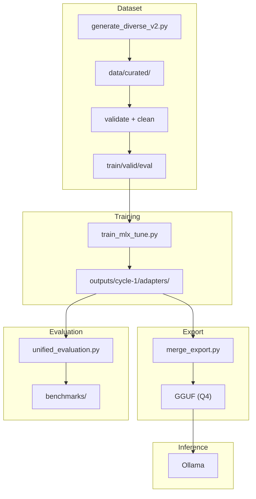

# OCI Specialist LLM

Fine-tuned Large Language Model for Oracle Cloud Infrastructure (OCI) using Apple Silicon, MLX, and LoRA.

[](LICENSE)
[](https://www.python.org)
[](https://mlx.ai)
[](https://huggingface.co/mlx-community/Meta-Llama-3.1-8B-Instruct-4bit)

> **Language**: Data and prompts in Brazilian Portuguese (PT-BR)

---

## Overview

This project trains a specialized LLM for Oracle Cloud Infrastructure using Apple's MLX framework on Apple Silicon. The pipeline covers dataset generation, validation, MLX LoRA fine-tuning, GGUF export, and evaluation.



**Tech Stack**: Python 3.12, MLX 0.31.1, MLX-LM 0.31.1, MLX-Tune 0.4.18

---

## Quick Start

### 1. Environment Setup

```bash
# Create virtual environment
python3.12 -m venv venv
source venv/bin/activate

# Install dependencies
pip install -r requirements.txt
```

### 2. Generate Dataset

```bash
python scripts/generate_diverse_v2.py
```

This generates ~6,600 examples across 71 OCI topics in `data/curated/`.

### 3. Prepare Data

```bash
# Concatenate all files
cat data/curated/*.jsonl > data/all_curated.jsonl

# Validate and clean
python scripts/validate_jsonl.py --input data/all_curated.jsonl --output data/all_curated_valid.jsonl
python scripts/clean_dataset.py --input data/all_curated_valid.jsonl --output data/all_curated_clean.jsonl

# Split into train/valid/eval
python scripts/build_dataset_fixed.py --input data/all_curated_clean.jsonl
```

### 4. Train (Cycle 1)

```bash
CYCLE=cycle-1 python training/train_mlx_tune.py --fresh
```

> [!TIP]
> First training run takes ~20-25 minutes on M3 Pro (18GB). The script automatically saves adapters to `outputs/cycle-1/adapters/`.

### 5. Export to GGUF

```bash
python scripts/merge_export.py --cycle cycle-1 --quant q4 --name oci-specialist
```

This creates `outputs/cycle-1/gguf/oci-specialist-Q4_K_M.gguf` (~4.7GB).

### 6. Run Inference with Ollama

```bash
# Create Modelfile
cat > /tmp/Modelfile << 'EOF'
FROM ./outputs/cycle-1/gguf/oci-specialist-Q4_K_M.gguf
PARAMETER temperature 0.1
PARAMETER top_p 0.9
PARAMETER top_k 40
SYSTEM Você é um especialista em OCI (Oracle Cloud Infrastructure) com profundos conhecimentos sobre compute, storage, networking, database, security e DevOps.
EOF

# Import to Ollama
ollama create oci-specialist -f /tmp/Modelfile

# Test
echo "Como criar uma instância no OCI?" | ollama run oci-specialist
```

---

## Dataset

| Metric | Value |
|--------|-------|
| Total | 6,627 examples |
| Topics | 71 OCI categories |
| Removed (cleaning) | 3,313 |

### Split

| Split | Examples | % |
|-------|----------|---|
| Train | 4,956 | 74.8% |
| Valid | 978 | 14.7% |
| Eval | 632 | 9.5% |

### Categories

- **OCI Core**: compute, storage, networking, lb, database, container, serverless - 20 topics
- **Security**: iam, policies, vault, encryption, cloud-guard, waf - 9 topics
- **Migration**: AWS/Azure/GCP/On-prem → OCI - 14 topics
- **Terraform**: provider, compute, storage, networking, etc - 12 topics
- **Observability** - 4 topics
- **Troubleshooting** - 8 topics
- **DevOps** - 4 topics

---

## Training

### Configuration

See `config/cycle-1.env`:

| Parameter | Value |
|-----------|-------|
| MODEL | mlx-community/Meta-Llama-3.1-8B-Instruct-4bit |
| LEARNING_RATE | 2e-4 |
| LORA_RANK | 8 |
| LORA_ALPHA | 16 |
| ITERS | 250 |
| MAX_SEQ_LENGTH | 2048 |

### Multi-Cycle Training

```bash
# Cycle 1 (from scratch)
CYCLE=cycle-1 python training/train_mlx_tune.py --fresh

# Cycle 2 (resume from cycle-1)
CYCLE=cycle-2 python training/train_mlx_tune.py

# Cycle 3 (resume from cycle-2)
CYCLE=cycle-3 python training/train_mlx_tune.py
```

### Expected Performance (M3 Pro 18GB)

| Metric | Value |
|--------|-------|
| Peak Memory | ~6.5 GB |
| Speed | ~85 tokens/sec |
| Time (250 iters) | ~21 minutes |
| Loss (train) | ~2.2 → ~0.37 |

---

## Evaluation

```bash
# Test mode (10 samples, ~2 min)
python scripts/unified_evaluation.py --mode test

# Full evaluation (325 samples, ~90 min)
python scripts/unified_evaluation.py --mode full
```

### Results (Cycle 1)

| Metric | Base Model | Fine-Tuned | Delta |
|--------|------------|------------|-------|
| technical_correctness | 3.10 | 4.34 | +1.24 |
| depth | 4.03 | 3.91 | -0.12 |
| structure | 4.20 | 4.40 | +0.20 |
| hallucination | 4.85 | 5.00 | +0.15 |
| **overall** | **3.91** | **4.22** | **+0.31** |

## Inference

### MLX-LM (Apple Silicon)

Direct inference with fine-tuned adapters using MLX:

```bash
# Test fine-tuned model (with LoRA adapter)
python scripts/run_inference_v2.py --config config/inference_prompts.yaml \
  --adapter outputs/cycle-1/adapters
```

> [!NOTE]
> This requires Apple Silicon and loads the base model + LoRA adapters. Use this for quick testing during development.

### Ollama (Recommended)

For full local inference with the exported GGUF model:

```bash
# Create Modelfile
cat > /tmp/Modelfile << 'EOF'
FROM ./outputs/cycle-1/gguf/oci-specialist-Q4_K_M.gguf
PARAMETER temperature 0.1
PARAMETER top_p 0.9
PARAMETER top_k 40
SYSTEM Você é um arquiteto especialista em OCI...
EOF

# Import and run
ollama create oci-specialist -f /tmp/Modelfile
ollama run oci-specialist
```

> [!NOTE]
> The GGUF export produces ~4.7GB in Q4 quantization.

---

## Project Structure

```
├── config/                  # Training configs
│   ├── cycle-1.env
│   ├── inference_prompts.yaml
│   └── gguf.env
├── data/                    # Datasets
│   ├── curated/             # 71 topic files
│   ├── train.jsonl
│   ├── valid.jsonl
│   └── eval.jsonl
├── scripts/                 # Pipeline scripts
│   ├── generate_diverse_v2.py
│   ├── validate_jsonl.py
│   ├── build_dataset_fixed.py
│   ├── merge_export.py
│   └── unified_evaluation.py
├── training/                # Training scripts
│   └── train_mlx_tune.py
├── outputs/                 # Generated artifacts
│   └── cycle-1/
│       ├── adapters/        # LoRA adapters
│       └── gguf/          # Exported models
└── venv/                  # Python venv
```

---

## Limitations

1. **Single-turn only**: No multi-turn conversations in dataset
2. **No RAG**: No real-time access to OCI documentation

---

## Resources

- [MLX Documentation](https://mlx.ai)
- [MLX-LM GitHub](https://github.com/ml-explore/mlx-lm)
- [Oracle Cloud Infrastructure Docs](https://docs.oracle.com/en-us/iaas/Content/home.htm)
- [HuggingFace Base Model](https://huggingface.co/mlx-community/Meta-Llama-3.1-8B-Instruct-4bit)