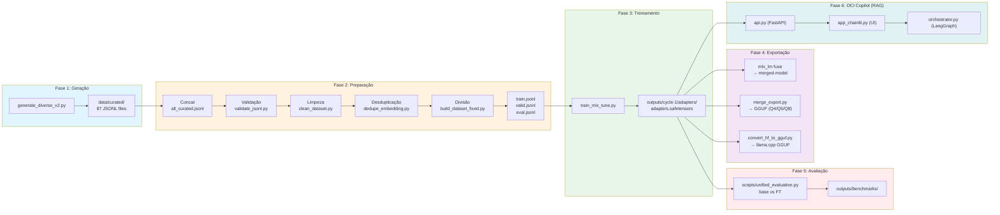

# OCI Specialist LLM

[🇺🇸 English](README.en-US.md) | [🇧🇷 Português](README.md)

Large Language Model (LLM) fine-tuned para Oracle Cloud Infrastructure (OCI) usando Apple Silicon, MLX e LoRA.

[](LICENSE)
[](https://www.python.org)
[](https://mlx.ai)
[](https://huggingface.co/mlx-community/Qwen2.5-Coder-7B-Instruct-4bit)
[](docs/taxonomy.md)

> **Idioma**: Dados e prompts em Português do Brasil (PT-BR).

---

## Visão Geral

Este projeto treina um LLM especializado para Oracle Cloud Infrastructure utilizando o framework MLX da Apple em Apple Silicon. O pipeline abrange a geração do dataset, validação, fine-tuning via MLX LoRA e integração com uma camada de RAG (OCI Copilot).



**Stack Tecnológica**: Python 3.12, MLX 0.31.1, Qwen 2.5 Coder 7B, LangGraph, Chainlit, FAISS.

---

## Funcionalidades

- **LoRA Fine-tuning**: Adaptação de baixo ranque com modelo base **Qwen 2.5 Coder 7B Instruct** (4-bit).
- **Otimizado para M3 Pro**: Configurações hiper-otimizadas para 18GB de RAM, usando **BF16 nativo** e sem Swap em disco.
- **RAG Híbrido Avançado**: Busca semântica (FAISS) + lexical (BM25) com persistência local e **Ingestão Offline**.
- **Sistema Multi-Agentes**: Orquestração via **LangGraph** (Router, Descoberta, Arquitetura, Execução).
- **Interface OCI Copilot**: UI construída com **Chainlit**, suportando anexos de arquivos, streaming de tokens e **Human-in-the-loop** para segurança em comandos CLI.
- **Avaliação Automatizada**: Pipeline de benchmark para medir precisão técnica, alucinação e profundidade.

---

## Dataset

| Métrica | Valor |
|--------|-------|
| **Total Gerado** | 21.750 exemplos (87 categorias × 250) |
| **Após Limpeza/Desduplicação** | 21.327 exemplos |
| **Treino (Train)** | 15.995 exemplos (75%) |
| **Validação (Valid)** | 3.199 exemplos (15%) |
| **Avaliação (Eval)** | 2.133 exemplos (10%) |
| **Categorias** | 87 tópicos do OCI |

### Divisão (Split)

| Split | Exemplos | % |
|-------|----------|---|
| Treino (Train) | 15.995 | 75% |
| Validação (Valid) | 3.199 | 15% |
| Avaliação (Eval) | 2.133 | 10% |

---

## Treinamento

O treinamento agora utiliza o modelo **Qwen 2.5 Coder 7B Instruct** (4-bit), otimizado para extrair o máximo de performance do Apple Silicon M3 Pro.

### Preparação do Ambiente

```bash
python3.12 -m venv venv
source venv/bin/activate
pip install -r requirements.txt
```

### Execução do Treino

```bash
# Executa o ciclo consolidado de treinamento
bash training/run_all_cycles.sh --fresh
```

**Configuração Otimizada** (`config/cycle-1.env`):

| Parâmetro | Valor | Descrição |
|-----------|-------|-----------|
| **MODEL** | `Qwen2.5-Coder-7B-Instruct-4bit` | Base de código superior |
| **NUM_LAYERS** | 14 | 50% das camadas (Total: 28) |
| **BATCH_SIZE** | 1 | Agilidade em sequências únicas |
| **GRAD_ACCUM** | 4 | Tamanho efetivo de 4 |
| **BF16** | true | Aceleração nativa em hardware M3 |
| **GRAD_CHECKPOINT**| false | Prioridade para velocidade (Tokens/sec) |
| **ITERS** | 4000 | Ciclo completo de aprendizado |
| **MAX_SEQ** | 768 | Contexto ideal para OCI |

---

## Avaliação

O pipeline de avaliação compara o modelo fine-tuned contra o modelo base para garantir que não houve regressões catastróficas.

```bash
# Avaliação Recomendada (200 amostras estratificadas, ~30 min)
python scripts/unified_evaluation.py --cycle cycle-1 --mode medium --fresh

# Avaliação Completa (2133 amostras, ~4-6 horas)
python scripts/unified_evaluation.py --cycle cycle-1 --mode full --fresh
```

### Resumo dos Resultados (Iniciais)

| Métrica | Modelo Base | Fine-Tuned | Delta |
|--------|-------------|------------|-------|
| technical_correctness | 3.40 | 3.40 | +0.00 |
| depth | 2.60 | 2.60 | +0.00 |
| structure | 3.93 | 4.23 | +0.30 |
| hallucination | 3.25 | 3.87 | +0.62 |
| clarity | 3.49 | 3.19 | -0.30 |
| **Overall** | **3.33** | **3.46** | **+0.12** |

---

## RAG (Retrieval-Augmented Generation)

O OCI Copilot utiliza uma camada de RAG persistente para acessar fatos em tempo real da documentação Oracle.

### Setup do RAG

```bash
python3.12 -m venv venv-rag
source venv-rag/bin/activate
pip install -r requirements-rag.txt
pip install langgraph chainlit
```

### Ingestão Offline (Obrigatória)
Para economizar RAM, os índices devem ser gerados antes de subir o sistema:
```bash
python scripts/update_rag.py
```

### Estrutura dos Módulos
- `api.py`: Backend FastAPI que serve os índices FAISS e BM25.
- `orchestrator.py`: Orquestrador **LangGraph** (Router -> Especialistas -> Execução).
- `app_chainlit.py`: Interface visual com suporte a anexos e aprovação manual de comandos.

---

## Inferência

Após o treinamento, você pode subir o modelo para uso local ou API.

### MLX-LM API
```bash
mlx_lm.server --model mlx-community/Qwen2.5-Coder-7B-Instruct-4bit --adapter outputs/cycle-1/adapters
```

### OCI Copilot UI (Oficial)
```bash
# Iniciar o ecossistema completo
# Terminal 1:
uvicorn rag.api:app --port 8000
# Terminal 2:
chainlit run rag/app_chainlit.py
```

---

## Benchmark

### Comparação de Métricas


### Performance por Categoria


### Principais Ganhos
1. **Troubleshooting Functions**: +0.65
2. **Networking VCN**: +0.62
3. **Storage File**: +0.57
4. **Troubleshooting Compute**: +0.57
5. **Migration Azure Storage**: +0.55

---

## Roadmap

1. ~~**Implementação de RAG Híbrido**~~ ✅ Concluído.
2. ~~**Migração para Arquitetura Qwen 2.5 Coder**~~ ✅ Concluído.
3. ~~**Orquestração Multi-Agentes com LangGraph**~~ ✅ Concluído.
4. **Integração com OpenRouter**: Roteamento para modelos de fronteira (Claude/GPT-4) em tarefas complexas.
5. **Exportação para Hugging Face Hub**: Publicação dos adaptadores treinados.

---

## Agradecimentos

Este projeto foi desenvolvido utilizando a infraestrutura de hardware Apple Silicon e a biblioteca MLX, com dados sintetizados e validados especificamente para cenários de OCI.

---

## Licença

Este projeto está licenciado sob a Licença MIT. Veja o arquivo [LICENSE](LICENSE) para detalhes.
