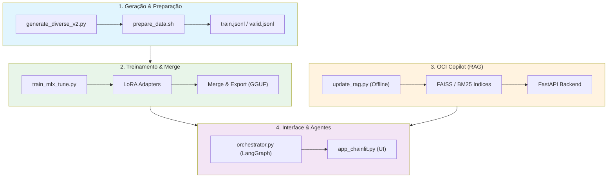

# OCI Specialist LLM

[🇺🇸 English](README.en-US.md) | [🇧🇷 Português](README.md)

Large Language Model (LLM) fine-tuned para Oracle Cloud Infrastructure (OCI) usando Apple Silicon, MLX e LoRA.

[](LICENSE)
[](https://www.python.org)
[](https://mlx.ai)
[](https://huggingface.co/mlx-community/Qwen2.5-Coder-7B-Instruct-4bit)
[](docs/taxonomy.md)

---

### 🚀 Core Stack & Componentes
- **LLM Base**: [Qwen 2.5 Coder 7B Instruct](https://huggingface.co/Qwen/Qwen2.5-Coder-7B-Instruct) (4-bit).
- **Orquestração de Agentes**: [LangGraph](https://python.langchain.com/docs/langgraph) & [LangChain](https://langchain.com).
- **Interface OCI Copilot**: [Chainlit](https://chainlit.io) (Interactive UI com HITL).
- **Treinamento e Inferência**: [MLX Framework](https://mlx.ai) & [MLX-Tune](https://github.com/Aaronipher/mlx-tune).
- **RAG (Busca Híbrida)**: [FAISS](https://github.com/facebookresearch/faiss) (Dense) + [Rank-BM25](https://github.com/dorianbrown/rank_bm25) (Sparse).
- **Backend Service**: [FastAPI](https://fastapi.tiangolo.com) (RAG API).
- **Embeddings & Rerank**: [Hugging Face](https://huggingface.co) & [Sentence-Transformers](https://sbert.net).
- **Hardware**: Otimizado para Apple Silicon (M3 Pro 18GB).
- **Linguagem**: Python 3.12.
- **Idioma**: Dados e prompts em Português do Brasil (PT-BR).

---

## Visão Geral

Este projeto treina um LLM especializado para Oracle Cloud Infrastructure utilizando o framework MLX da Apple em Apple Silicon. O pipeline abrange a geração do dataset, validação, fine-tuning via MLX LoRA, fusão de pesos (Merge) e integração com uma camada de RAG (OCI Copilot).



---

## Funcionalidades

- **LoRA Fine-tuning**: Adaptação de baixo ranque com modelo base **Qwen 2.5 Coder 7B Instruct** (4-bit).
- **Otimizado para M3 Pro**: Configurações hiper-otimizadas para 18GB de RAM, usando **BF16 nativo** e sem Swap em disco.
- **RAG Híbrido Avançado**: Busca semântica (FAISS) + lexical (BM25) com persistência local e **Ingestão Offline**.
- **Sistema Multi-Agentes**: Orquestração via **LangGraph** (Router, Descoberta, Arquitetura, Execução).
- **Interface OCI Copilot**: UI construída com **Chainlit**, suportando anexos de arquivos, streaming de tokens e **Human-in-the-loop** para segurança em comandos CLI.
- **Merge & Export**: Pipeline para fundir adaptadores LoRA ao modelo base e exportar para GGUF (quantização local).
- **Avaliação Automatizada**: Pipeline de benchmark para medir precisão técnica, alucinação e profundidade.

---

## Dataset

| Métrica | Valor |
|--------|-------|
| **Total Gerado** | 21.750 exemplos (87 categorias × 250) |
| **Após Limpeza/Desduplicação** | 21.327 exemplos |
| **Treino (Train)** | 15.995 exemplos (75%) |
| **Validação (Valid)** | 3.199 exemplos (15%) |
| **Avaliação (Eval)** | 2.133 exemplos (10%) |
| **Categorias** | 87 tópicos do OCI |

### Divisão (Split)

| Split | Exemplos | % |
|-------|----------|---|
| Treino (Train) | 15.995 | 75% |
| Validação (Valid) | 3.199 | 15% |
| Avaliação (Eval) | 2.133 | 10% |

---

## Treinamento

O treinamento utiliza o framework MLX-Tune, otimizado para extrair o máximo de performance do Apple Silicon M3 Pro.

### 1. Setup do Ambiente

```bash
python3.12 -m venv venv
source venv/bin/activate
pip install -r requirements.txt
```

### 2. Execução do Treino

```bash
# Executa o ciclo consolidado de treinamento
bash training/run_all_cycles.sh --fresh
```

### 3. Fusão de Pesos (Merge) & Exportação

Após o treino, você deve fundir os adaptadores LoRA ao modelo base e exportar para o formato GGUF (compatível com llama.cpp/Ollama).

```bash
# Merge e export para GGUF Q4
python scripts/merge_export.py --cycle cycle-1 --quant q4 --name oci-specialist
```

### Configuração Otimizada (`config/cycle-1.env`)

| Parâmetro | Valor | Descrição |
|-----------|-------|-----------|
| **MODEL** | `Qwen2.5-Coder-7B-Instruct-4bit` | Base de código superior |
| **NUM_LAYERS** | 14 | 50% das camadas (Total: 28) |
| **BATCH_SIZE** | 1 | Agilidade em sequências únicas |
| **GRAD_ACCUM** | 4 | Tamanho efetivo de 4 |
| **BF16** | true | Aceleração nativa em hardware M3 |
| **ITERS** | 4000 | Ciclo completo de aprendizado |
| **MAX_SEQ** | 768 | Contexto ideal para OCI |

---

## Avaliação

O pipeline de avaliação compara o modelo fine-tuned contra o modelo base usando métricas semânticas e técnicas.

```bash
# Avaliação Recomendada (200 amostras estratificadas, ~30 min)
python scripts/unified_evaluation.py --cycle cycle-1 --mode medium --fresh

# Avaliação Completa (2133 amostras, ~4-6 horas)
python scripts/unified_evaluation.py --cycle cycle-1 --mode full --fresh
```

### Resumo dos Resultados (Iniciais)

| Métrica | Modelo Base | Fine-Tuned (Cycle 1) | Delta |
|--------|-------------|------------|-------|
| technical_correctness | 3.40 | 3.40 | +0.00 |
| depth | 2.60 | 2.60 | +0.00 |
| structure | 3.93 | 4.23 | +0.30 |
| hallucination | 3.25 | 3.87 | +0.62 |
| clarity | 3.49 | 3.19 | -0.30 |
| **Overall** | **3.33** | **3.46** | **+0.12** |

---

## RAG (Retrieval-Augmented Generation)

O OCI Copilot utiliza uma camada de RAG persistente para acessar fatos em tempo real da documentação Oracle.

### 1. Setup do RAG

```bash
python3.12 -m venv venv-rag
source venv-rag/bin/activate
pip install -r requirements-rag.txt
pip install langgraph chainlit
```

### 2. Ingestão Offline (Obrigatória)
Para economizar RAM durante o chat, os índices devem ser gerados offline:
```bash
python scripts/update_rag.py
```

### 3. Orquestração e Agentes
- **Backend API**: `rag/api.py` serve os índices FAISS e BM25 via FastAPI.
- **Orquestrador**: `rag/orchestrator.py` utiliza **LangGraph** para gerenciar a máquina de estados entre os agentes especialistas.
- **Estratégias**: Pesos dinâmicos entre denso/esparso configurados em `config/oci-copilot-agents.yaml`.

---

## Inferência e UI

Após o treinamento e merge, utilize a interface oficial **Chainlit** para interagir com o Copilot.

### 1. Iniciar Backend RAG
```bash
uvicorn rag.api:app --port 8000
```

### 2. Iniciar Interface Visual
```bash
chainlit run rag/app_chainlit.py -w
```
Acesse em: `http://localhost:8000` (ou porta configurada).

---

## Benchmark

### Comparação de Métricas


### Performance por Categoria


### Principais Ganhos por Tópico
1. **Troubleshooting Functions**: +0.65
2. **Networking VCN**: +0.62
3. **Storage File**: +0.57
4. **Troubleshooting Compute**: +0.57
5. **Migration Azure Storage**: +0.55

---

## Roadmap

As seguintes melhorias estão planejadas:

1. **Integração com OpenRouter**: Roteamento para modelos de fronteira (Claude/GPT-4) em tarefas complexas.
2. **Exportação para Hugging Face Hub**: Publicação dos adaptadores treinados e modelos quantizados.

---

## Agradecimentos

Este projeto foi desenvolvido integrando as seguintes tecnologias de ponta:

- **Hardware**: Apple Silicon (M3 Pro) com Memória Unificada.
- **Treinamento e Inferência**: [MLX Framework](https://mlx.ai) e [MLX-Tune](https://github.com/Aaronipher/mlx-tune).
- **Modelo Base**: [Qwen 2.5 Coder 7B Instruct](https://huggingface.co/Qwen/Qwen2.5-Coder-7B-Instruct) (Alibaba Cloud).
- **Orquestração de Agentes**: [LangGraph](https://python.langchain.com/docs/langgraph) e [LangChain](https://langchain.com).
- **Interface do Usuário**: [Chainlit](https://chainlit.io).
- **Serviços de Backend**: [FastAPI](https://fastapi.tiangolo.com).
- **Motores de Busca (RAG)**: [FAISS](https://github.com/facebookresearch/faiss) (Dense) e [Rank-BM25](https://github.com/dorianbrown/rank_bm25) (Sparse).
- **Embeddings e Re-ranking**: [Hugging Face](https://huggingface.co) e [Sentence-Transformers](https://sbert.net).
- **Desenvolvimento**: [Python 3.12](https://www.python.org).
- **Dados**: Sintetizados e validados especificamente para cenários de Oracle Cloud Infrastructure (OCI).

---

## Licença

Este projeto está licenciado sob a Licença MIT. Veja o arquivo [LICENSE](LICENSE) para detalhes.
