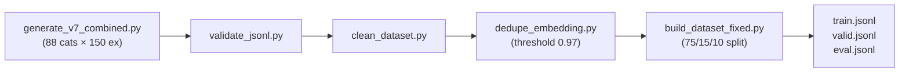

---
annotations_creators:
- no-annotation
language:
- pt-BR
language_creators:
- machine-generated
license:
- mit
multilingual:
- pt-BR
pretty_name: OCI Copilot Jr Dataset
size_categories:
- 10K<n<100K
source_datasets:
- original
tags:
- oracle-cloud-infrastructure
- oci
- fine-tuning
- copilot
- mlx
- apple-silicon
---

# Dataset Card: OCI Copilot Jr Dataset

## Overview

This dataset contains **13,196 examples** of high-quality training data for fine-tuning a Large Language Model to become an Oracle Cloud Infrastructure (OCI) specialist — the "OCI Copilot Jr".

The dataset was **synthetically generated** using prompt templates with OCI CLI commands and real-world enterprise scenarios in Brazilian Portuguese (PT-BR).

| Split | Examples | Percentage |
|-------|----------|-------------|
| Train | 9,897 | 75% |
| Valid | 1,979 | 15% |
| Eval  | 1,320 | 10% |
| **Total** | **13,196** | 100% |

## Dataset Structure

### Schema (Chat Format)

```json
{
  "messages": [
    {
      "role": "system",
      "content": "Você é um arquiteto e especialista experiente em OCI focado no domínio de {category}. Forneça orientações técnicas, profundas e definitivas."
    },
    {
      "role": "user",
      "content": "Para o ambiente {environment} do nosso projeto {project}, precisamos realizar: {task}. Quais as melhores estratégias e comandos no OCI considerando a restrição: {restriction}?"
    },
    {
      "role": "assistant",
      "content": "## {task} — OCI Step-by-Step\n\n**Cenário**: {company}, projeto {project}, ambiente {environment}\n\n[detailed technical response with OCI CLI commands, Terraform, and best practices]"
    }
  ]
}
```

### Categories (88 OCI Domains)

| Pillar | Categories |
|--------|------------|
| **Compute** | instances, custom-images, scaling |
| **Container** | instances, OKE |
| **Database** | autonomous, autonomous-json, exadata, exadata-cloud, MySQL, NoSQL, PostgreSQL |
| **DevOps** | artifacts, CI/CD, resource-manager, secrets |
| **FinOps** | cost-optimization, rightsizing, showback-chargeback, storage-tiering |
| **Governance** | audit-readiness, budgets-cost, compartments, compliance, landing-zone, policies-guardrails, resource-discovery, tagging |
| **Load Balancer** | load-balancer |
| **Migration** | aws-database, azure-compute, azure-database, azure-storage, data-transfer, gcp-compute, gcp-database, gcp-storage, onprem-compute, onprem-database, onprem-storage, onprem-vmware |
| **Networking** | connectivity, security, VCN |
| **Observability** | APM, logging, monitoring, stack-monitoring |
| **Platform** | backup-governance, SRE-operations |
| **Security** | cloud-guard, dynamic-groups, encryption, federation, IAM-basics, policies, posture-management, vault-keys, vault-secrets, WAF, zero-trust |
| **Serverless** | api-gateway, functions |
| **Storage** | block, file, object |
| **Terraform** | compute, container, database, devops, load-balancer, networking, observability, provider, security, serverless, state, storage |
| **Troubleshooting** | authentication, compute, connectivity, database, functions, OKE, performance, storage |

## Data Generation Pipeline



### Generation Process

1. **Template-based generation**: Uses prompt templates with varied:
   - Company names (realistic Brazilian enterprises)
   - Project names
   - Environments (greenfield, brownfield, production, staging)
   - Personas (SRE, Platform Engineer, FinOps Analyst, Architect)
   - Restrictions (budget-limited, no-downtime, rollback-15min, etc.)
   - Regions and compartments

2. **Quality Validation**:
   - JSONL schema validation
   - Content cleaning (removes generic templates, incorrect CLI)
   - Semantic deduplication using embeddings (threshold 0.97)

### Token Statistics

| Metric | Value |
|--------|-------|
| Average tokens/example | 883 |
| Min tokens | 410 |
| Max tokens | 934 |

## Use and Limitations

### Intended Use

This dataset is designed for:
- Fine-tuning LLMs for Oracle Cloud Infrastructure (OCI) operations
- Training technical assistants specialized in OCI CLI, Terraform, and best practices
- Building domain-specific RAG systems for cloud operations

### Limitations

- **Language**: Only Brazilian Portuguese (PT-BR)
- **Generated data**: Not human-annotated, may contain occasional inaccuracies
- **Knowledge cutoff**: Based on OCI documentation available up to April 2026
- **Scope**: Focus on operational tasks (not development/architecture planning)

## Citation

```bibtex
@dataset{lemos_2026_oci_copilot_jr,
  author    = {Otavio Lemos},
  title     = {OCI Copilot Jr Dataset},
  year      = {2026},
  publisher = {HuggingFace},
  url       = {https://huggingface.co/datasets/otavio-lemos/oci-copilot-jr-dataset}
}
```

## License

MIT License - See [LICENSE](https://github.com/otavio-lemos/olia-2-oci/blob/main/LICENSE)

---

*Dataset generated using MLX-Tune pipeline on Apple Silicon M3 Pro*